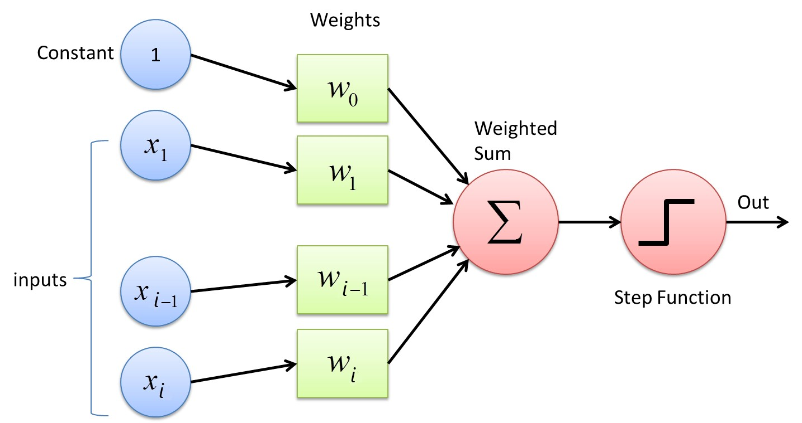
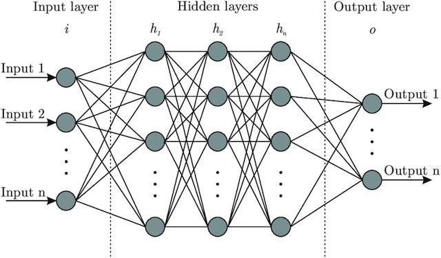
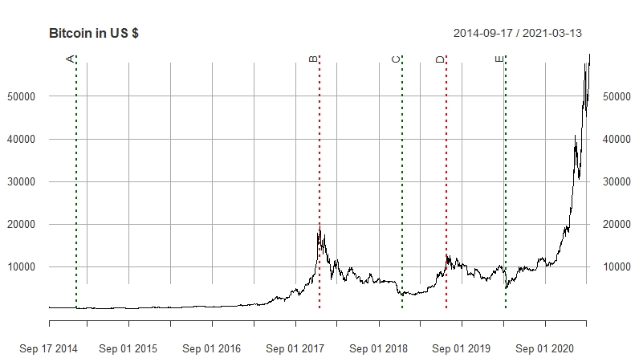

## 2. Theory {#theory}

The following chapter is intended to provide the theoretical foundations necessary for our work. It is divided into a part that provides an overview of artificial neural networks. Followed by section [2.2.](#bitcoin) which shows the background and the ecosystem of Bitcoin. This knowledge should be kept in mind, which should help in understanding the price formation of Bitcoin.

### 2.1. Neural network {#neural_network}

In the context of this work, artificial neural networks are used to answer supervised learning questions that focus on the classification of data. This means that a neural network finds a correlation between the data and their labels and optimizes its parameters to minimize the error for the next try. This process is called supervised training and is performed with a test data sample. An application example of classification is that a neural network is used for face recognition after it has learned the classification of different faces in the process of supervised training. Predictive analysis works similarly to the classification of labeled data. It estimates future values based on past events and can be trained with historical data. On the other hand, unsupervised learning (clustering) is applied to detect patterns from unlabeled data. Based on these patterns, for example, anomalies can be detected that are relevant in the fight against fraud (fraud detection). Unsupervised learning is not discussed further in this paper.

Section [2.1.1.](#perceptron) will demonstrate the functioning of a neural network using a simple perceptron.

#### 2.1.1. Perceptron {#perceptron}
&nbsp;

The construction of an artificial neural network is demonstrated using a perceptron. It is a simple algorithm for supervised learning of binary classification problems. This algorithm classifies patterns by performing a linear separation. Although this discovery was anticipated with great expectations in 1958, it became increasingly apparent that these binary classifiers are only applicable to linearly separable data inputs. This was only later addressed by the discovery of multiple layer perceptrons (MLP) [@perceptron_paper].

Basically, a perceptron is a single-layer neural network and consists of the following five components and can also be observed in figure \ref{fig:perceptron_schema}.

1.  Inputs

2.  Weights

3.  Bias

4.  Weighted sum

5.  Activation function

Inputs are the information that is fed into the model. In the case of econometric time series, it is mostly the current and historical log returns (lags). These are multiplied by the weights and added together with the bias term to form the weighted sum. This weighted sum is finally passed on to the non-linear activation function, which determines the output of the perceptron.

\newpage

```{r perceptron_schema, out.width='70%', fig.cap='Schematic diagram of a perceptron.', echo=FALSE}

```

The perceptron can also be represented as a function, which can be seen in equation \ref{eq:perceptron}. Analogous to the representation above, the inputs $x_{i}$ are multiplied by the weights $w_{i}$ in a linear combination. Then an error term is added so that the whole can be packed into the non-linear activation function $g(S)$ . $\hat{y}$ is the binary output of this perceptron. With the aid of an activation function, binary output is obtained. The Heaviside step function shown in figure \ref{fig:perceptron_schema} is usually only used in single layer perceptrons, which recognize linear separable patterns. For the multi-layer neural networks presented later, step functions are not an option, because in the course of the backpropagation algorithm the gradient descent has to be minimized. This requires derivatives of the activation function, which in the case of this Heaviside step function equals 0. Because the foundation for the optimization process is missing, functions like the sigmoid function or the hyperbolic tangent function are used [@nn_learning_theoretical_foundations]. More about this topic is discussed in chapter [2.1.2](#backprogation_algorithm).

```{=tex}
\begin{align} \label{eq:perceptron}
\hat{y}=g(w_{0}+\sum_{i=1}^{n}x_{i}w_{i})
\end{align}
```
As just mentioned, the aim is to feed the perceptron with the training set and change the weights $w_{i}$ with each cycle so that the prediction becomes more accurate. The output value is compared to the desired value. Finally, the sign of the difference $y-\hat{y}$ determines whether the inputs of that iteration are added to or subtracted from the weights. Ideally, the weights will gradually converge and provide us with a usable model [@nn_learning_theoretical_foundations].

\newpage

#### 2.1.2. Backpropagation algorithm {#backprogation_algorithm}
&nbsp;

Finding the optimal weights of the neural network is achieved by finding the minimum of an error function. One of the most common methods for this is the backpropagation algorithm. This algorithm searches for the minimum of the error function by making use of a method called gradient descent. The gradient method is used in numerics to solve general optimization problems. In doing so, we progress (using the example of a minimization problem) from a starting point along a descent direction until no further numerical improvement is achieved. Since this method requires the computation of the gradient of the error function after each step, continuity and differentiability of this function must necessarily be given. The step function mentioned above in section [2.1.1.](#perceptron) is therefore out of the question, but a non-linear function such as the logistic and the hyperbolic tangent functions (sigmoid) [@backpropagation]. Both activation functions are visible in figure \ref{fig:sigmoid}. While the target range of the 'ordinary' sigmoid function (equation \ref{eq:sigmoid_logistic}) is between 0 and 1, the $\hat{y}$ of the hyperbolic tangent function (equation \ref{eq:sigmoid_tanh}) ranges between -1 and 1. $v_{i}$ equals the weighted sum including bias term.

```{=tex}
\begin{eqnarray}
\hat{y}(v_{i})=(1+e^{-v_{i}})^{-1} \label{eq:sigmoid_logistic} \\
\hat{y}(v_{i})=\tanh(v_{i}) \label{eq:sigmoid_tanh}
\end{eqnarray}
```
<!-- \begin{align} \label{eq:sigmoid_logistic} -->
<!-- \hat{y}(v_{i})=(1+e^{-v_{i}})^{-1} -->
<!-- \end{align} -->

<!-- \begin{align} \label{eq:sigmoid_tanh} -->
<!-- \hat{y}(v_{i})=\tanh(v_{i}) -->
<!-- \end{align} -->

```{r sigmoid, echo=FALSE, fig.cap="Two common sigmoid activation functions: logistic functions and hyperbolic tangent."}
# Define x
v <- seq(-5, 5, 0.02)

# Calculate target variables for both functions
l <- (1 + exp(-v))^(-1)
t <- tanh(v)

# Plotting sigmoid functions
plot(x = v, y = l, type = "l", main = "Activation functions", xlim = c(-5,5), ylim = c(-1, 1), ylab = "y")
lines(x = v, y = t, col = 2)
legend("bottomright", legend = c("Logistic", "Tanh"), col = c(1,2), pch = "-", cex = 1)
```

In the course of the error analysis, the output of the neural network respectively the result from the activation function in the output layer is compared with the desired value. The most commonly used error function E is the Mean Squared Error (MSE), which is seen in equation \ref{eq:mse}. $y_{i}$ represents the actual value for the data point $i$, while $\hat{y}_{i}$ is the predicted value for data point $i$. The average of this error function is the average MSE, which is determined for a corresponding model. The learning problem is to adjust the weights $w_{i}$ within the training sample so that $MSE(w)$ is minimized [@efficient_backprop].

```{=tex}
\begin{align} \label{eq:mse}
  E=MSE=\frac{1}{n}\sum_{i = 1}^{n}(y_{i}-\hat{y}_{i})^2 \\
  =\frac{1}{n}\sum_{i = 1}^{n}(y_{i}-g(w_{0}+x_{i}w_{i}))^2 \nonumber
\end{align}
```
As mentioned, this is searched for by the gradient descent method. The gradient of a function is a vector whose entries are the first partial derivatives of the function. The first entry is the partial derivative after the first variable, the second entry is the partial derivative after the second variable and so on. Each entry indicates the slope of the function in the direction of the variable to which it was derived. In this work, the notation $\nabla{E}$ is used when talking about the gradient for the error function $E$, which is displayed in equation \ref{eq:gradient_descent} [@backpropagation].

```{=tex}
\begin{align} \label{eq:gradient_descent}
\nabla{E}=(\frac{\partial E}{\partial w_{1}},
\frac{\partial E}{\partial w_{2}},
\dots,
\frac{\partial E}{\partial w_{i}})
\end{align}
```
The weights get adjusted according to the following algorithm \ref{eq:weight_adj} where $\Delta{w_{i}}$ is the change of the weight $w_{i}$ and $\gamma$ represents a freely definable parameter. In literature, this parameter is often called a learning constant [@backpropagation_proofs]. The negative value is used because the gradient naturally points in the direction with the largest increase of the error function. To minimize the MSE, the elements in the gradient $\nabla{E}$ must be multiplied by -1.

```{=tex}
\begin{align} \label{eq:weight_adj}
\Delta{w_{i}}=-\gamma\frac{\partial E}{\partial w_{i}}, \\
\text{for } i=1,2,\dots,n \nonumber
\end{align}
```

\newpage

#### 2.1.3. Multilayer perceptron {#MLP}
&nbsp;

Multilayer perceptrons (MLP) are widely used feedforward neural network models and make usage of the backpropagation algorithm. They are an evolution of the original perceptron proposed by Rosenblatt in 1958 [@perceptron_paper]. The distinction is that they have at least one hidden layer between input and output layer, which means that an MLP has more neurons whose weights must be optimized. Consequently, this requires more computing power, but more complex classification problems can be handled [@mlp_architecture]. Figure \ref{fig:mlp_schema} shows the structure of an MLP with $n$ hidden layers. Compared to the perceptron, it can be seen that this neural network consists of an input layer, one or more hidden layers, and an output layer. In each layer, there is a different number of neurons, respectively nodes. These properties (number of layers and nodes) can be summarized with the term 'network architecture' and will be dealt with in this thesis.

```{r mlp_schema, out.width='60%', fig.cap='Schematic diagram of a multilayer perceptron', echo=FALSE}


# https://assets.website-files.com/5ac6b7f2924c652fd013a891/5edab65ea64212da0ad611b7_5d52f096076d2b058e88cf0c_Artificial-neural-network-architecture-ANN-i-h-1-h-2-h-n-o.jpeg
```

Every neural network has an input layer, which consists of one or more nodes. This number is determined from the training data and tells us how many features should be delivered to the neural network. In the case of bitcoin prices, we could use today's price and the prices of the last 10 days (lags 1-10), so the input layer would consist of 11 nodes. Some configurations also require a bias term to adjust the output along with the weighted sum, which is also added to the input layer. In contrast to the scheme of the MLP, this setup can be seen in figure \ref{fig:perceptron_schema} where the bias term is defined as 'constant'. Similarly to the input layer, each neural network has exactly one output layer. This can consist of one or more nodes. In this thesis, MLP is used as a regressor and therefore only one neuron is needed in this layer.

In between are the hidden layers, whose number and size can be configured as desired. The challenge is to find an optimal and efficient configuration without causing overfitting of the training data. The number of hidden layers depends primarily on the application area of the neural network. For example, working with image recognition would require more layers since the image file is broken down into individual pixels. Subsequently, the layers are used to optimize from rough outlines to the smallest detail. In our research, we came across several methods or 'rules of thumb' to optimize the model. A frequently suggested method is explained by Andrej Karpathy (director of the AI department of Tesla, Inc.). His GitHub entry recommends the approach of starting with a model that is too large that causes overfitting. Subsequently, the model is reduced by focusing on increasing training loss and improving validation loss [@recipe_training].

#### 2.1.4. Recurrent neural networks (RNN) {#RNN}
&nbsp;

#### 2.1.5. Long-short term memory (LSTM) {#LSTM}
&nbsp;

#### 2.1.6. Challenges
&nbsp;

-   Early stopping required to avoid overfitting to in-sample data

-   Gradient vanishing problem

Sigmoid suffers from the problem of Vanishing Gradient. The gradients of the NN's output with respect to the parameters become so small, that the NN takes smaller steps towards the minima of the loss function and eventually stop learning.

-   Dying Relu Problem (?)

\newpage

### 2.2. Bitcoin {#bitcoin}

In this section bitcoin as a crypto-curreny is introduced. The historical data is analyzed and commented. Further the technology in and around crypto-currencies is briefly explained. A detailed explanation would require a paper itself, therefore the explanation is done as simple as possible.

In the following work bitcoin as a cryptocurreny is mentionend in its short term BTC, by the meaning of US Dollars per Bitcoin.

#### 2.2.1. Historical analysis
&nbsp;

The story of bitcoin began with a paper published by the name of Satoshi Nakamoto [@bitcoin]. The publisher of the document cannot be assigned to a real person, therefore the technology inventor remains mysteriosly unknown until today. In 2009 the first bitcoin transaction was executed. On account of the opensource technology of bitcoin, lots of alternative currencies were created. Until 2013 the cryptocurrencies operated under the radar of most regulatory institutions. Because of the anonymity of the transactions, criminals were attracted by the newborn payment method. Headlines, such as the seizure of 26,000 bitcoins by closing the "Dark-Web" Website Silkroad through the Drug Enforcement Agency, followed moreoften in the newspapers. Nevertheless in 2014 more companys,such as :Zynga, D LasVegas Casinos, Golden Gate Hotel & Casino, TigerDirect, Overstock.com, Newegg, Dell, and even Microsoft [@A_History_of_Bitcoin]. began to accept bitcoin as a payment method. In 2014 the first derivative with bitcoin as an underlying was approved by the U.S.Commodity Futures Trading Commission. 2015 an estimated 160000 merchants used bitcoin to trade . It is observed that the value of bitcoin is very volatile, we will discuss this in a FURTHER XYXY section. Let us first look a the price in \ref{fig:price_btc} and the log(price)\ref{fig:logprice_btc} and get a sense of the chart. Note: The data in the charts start in 2014 where it was listed in coinmarket, events between 2009 and 2014 are described without visualization.

Around 2010 bitcoin had the first increase in price as it jumped a 100% from 0.0008 USD to 0.08 Dollar [@Bitcoin_history]. In 2011 the price rose from 1 USD to 32 USD within 3 months and recessd shortly after to 2 USD this can be referred as a first price bubble in bitcoin, for the next year the pri climbed to 13 Dollars and reached a never seen level of 220 USD, only to plunge to 70 USD within a half month in April 2013. By the end of the year a rally brought btc up to a peak of 1156 USD. The following year brought bad news and the price slowly decreased to 315 USD in 2015 after an observed drop of 20% after news from the trial of Ross Ulbricht, founder of Silk road marked in Letter \textbf{A}.From this point in time, things began to change, more volume was flushed in the market and the price of BTC began to ascend and the real rally began ,the BTC rose up to 20k USD / BTC on 17th September 2017 \textbf{B}. After the rise comes the fall and BTC lost value for more than a year until \textbf{C} 2018-12-15 the trend reverted and found its peak after 6 months in \textbf{D} 2019-06-26, but oncemore it was not lasting for long as bitcoin lost \textbf{D} 2020-03-12 nearly half its value in 4 days. But the story wasn't over by now after the drop, the price of the cryptocurrency regained value, passed previous levels and shortly after exploded, after companies like tesla and signal bought a big chunk of bitcoins, into a maximum of 58000 USD per bitcoin.

\newpage

```{r logprice_btc, out.width='80%', fig.cap='Schematic diagram of a perceptron.', echo=FALSE}
knitr::include_graphics("images/logbtc_usd.jpeg")
```

```{r price_btc, out.width='80%', fig.cap='Schematic diagram of a perceptron.', echo=FALSE}

```

\newpage

#### 2.3.2. SHA256 Hash
&nbsp;

-   Block
-   Blockchain
-   Distributed Blockchain
-   Token
-   Coinbase Transaction
-   Public/Private Key -\> Signing
-   Signature (sign, verify)
-   Transaction
