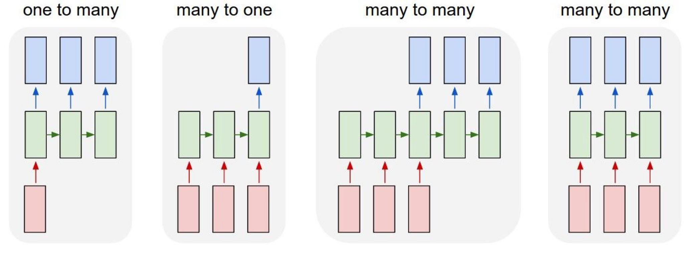
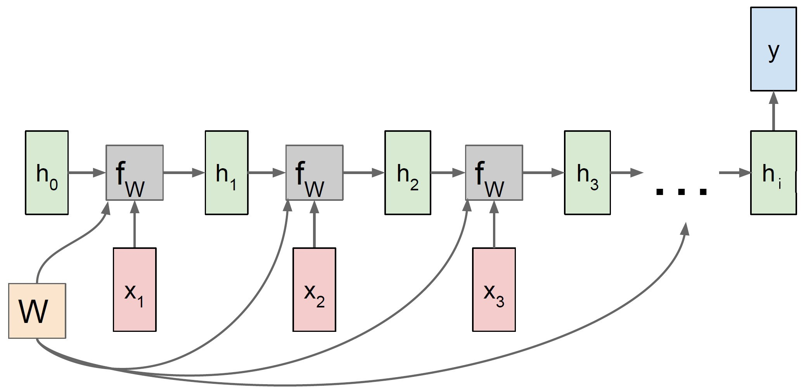
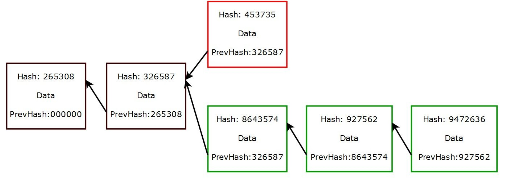

## 2. Theory {#theory}

The following chapter is intended to provide the theoretical foundations necessary for our work. It is divided into a part that provides an overview of artificial neural networks. Followed by section [2.2.](#bitcoin) which shows the background and the ecosystem of Bitcoin. This knowledge should be kept in mind, which should help in understanding the price formation of bitcoin.

### 2.1. Neural network {#neural_network}

In the context of this work, artificial neural networks are used to answer supervised learning questions that focus on the classification of data. This means that a neural network finds a correlation between the data and their labels and optimizes its parameters to minimize the error for the next try. This process is called supervised training and is performed with a test data sample. An application example of classification is that a neural network is used for face recognition after it has learned the classification of different faces in the process of supervised training. Predictive analysis works similarly to the classification of labeled data. It estimates future values based on past events and can be trained with historical data. On the other hand, unsupervised learning (clustering) is applied to detect patterns from unlabeled data. Based on these patterns, for example, anomalies can be detected that are relevant in the fight against fraud (fraud detection). Unsupervised learning is not discussed further in this paper. Section [2.1.1.](#perceptron) will demonstrate the functioning of a neural network using a simple perceptron.

#### 2.1.1. Perceptron {#perceptron}
&nbsp;

The construction of an artificial neural network is demonstrated using a perceptron. It is a simple algorithm for supervised learning of binary classification problems. This algorithm classifies patterns by performing a linear separation. Although this discovery was anticipated with great expectations in 1958, it became increasingly apparent that these binary classifiers are only applicable to linearly separable data inputs. This was only later addressed by the discovery of multiple layer perceptrons (MLP) [@perceptron_paper]. Basically, a perceptron is a single-layer neural network and consists of the following five components and can also be observed in figure \ref{fig:perceptron_schema}.

1.  Inputs

2.  Weights

3.  Bias

4.  Weighted sum

5.  Activation function

Inputs are the information that is fed into the model. In the case of econometric time series, it is mostly the current and historical log returns (lags). These are multiplied by the weights and added together with the bias term to form the weighted sum. This weighted sum is finally passed on to the non-linear activation function, which determines the output of the perceptron.

\newpage

```{r perceptron_schema, fig.align='center', out.width='70%', fig.cap='Schematic diagram of a perceptron.', echo=FALSE}
knitr::include_graphics("images/Perceptron.jpg")
```

The perceptron can also be represented as a function, which can be seen in equation \ref{eq:perceptron}. Analogous to the representation above, the inputs $x_{i}$ are multiplied by the weights $w_{i}$ in a linear combination. Then an error term is added so that the whole can be packed into the non-linear activation function $g(S)$ . $\hat{y}$ is the binary output of this perceptron. With the aid of an activation function, binary output is obtained. The Heaviside step function shown in figure \ref{fig:perceptron_schema} is usually only used in single layer perceptrons, which recognize linear separable patterns. For the multi-layer neural networks presented later, step functions are not an option, because in the course of the backpropagation algorithm the gradient descent has to be minimized. This requires derivatives of the activation function, which in the case of this Heaviside step function equals 0. Because the foundation for the optimization process is missing, functions like the sigmoid function or the hyperbolic tangent function are used [@nn_learning_theoretical_foundations]. More about this topic is discussed in chapter [2.1.2](#backprogation_algorithm).

```{=tex}
\begin{align} \label{eq:perceptron}
\hat{y}=g(w_{0}+\sum_{i=1}^{n}x_{i}w_{i})
\end{align}
```
As just mentioned, the aim is to feed the perceptron with the training set and change the weights $w_{i}$ with each cycle so that the prediction becomes more accurate. The output value is compared to the desired value. Finally, the sign of the difference $y-\hat{y}$ determines whether the inputs of that iteration are added to or subtracted from the weights. Ideally, the weights will gradually converge and provide us with a usable model [@nn_learning_theoretical_foundations].

\newpage

#### 2.1.2. Backpropagation algorithm {#backprogation_algorithm}
&nbsp;

Finding the optimal weights of the neural network is achieved by finding the minimum of an error function. One of the most common methods for this is the backpropagation algorithm. This algorithm searches for the minimum of the error function by making use of a method called gradient descent. The gradient method is used in numerics to solve general optimization problems. In doing so, we progress (using the example of a minimization problem) from a starting point along a descent direction until no further numerical improvement is achieved. Since this method requires the computation of the gradient of the error function after each step, continuity and differentiability of this function must necessarily be given. The step function mentioned above in section [2.1.1.](#perceptron) is therefore out of the question, but a non-linear function such as the logistic and the hyperbolic tangent functions (sigmoid) [@backpropagation]. Both activation functions are visible in figure \ref{fig:sigmoid}. While the target range of the 'ordinary' sigmoid function (equation \ref{eq:sigmoid_logistic}) is between 0 and 1, the $\hat{y}$ of the hyperbolic tangent function (equation \ref{eq:sigmoid_tanh}) ranges between -1 and 1. $v_{i}$ equals the weighted sum including bias term.

```{=tex}
\begin{eqnarray}
\hat{y}(v_{i})=(1+e^{-v_{i}})^{-1} \label{eq:sigmoid_logistic} \\
\hat{y}(v_{i})=\tanh(v_{i}) \label{eq:sigmoid_tanh}
\end{eqnarray}
```
<!-- \begin{align} \label{eq:sigmoid_logistic} -->
<!-- \hat{y}(v_{i})=(1+e^{-v_{i}})^{-1} -->
<!-- \end{align} -->

<!-- \begin{align} \label{eq:sigmoid_tanh} -->
<!-- \hat{y}(v_{i})=\tanh(v_{i}) -->
<!-- \end{align} -->

```{r sigmoid, fig.align='center', echo=FALSE, fig.cap="Two common sigmoid activation functions: logistic functions and hyperbolic tangent."}
# Define x
v <- seq(-5, 5, 0.02)

# Calculate target variables for both functions
l <- (1 + exp(-v))^(-1)
t <- tanh(v)

# Plotting sigmoid functions
plot(x = v, y = l, type = "l", main = "Activation functions", xlim = c(-5,5), ylim = c(-1, 1), ylab = "y")
lines(x = v, y = t, col = 2)
legend("bottomright", legend = c("Logistic", "Tanh"), col = c(1,2), pch = "-", cex = 1)
```

In the course of the error analysis, the output of the neural network respectively the result from the activation function in the output layer is compared with the desired value. The most commonly used error function E is the Mean Squared Error (MSE), which is seen in equation \ref{eq:mse}. $y_{i}$ represents the actual value for the data point $i$, while $\hat{y}_{i}$ is the predicted value for data point $i$. The average of this error function is the average MSE, which is determined for a corresponding model. The learning problem is to adjust the weights $w_{i}$ within the training sample so that $MSE(w)$ is minimized [@efficient_backprop].

```{=tex}
\begin{align} \label{eq:mse}
  E &=MSE(w) \\
  &=\frac{1}{n}\sum_{i = 1}^{n}(y_{i}-\hat{y}_{i})^2 \nonumber \\
  &=\frac{1}{n}\sum_{i = 1}^{n}(y_{i}-g(w_{0}+x_{i}w_{i}))^2 \nonumber 
\end{align}
```
As mentioned, this is searched for by the gradient descent method. The gradient of a function is a vector whose entries are the first partial derivatives of the function. The first entry is the partial derivative after the first variable, the second entry is the partial derivative after the second variable and so on. Each entry indicates the slope of the function in the direction of the variable to which it was derived. In this work, the notation $\nabla{E}$ is used when talking about the gradient for the error function $E$, which is displayed in equation \ref{eq:gradient_descent} [@backpropagation].

```{=tex}
\begin{align} \label{eq:gradient_descent}
\nabla{E}=(\frac{\partial E}{\partial w_{1}},
\frac{\partial E}{\partial w_{2}},
\dots,
\frac{\partial E}{\partial w_{i}})
\end{align}
```
The weights get adjusted according to the following algorithm \ref{eq:weight_adj} where $\Delta{w_{i}}$ is the change of the weight $w_{i}$ and $\gamma$ represents a freely definable parameter. In literature, this parameter is often called a learning constant [@backpropagation_proofs]. The negative value is used because the gradient naturally points in the direction with the largest increase of the error function. To minimize the MSE, the elements in the gradient $\nabla{E}$ must be multiplied by -1.

```{=tex}
\begin{align} \label{eq:weight_adj}
\Delta{w_{i}}=-\gamma\frac{\partial E}{\partial w_{i}}, \\
\text{for } i=1,2,\dots,n \nonumber
\end{align}
```

\newpage

#### 2.1.3. Multilayer perceptron {#MLP}
&nbsp;

Multilayer perceptrons (MLP) are widely used feedforward neural network models and make usage of the backpropagation algorithm. They are an evolution of the original perceptron proposed by Rosenblatt in 1958 [@perceptron_paper]. The distinction is that they have at least one hidden layer between input and output layer, which means that an MLP has more neurons whose weights must be optimized. Consequently, this requires more computing power, but more complex classification problems can be handled [@mlp_architecture]. Figure \ref{fig:mlp_schema} shows the structure of an MLP with $n$ hidden layers. Compared to the perceptron, it can be seen that this neural network consists of an input layer, one or more hidden layers, and an output layer. In each layer, there is a different number of neurons, respectively nodes. These properties (number of layers and nodes) can be summarized with the term 'network architecture' and will be dealt with in this thesis.

```{r mlp_schema, fig.align='center', out.width='60%', fig.cap='Schematic diagram of a multilayer perceptron', echo=FALSE}
knitr::include_graphics("images/MLP.jpeg")

# https://assets.website-files.com/5ac6b7f2924c652fd013a891/5edab65ea64212da0ad611b7_5d52f096076d2b058e88cf0c_Artificial-neural-network-architecture-ANN-i-h-1-h-2-h-n-o.jpeg
```

Every neural network has an input layer, which consists of one or more nodes. This number is determined from the training data and tells us how many features should be delivered to the neural network. In the case of bitcoin prices, we could use today's price and the prices of the last 10 days (lags 1-10), so the input layer would consist of 11 nodes. Some configurations also require a bias term to adjust the output along with the weighted sum, which is also added to the input layer. In contrast to the scheme of the MLP, this setup can be seen in figure \ref{fig:perceptron_schema} where the bias term is defined as 'constant'. Similarly to the input layer, each neural network has exactly one output layer. This can consist of one or more nodes. In this thesis, MLP is used as a regressor and therefore only one neuron is needed in this layer.

In between are the hidden layers, whose number and size can be configured as desired. The challenge is to find an optimal and efficient configuration without causing overfitting of the training data. The number of hidden layers depends primarily on the application area of the neural network. For example, working with image recognition would require more layers since the image file is broken down into individual pixels. Subsequently, the layers are used to optimize from rough outlines to the smallest detail. In our research, we came across several methods or 'rules of thumb' to optimize the model. A frequently suggested method is explained by Andrej Karpathy (director of the AI department of Tesla, Inc.). His GitHub entry recommends the approach of starting with a model that is too large that causes overfitting. Subsequently, the model is reduced by focusing on increasing training loss and improving validation loss [@recipe_training].

#### 2.1.4. Recurrent neural networks (RNN) {#RNN}
&nbsp;

Recurrent neural networks (RNN) are a further development of conventional neural networks. While MLP use new inputs $x_i$ in each epoch, RNN also use sequential data $h_i$ in addition to $x_i$. This sequential data are called hidden states and result from the previous runs. This has the advantage that historical information stemming from past predictions is included for the prediction for $t+1$. This effect can be intuitively explained by an example in which the flight path of a scheduled flight is predicted using RNN. When predicting the exact location (coordinates) of a plane, it is of great advantage to know the location at $t-1$ and to derive the flight direction from it. With the inclusion of this information, the target area can be narrowed down, which optimally leads to more accurate results. The same principle is used in applications like machine translation and speech recognition, where the result (here possibly letter or word) of the last epoch plays a big role for the next prediction [@RNN].

```{r RNN, fig.align='center', out.width='80%', fig.cap= 'Process sequences of different applicances of RNN.', echo=FALSE}



#[1]F.-F. Li, J. Johnson, and S. Yeung, ‘Lecture 10: Recurrent Neural Networks’, p. 105.

```

Figure \ref{fig:RNN} shows different process sequences of the RNN, which vary depending on the field of application. The red rectangles at the bottom represent the number of inputs. Similarly, the blue rectangles represent the outputs that come out of the RNN. The term 'many' refers to $>1$ and is illustrated with three rectangles in the figure. The green ones represent the hidden states $h_i$ of all time steps and thus can be seen as the memory of the neural network. The green arrows show that the previous hidden state is used as input for the current step. Starting from the left: one-to-many can be used for image captioning (extracting sequence of words from images), many-to-one for sentiment classification from sequence of words, many-to-many for machine translation (sequence of words in one language to sequence of words in another language) and many-to-many for video classification on frame level [@RNN_Stanford]. For the prediction of the BTC/USD exchange rate in this paper, we deal with the process many-to-one. This method combines information from inputs and hidden states into one single prediction value. 

```{r RNN_many_to_one, fig.align='center', out.width='70%', fig.cap= 'Computational graph of a many-to-one RNN.', echo=FALSE}



#[1]F.-F. Li, J. Johnson, and S. Yeung, ‘Lecture 10: Recurrent Neural Networks’, p. 105.

```

```{=tex}
\begin{align} \label{eq:RNN_many_to_one_1}
  h_{i} & = f_{W}(h_{i-1}, x_{i}) \\
  & = \tanh(W_{h}h_{i-1} + W_{x}x_{i} + b) \nonumber 
\end{align}
```

Equation \ref{eq:RNN_many_to_one_1} shows how the hidden states $h_{i}$ are calculated at each time step, $i$ where $f_{W}$ is an activation function (here: hyperbolic tangent function), $h_{i-1}$ is the previous state and $x_i$ is the input vector at time step i. In some cases, a bias term $b$ is added to the parameters. $W_{h}$ represents the weight matrix for $h_{i}$ with dimension (length($h$)$\times$length($h$)). Thus, $W_{x}$ is the weight matrix for $x_{i}$ with dimension (length($h$)$\times$length($x$)).

```{=tex}
\begin{align} \label{eq:RNN_many_to_one_2}
  \hat{y_{i}} = W_{y}h_{i}
\end{align}
```

Looking at equation \ref{eq:RNN_many_to_one_2}, $y_{i}$ equals the output and desired prediction of the RNN. The prediction results from the matrix-vector product of the weight matrix $W_{y}$ with dimension (length($h$)$\times$length($y$)) and the hidden states vector $h$.

#### 2.1.5. Long-short term memory (LSTM) {#LSTM}
&nbsp;

#### 2.1.6. Challenges {#challenges}
&nbsp;

##### 2.1.6.1 Overfitting {#overfitting}
&nbsp;

We have encountered several challenges that can occur when using neural networks. One of these possible problems is called overfitting. The goal of a neural network is to build a statistical model of the training set that is capable of generating the data. In overfitting on the other hand, the exact conditions of the training data including noise are reproduced. The focus is no longer on the underlying function. Last but not least, an unnecessarily large number of parameters or epochs can be 'consumed' for this, which makes the whole process relatively inefficient [@RNN]. 

=> still needs clarification how we solve these challenges in this thesis!

##### 2.1.6.2. Vanishing gradient problem {#vanishing_gradient}
&nbsp;

Another characteristic that requires our attention is the vanishing gradient problem. As explained in chapter [2.1.2.](#backpropagation_algorithm), the weights of the neural network are adjusted using the gradient of the loss function. Thereby, the problem can occur that the gradient almost vanishes. The error function's gradients become so small that the backpropagation algorithm takes smaller steps towards the loss function's minima and eventually stops learning. For example, if the derivative of an activation function such as the logistic sigmoid function approaches zero for extremely large or small values for $x$. To avoid these extreme values for $x$, the inputs are scaled and normalized in this paper. This ensures that the definition range is within the range where the gradient is still large enough for the backpropagation algorithm.  

=> still needs clarification how we solve these challenges in this thesis!

### 2.2. Model comparison {#model_comparison}

This thesis sets the goal to compare the different neural networks presented. Besides the types of neural networks, the network architecture (number of layers and nodes) is explored. In addition, a comparison is made with the winner of the Forecasting Competition M4, which combines a standard exponential smoothing model with an LSTM network. To make the comparison meaningful enough, the following two figures are compared. 

#### 2.2.1. Sharpe Ratio {#sharpe_ratio}
&nbsp;

The first number refers to the performance of the trading strategy based on the sign of the prediction $t+1$ and is called Sharpe Ratio. Sharpe ratio is a very powerful and widely used ratio to measure performance and it describes return per risk.

```{=tex}
\begin{align} \label{eq:Sharpe}
  \text{Sharpe Ratio} = \frac{R_{p}-R_{f}}{\sigma}
\end{align}
```

$R_{p}$ represents the return of the portfolio, while $R_{f}$ equals the risk free rate. $\sigma$ is the standard deviation of the portfolios excess return (risk). For the comparison of different series, the Sharpe Ratio needs to be annualized with $\sqrt{365}$ as the crypto market is open 24/7.

#### 2.2.2. Diebold Mariano {#diebold_mariano}
&nbsp;

The second method used is the Diebold Mariano test, which compares the predictive accuracy between two forecasts. First, the loss differential $d_{i}$ between two forecasts is defined in equation \ref{eq:DM_loss_diff} where a loss function L of one model is subtracted from another model. The proposed loss functions include absolute errors (AE) and squared errors (SE) [@DM_paper]. Given an expected value of $d = 0$, both forecasts are assumed to have the same accuracy. If the expected value differs from zero, the null hypothesis can be rejected. This would mean that the two methods have different levels of accuracy. 

```{=tex}
\begin{align} \label{eq:DM_hypothesis}
  H_{0}: E(d_{i}) = 0 \\
  H_{1}: E(d_{i}) \neq 0 \nonumber
\end{align}
```

with

```{=tex}
\begin{align} \label{eq:DM_loss_diff}
  d_{i} = L(e_{1i}) - L(e_{2i})
\end{align}
```

and

```{=tex}
\begin{align} \label{eq:DM_error}
  e_{ti} = \hat{y_{ti}} - y_{i} \\
  \text{for } t={1,2} \nonumber
\end{align}
```

Under the null hypothesis $H_{0}$, the Diebold Mariano test uses the statistics shown in equation \ref{eq:DM} and is asymptotically N(0,1) distributed. On the other hand, the null hypothesis is rejected if the calculated absolute Diebold Mariano value is outside $-z_{\alpha/2}$ and $z_{\alpha/2}$. Thus, $|DM|>z_{\alpha/2}$ is valid when there is a significant difference between the predictions where $z_{\alpha/2}$ is the positive bound of the z-value to the level $\alpha$.    

```{=tex}
\begin{align} \label{eq:DM}
  DM = \frac{\bar{d}}{\sqrt{\frac{2*\pi*\hat{f_{d}(0)}}{T}}} \rightarrow N(0,1)
\end{align}
```

where $\bar{d}$ is the sample mean of the loss differential and $f_{d}(0)$ is the spectral density of the loss differential at lag k [@DM_lecture].

```{=tex}
\begin{align} \label{eq:DM_definitions}
  \bar{d} = \sum_{i = 1}^{T}d_{i} \\
  f_{d}(0) = \frac{1}{2\pi}(\sum_{k=-\infty}^{\infty} \gamma_{d}(k))
\end{align}
```

In conclusion, the Diebold Mariano test helps us to understand whether the predictions of one model turned out better by chance or due to statistical significance. 

#### 2.2.3. Mean Squared Error (MSE) {#MSE}
&nbsp;

The third performance measurement method is also widely used and called mean squared error. Its calculation is very simple, for every timestep the estimated value is subtracted from the real empirical value, squared and then summarized and divided by the absolute number of observations as seen in equation \ref{eq:MSE}.

```{=tex}
\begin{align} \label{eq:MSE}
  MSE &= \frac{1}{N}\sum_{i = 1}^{N}(realvalue_{i}-prediciton_{i})^2 \\
  &= \frac{1}{N}\sum_{i = 1}^{N}(y_{i}-\hat{y}_{i})^2
\end{align}  
```

The application of MSE is widely used in statistical modeling and supervised learning. However, it should be noted that the metric is very sensitive to outliers. In the presence of outliers, a robust variant should be considered as an alternative. 

\newpage

### 2.3. Bitcoin {#bitcoin}

In this section bitcoin as a crypto-curreny is introduced. The historical data is analyzed and commented. Further the technology in and around crypto-currencies in chapter [2.3.2.](#bitcoin_tec) is briefly explained. A detailed explanation would require a paper itself, therefore the explanation is done as simple as possible.

In the following work bitcoin as a cryptocurreny is mentionend in its short term BTC, by the meaning of US Dollars per bitcoin.

#### 2.3.1. Historical analysis {#historical_analysis}
&nbsp;

The story of bitcoin began with a paper published by the name of Satoshi Nakamoto [@bitcoin]. The publisher of the document cannot be assigned to a real person, therefore the technology inventor remains mysteriosly unknown until today. In 2009 the first bitcoin transaction was executed. On account of the opensource technology of bitcoin, lots of alternative currencies were created. 

Until 2013 the cryptocurrencies operated under the radar of most regulatory institutions. Because of the anonymity of the transactions, criminals were attracted by the newborn payment method. Headlines, such as the seizure of 26'000 bitcoins by closing the "Dark-Web" Website Silkroad through the Drug Enforcement Agency, followed moreoften in the newspapers. 

Nevertheless in 2014 more companys, such as: Zynga, D LasVegas Casinos, Golden Gate Hotel & Casino, TigerDirect, Overstock.com, Newegg, Dell, and even Microsoft [@A_History_of_Bitcoin], began to accept bitcoin as a payment method. In 2014 the first derivative with bitcoin as an underlying was approved by the U.S.Commodity Futures Trading Commission.
2015 an estimated 160'000 merchants used bitcoin to trade. 


Let us first look a the price in Figure \ref{fig:price_btc} and the log(price) in Figure \ref{fig:logprice_btc} and get a sense of the chart. Note: The data in the charts start in 2014 where it was listed in coinmarket, events between 2009 and 2014 are described without visualization.

Around 2010 bitcoin had the first increase in price as it jumped a 100% from 0.0008 USD to 0.08 Dollar [@Bitcoin_history]. In 2011 the price rose from 1 USD to 32 USD within 3 months and recessd shortly after to 2 USD this can be referred as a first price bubble in bitcoin, for the next year the price climbed to 13 Dollars and reached a never seen level of 220 USD, only to plunge to 70 USD within a half month in April 2013.
By the end of the year a rally brought btc up to a peak of 1156 USD. The following year brought bad news and the price slowly decreased to 315 USD in 2015 after an observed drop of 20% after news from the trial of Ross Ulbricht, founder of Silk road marked in Letter \textbf{A}.

From this point in time, things began to change, more volume was flushed in the market and the price of BTC began to ascend and the real rally began ,the BTC rose up to 20k USD / BTC on 17th September 2017 \textbf{B}. After the rise comes the fall and BTC lost value for more than a year until \textbf{C} 2018-12-15 the trend reverted and found its peak after 6 months in \textbf{D} 2019-06-26, but oncemore it was not lasting for long as bitcoin lost \textbf{D} 2020-03-12 nearly half its value in 4 days.

But the story was not over by now, after the drop the price of the cryptocurrency regained value, passed previous levels and shortly after exploded, after companies like Tesla and Signal bought a big chunk of bitcoins, into a maximum of 58000 USD per bitcoin. It is also observed that the value of bitcoin is very volatile, we will discuss this in  section [3.2.](#data_exploration).

\newpage

```{r logprice_btc, out.width='80%', fig.cap='Logarithmic BTC/USD', echo=FALSE}
knitr::include_graphics("images/logbtc_usd.jpeg")
```

```{r price_btc, out.width='80%', fig.cap='BTC/USD', echo=FALSE}
knitr::include_graphics("images/btc_usd.jpeg")
```

\newpage

#### 2.3.2. Bitcoin technology and cryptocurrencies {#bitcoin_tec} 
&nbsp;

This chapter focuses on the technical aspects of the cryptocurrency bitcoin. It describes the role that blockchain technology plays in cryptocurrencies and how this manifests itself in the case of bitcoin. Cryptocurrency as a more general term is used because bitcoin was only the first of its kind. One may look at a cryptocurrency similarly to a normal currency because you can buy and sell things and get bitcoin in exchange. But cryptocurrencies fundamentally differ to conservative currencies in merely all ways. The cryptocurrencies (not just bitcoin) are based on the blockchain technology introduced in Nakamotos paper [@bitcoin]. The system is decentralized, where no institution or government regulates the market in terms of the blockchain itself. The transactions are signed by the participants via  cryptographic hash functions, which generate a private and public key. This means that every signature can only be accessed by the owner of the private key i.e. it can not be copied. Once a transaction is signed, it is broadcasted into the network to all participants, so that everyone sees a transaction has been made.  Around 2400 transactions are packed in a block (the blocksize is limited by memory) which are broadcasted to all participants of the system. Every block consists the transaction information, previous hash, the special number and their resulting hash as visualized in figure \ref{fig:blockchain}.
Miners are now trying to approve the block by generating a hash with a certain pattern with the hashfunction f(prevhash, data of the block, special number), the so called proof of work. The first miner who finds the according special number to the hash with the certain pattern, gets an amount of bitcoin in reward.
The block with its new hash and the special number are now added to the chain and are broadcasted to the network. If someone manipulates transactions in a block and finds the special number to the hash, he could potentially get away with it but not for long because for the next block he must be also the first to find the right hash and so on. In figure \ref{fig:blockchain}, the red block is a false one which gets attached and later declined because the other branch is longer. Only the longest chain is to be trusted, and because there are so many miners one must have more than 50 % off the calculating power to get the best chance to find the right hash. Therefore its almost impossible to manipulate the chain. The cryptocurrency itself is now entirely defined by a chain of approved blocks by all participants.

Another interesting fact about bitcoin is that the amount of coins is determined by the rewards of the miners. The first block (genesisblock) had a reward of 50 Bitcoins, every 210'000 blocks this reward gets halved. Since a new block is added every 10 minutes (this is the average time to solve a hash) the halving of the block rewards occurs approximately every 4 years. Under these conditions, one expects a block reward of zero in 2140 with a maximum number of Bitcoins of 21 million [@blockrewards].

In recent days, the cryptocurrency has come under a lot of criticism. The immense computing expenditure has a very high power consumption which leads cryptomining companies to build huge farms with massive cooling aggregates. According to the article in Forbes magazine [@energy_consumption] the bitcoin mining process uses 0.51 percent (127TWh) of global energy consumption. The University of Cambridge created an index where the live energy consumption can be observed [@energy_index]. Right now China [@energy_map] contributes 70 % to the hash rate whereas the remaining 30 percent are distributed over the rest of the world.

```{r blockchain, out.width='80%', fig.cap='Blockchain schema', echo=FALSE}

```

\newpage

#### 2.3.3. Valuation and digital gold {#bitcoin_valuation} 
&nbsp;

As mentioned in the previous chapter, the maximum possible amount of 21 million equals a fixed supply of this cryptocurrency. This leads to the question if this has an influence on the fair market value of bitcoins. A. Meynkhard is conducting research in this area and has concluded that it relies on the following three factors [@bitcoin_halving]:

- Fixed maximum supply
- Mining process
- Reward halving

First, it is emphasized that in a decentralized monetary system, the newly issued amount is defined by the cryptographic algorithm. Consistently, new Bitcoins enter circulation when a miner sells their received reward to fund operating costs or new equipment. Unlike a central bank, which typically aims for an annual inflation target of 2%, with bitcoin the number of new coins issued is decreased after each halving. Meynkhard describes that this decrease in newly issued Bitcoins, assuming constant demand, causes the market value to increase in the long-term. Although in contrast to stock markets, there is only a fraction of historical data available, this halving phenomenon could certainly be observed. The halving in 2016 is made responsible for the price increase from USD 500 to USD 20'000 by December 2017. The latest halving in May 2020 appears to be responsible for the present bull market, which let the price drive from USD 9000 to over USD 60'000. This deflationary characteristic of bitcoin led to it being more and more referred to as digital gold in the broad media [@digital_gold].

\newpage

### 2.4. Explainable artificial intelligence {#xai}

Depending on the model architecture, a neural network can be a very complex construct. A number of weights and biases linked to the neurons lead to an output of the network through training. Understanding how exactly the alterations of the weights and biases lead to this output is a rather complex task. Due to this difficulty in interpretation, neural networks are often referred to as black boxes [@blackbox].

Although the networks may lead to desired results, it can be important to build an understanding of these models. Suppose we are developing a classification method in supervised learning for a particular problem. A classical approach such as linear regression is easy to understand and we can convince people with little knowledge of mathematics of the usefulness of this method. Consider that a good and simple explanation may depend on investment. Would an investor invest in something that is not understood and difficult to get a grasp of? Neural networks with their non-linearity and the large number of parameters does not make it easy for the user to convince an investor of the benefits of a neural network.

#### 2.4.1. Classic Approach
&nbsp;

As mentioned earlier, it is almost impossible to explain the networks based on the weights and biases. The following methods try to find effects on the features. One tries to find out which influence a certain feature has on the prediction of the network. There are classical approaches for explaining neural networks in the applications such as image recognition or text mining.

A widely used approach is the Shapley value which has its origin in game theory. With this method, one tries to find out how big the influence of a feature is. So how much a feature contributes to the prediction. The problem with this method is that it mixes the data at different points in time. In this paper, we study the prediction of financial time series, i.e. autocorrelated data. Thus, this approach is not suitable for our application to interpret the importance of individual features (lagged log returns) [@slide_xai].

An approach like ALE (Accumulated Local Effects) examines how the network reacts to change [@slide_xai]. The features (lags) are plotted in order against ALE in a graph. The problem with this method is that the plotted features do not contain the dimension of time. It could be that two very high values are very close to each other in the plot, but in reality, they occurred years after each other.

Another approach is the LIME (Local Interpretable Model-agnostic Explanations). This method examines the change of the forecast when changing the input data. A permuted data set is generated from the given data (for example, adding standardized noise). Using this artificially altered data set, an interpretable model (regression) is created to analyze the change in features [@xai_blackbox]. Changing the data affects the time dependence of the data. Thus, this method is also unusable for our application.

\newpage

#### 2.4.2. Explainability for Financial Time Series {#xai_finance}
&nbsp;

For the interpretation of financial time series, we would like to keep the dependency structure. The changes in trend or variability should be maintained. The sequence should not be shuffled. When mixing up the order, a value from far back could suddenly play a bigger role for the model than a current one. Intuitively, this would not add any value to financial time series.

For our application, the lagged log returns of bitcoin prices, are the features to be studied. We want to find out how the features affect the output of the neural network. A network is trained with delayed values as the input layer to match the output as closely as possible to the original values (the non-delayed ones). This concept strongly resembles a linear regression. What would this look like.

```{=tex}
\begin{align} \label{eq:lm1}
  Y_{i}=\beta_{0}+\beta_{1}*x_{i}^{(1)}+\beta_{2}*x_{i}^{(2)} + ... + \epsilon_{i}, \epsilon_{i} \sim \mathcal{N}(0, \sigma^{2})
\end{align}  
```

In our concrete example, the equation would look like this.

```{=tex}
\begin{align} \label{eq:lm2}
 \text{Original Data}_{t}=\text{Intercept}+\beta_{1}*\text{Data}^{(lag=1)}_{t}+\beta_{2}*\text{Data}^{(lag=2)}_{t} + ... + \epsilon_{i}
\end{align}  
```

Now, what could the fitted regression, respectively the regression coefficients tell us about the respective lagged values. For that, we can look at the autocorrelation function of the bitcoin log returns in figure \ref{fig:xai_acf}. Lags at 6 and 10 have a positive impact on the original data structure. In the context of the time series, this means that there is a strong 6- or 10-day dependency.

```{r xai_acf, fig.align='center', echo=FALSE, fig.cap="Autocorrelation function of BTC/USD."}
# Load Data
load("data/log_ret_27_03_21.rda")
load("data/BTC_USD_27_03_21.rda")
load("data/xai_data.rda")
load("data/xai_lm.rda")

btc <- BTC_USD_27_03_21$`BTC-USD.Adjusted`
logret <- log_ret_27_03_21

par(mfrow=c(1,1))
chart.ACF.phil(logret, ymax=0.06, maxlag = 20, main="BTC Price Dependency Structure")
```

\newpage

Looking at the regression coefficients in table \ref{tab:lm_tab}, we can discover the relationship between the ACF's and the coefficients of the regression. Again, lags 6 and 10 make the largest positive contribution to the fit of the model. Lags 7, 8, 9 make a negative contribution, as can also be seen in the ACFs.  Sign and value are in line with the ACF's.

```{r lm_tab, echo=FALSE}
library(kableExtra)
name <- c("Intercept", "Lag 1", "Lag 2", "Lag 3", "Lag 4", "Lag 5",
          "Lag 6", "Lag 7", "Lag 8", "Lag 9", "Lag 10")  
z <- as.numeric(round(xai_lm$coefficients,4))
df <- as.data.frame(rbind(name,z))
colnames(df) <- NULL
rownames(df) <- NULL
kbl(df, caption="Coefficient of the linear regression of the BTC log returns.", booktabs = T, linesep = "") %>%
  kable_styling(latex_options = c("striped", "hold_position")) %>%
  column_spec(1:6, color="#000000") %>%
  column_spec(7, color="#f6004a") %>%
  column_spec(8, color="#004c6d") %>%
  column_spec(9, color="#0075b6") %>%
  column_spec(10, color="#665191") %>%
  column_spec(11, color="#ff7c43")
```

Now we would like to create such an analogy with neural networks. In the case of linear regression, the coefficients, or the weights of the lagged data are the solutions of the partial derivatives of the optimization function. One obtains a coefficient for each lag, thus the respective weight, is time independent. We would now like to extend this concept. We want to keep the structure of the time series, the time dependence.

We can now calculate the partial derivatives of the output of a neural network with the respective input data of time $t$ for each time $t$. We obtain the coefficients or weights $\beta_{it}$.

```{=tex}
\begin{align} \label{eq:xai_partial}
\beta_{it} = \frac{\partial \text{Output}_{t}}{\partial \text{Data}^{(lag=i)}_{t}}
\end{align}  
```

Basically, we can thus state the following relationship between output and weighted input.

```{=tex}
\begin{align} \label{eq:xai_fit}
\text{Output}_{t} = \text{Intercept} + \beta_{1t}*\text{Data}^{(lag=1)}_{t} + \beta_{2t}*\text{Data}^{(lag=2)}_{t} + ... + \beta_{qt}*\text{Data}^{(lag=q)}_{t}
\end{align}  
```

In simpler terms, we train a neural network with input data of length up to delay q. Now we change a data point at time $t$, we add a disturbance term by $\delta$. So we change the value of an explanatory variable, one of our features. Suppose our input data at time $t$ looks like this.

$$X = x_{t-1}+x_{t-2}+...+x_{t-q}$$
For the feature at lag 1, we now want to calculate the partial derivative. We create a new data set $Y$ and change the data point at lag 1.

$$Y = x_{t-1}+(\delta*x_{t-1})+x_{t-2}+...+x_{t-q}$$
With the trained network we now generate two predictions for time $t$. Once with the original data $NN(X)$ and once with the data with the slightly altered value $NN(Y)$. Now we can calculate the discrete approximated partial derivative.

$$\beta_{1t} = \frac{\text{NN(X) - NN(Y)}}{\delta*x_{t-1}}$$

The output of the neural network changes by the value $\beta_{1t}$ if the input is changed by 1. This procedure can now be done for each feature at each point in time. Then one has for each feature at each time the derivations, which possibly makes an explanation of neuronal networks possible.

\newpage

asdasdasd

```{r xai_plot1, fig.align='center', echo=FALSE, fig.cap="XAI.", out.width='100%'}
par(mfrow=c(1,1))
colorino <- c("#ff1208", "#003f5c", "#2f4b7c", "#665191", "#a05195", "#d45087", "#f6004a", "#004c6d", "#0075b6", "#665191", "#ff7c43")
plot(xai_data, main="XAI ~ Bitcoin", col=colorino)
for (i in 1:ncol(xai_data))
  mtext(colnames(xai_data)[i], col=colorino[i], line=-i)
```

```{r xai_plot2, fig.align='center', echo=FALSE, fig.cap="XAI compared to log returns of BTC.", out.width='100%'}
# Load Data
par(mfrow=c(2,1))
colorino <- c("#000000", "#000000", "#000000", "#000000", "#000000", "#000000", "#f6004a", "#004c6d", "#0075b6", "#665191", "#ff7c43")
plot(xai_data, main="XAI ~ Bitcoin", col=colorino)
for (i in c(7,8,9,10,11))
  mtext(colnames(xai_data)[i], col=colorino[i], line=-i)
plot(logret, main="Log return ~ Bitcoin")
```

\newpage

```{r}
apply(na.omit(xai_data), 2, mean)[c(7,8,9,10,11)]
coef(xai_lm)[c(7,8,9,10,11)]
```