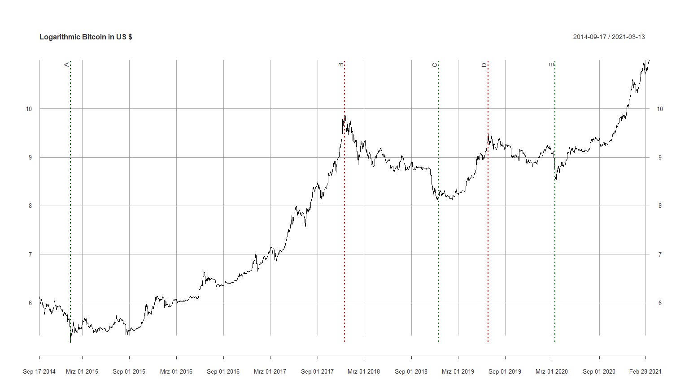
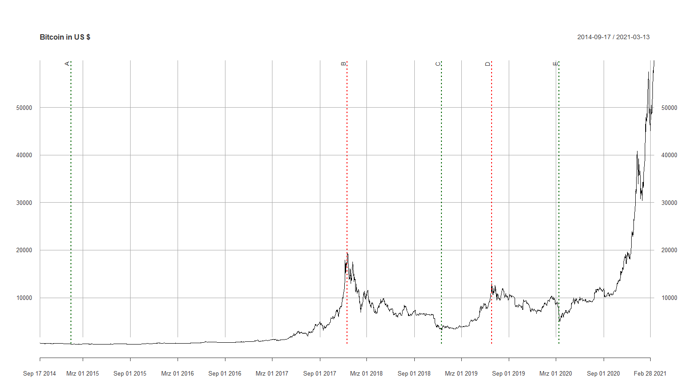

## 3. Theory {#theory}

The following chapter is intended to provide the theoretical foundations necessary for our work. It is divided into a part that provides an overview of artificial neural networks. Followed by section [2.3.](#bitcoin) that shows the background and the ecosystem of Bitcoin. This knowledge should be kept in mind, which should help in understanding the price formation of Bitcoin.

### 3.1. Neural network {#neural_network}

In the context of this work, artificial neural networks are used to answer supervised learning questions that focus on classification of data. This means that a neural network finds a correlation between the data and their labels and optimizes its parameters in order to minimize the error for the next try. This process is called supervised training and is performed with a test data sample. An application example of classification is that a neural network is used for face recognition after it has learned the classification of different faces in the process of supervised training. Predictive analysis works similarly to the classification of labeled data. It estimates future values based on past events and can be trained with historical data. On the other hand, unsupervised learning (clustering) is applied to detect patterns from unlabeled data. Based on these patterns, for example, anomalies can be detected that are relevant in the fight against fraud (fraud detection). Unsupervised learning is not discussed further in this paper.

Section [3.1.1.](#perceptron) will demonstrate the functioning of a neural network using a simple perceptron.

### 3.1.1. Perceptron {#perceptron}

The construction of an artificial neural network is demonstrated using a perceptron. It is a simple algorithm for supervised learning of binary classification problems. This algorithm classifies patterns by performing a linear separation. Although this discovery was anticipated with great expectations in 1958, it became increasingly apparent that these binary classifiers are only applicable to linearly separable data inputs. This was only later addressed by the discovery of multiple layer perceptrons (MLP). [@perceptron_paper]

(Rosenblatt, 1958)

Basically, a perceptron is a single-layer neural network and consists of the following five components and can also be observed in figure \@ref(fig:perceptron_schema).

1.  Inputs

2.  Weights

3.  Bias

4.  Weighted sum

5.  Activation function

Inputs are the information that is fed into the model. In the case of econometric time series, it is mostly the current and historical log returns (lags). These are multiplied by the weights and added together with the bias term to form the weighted sum. This weighted sum is finally passed on to the non-linear activation function, which determines the output of the perceptron.

```{r perceptron_schema, out.width='80%', fig.cap='Schematic diagram of a perceptron.', echo=FALSE}
knitr::include_graphics("images/Perceptron.jpg")
```

The perceptron can also be represented as a function. Analogous to the representation above, the inputs $x_{i}$ are multiplied by the weights $w_{i}$ in a linear combination. Then an error term is added so that the whole can be packed into the non-linear activation function $g(S)$ . $\hat{y}$ is the binary output of this perceptron. With the aid of an activation function, a binary output is obtained. The Heaviside step function shown in figure \ref{fig:perceptron_schema} is usually only used in single layer perceptrons, which recognize linear separable patterns. For the multi layer neural networks presented later, step functions are not an option, because in the course of the backpropagation algorithm the gradient descent has to be minimized. This requires derivatives of the activation function, which in the case of this Heaviside step function equals 0. Because the foundation for the optimization process is missing, functions like the sigmoid function or the hyperbolic tangent function are used. More about this topic is discussed in chapter [3.1.2.](#backprogation_algorithm). [@nn_learning_theoretical_foundations]

```{=tex}
\begin{align} \label{eq:perceptron}
\hat{y}=g(w_{0}+\sum_{i=1}^{n}x_{i}w_{i})
\end{align}
```
(Anthony and Bartlett, 1999)

As just mentioned, the aim is to feed the perceptron with the training set and change the weights $w_{i}$ with each cycle so that the prediction becomes accurate. The output value is compared to the desired value. Finally, the sign of the difference $y-\hat{y}$ determines whether the inputs of that iteration are added to or subtracted from the weights. Ideally, the weights will gradually converge and provide us with an usable model. [@nn_learning_theoretical_foundations]

### 3.1.2. Backpropagation algorithm {#backprogation_algorithm}

Finding the optimal weights of the neural network is achieved by finding the minimum of an error function. One of the most common methods for this is the backpropagation algorithm. This algorithm searches for the minimum of the error function by making use of a method called Gradient Descent. The gradient method is used in numerics to solve general optimization problems. In doing so, we progress (using the example of a minimization problem) from a starting point along a descent direction until no further numerical improvement is achieved. Since this method requires the computation of the gradient of the error function after each step, a continuity and differentiability of this function must necessarily be given. The step function mentioned above in section 3.1.1 is therefore out of the question, but a non-linear function such the logistic and the hyperbolic tangent functions (sigmoid).

```{=tex}
\begin{align} \label{eq:sigmoid_logistic}
y(v_{i})=(1+e^{-v_{i}})^{-1}
\end{align}
```
```{=tex}
\begin{align} \label{eq:sigmoid_tanh}
y(v\_{i})=tanh(v\_{i})
\end{align}
```
While the target range of the 'ordinary' sigmoid function is between 0 and 1, the $y$ of the Tanh function ranges between -1 and 1.

```{r sigmoid, echo=FALSE, fig.cap="Two common sigmoid activation functions: logistic functions and hyperbolic tangent."}
# Define x
x <- seq(-5, 5, 0.02)

# Calculate target variables for both functions
l <- (1 + exp(-x))^(-1)
t <- tanh(x)

# Plotting sigmoid functions
plot(x = x, y = l, type = "l", main = "Activation functions", xlim = c(-5,5), ylim = c(-1, 1), ylab = "y")
lines(x = x, y = t, col = 2)
legend("bottomright", legend = c("Logistic", "Tanh"), col = c(1,2), pch = "-", cex = 1)
```

[@backpropagation]

### 3.1.3. Types of artificial neural networks {#types_of_nn}

-   MLP / DNN (explain nodes and layers)

-   Recurrent neural networks (RNN)

-   Long-short term memory (LSTM)

### 3.1.4. Challenges

-   Early stopping required to avoid overfitting to in-sample data

-   Gradient vanishing problem

Sigmoid suffers from the problem of Vanishing Gradient. The gradients of the NN's output with respect to the parameters become so small, that the NN takes smaller steps towards the minima of the loss function and eventually stop learning.

-   Dying Relu Problem (?)

### 3.2. Bitcoin {#bitcoin}

In this section bitcoin as a crypto-curreny is introduced. The historical data is analyzed and commented. Further the technology in and around crypto-currencies is briefly explained. A detailed explanation would require a paper itself, therefore the explanation is done as simple as possible.

In the following work bitcoin as a cryptocurreny is mentionend in its short term BTC, by the meaning of US Dollars per Bitcoin.

#### 3.2.1. Historical analysis


The story of bitcoin began with a paper published by the name of Satoshi Nakamoto @Book[@bitcoin]. The publisher of the document cannot be assigned to a real person, therefore the technology inventor remains mysteriosly unknown until today. In 2009 the first transaction was executed. Because of the opensource technology of bitcoin, lots of alternative currencies were created. Until 2013 the cryptocurrencies operated under the radar of most regulatory institutions. Because of the anonymity of the transactions, criminals were attracted by the newborn payment method. Headlines,  such as the seizure of 26,000 bitcoins by closing the "Dark-Web" Website Silkroad through the Drug Enforcement Agency, followed moreoften in the newspapers. Nevertheless in 2014 more companys,such as :Zynga, D LasVegas Casinos, Golden Gate Hotel & Casino, TigerDirect, Overstock.com, Newegg, Dell, and even Microsoft. began to accept bitcoin as a payment method. In 2014 the first derivative with bitcoin as an underlying was approved by the U.S.Commodity Futures Trading Commission. 2015  estimated 160000 merchants used bitcoin to trade {#A History of Bitcoin}. Regarding the price in\ref{price_btc} and the log(price)\ref{logprice_btc} At Letter \textbf{A} we can observe a drop of 20% after news from the trial of Ross Ulbricht, founder of Silk road.  From this point in time,
things began to change, more volume was flushed in the market and the price of BTC began to ascend and the real rally began ,the BTC rose up to  20k USD / BTC on 17th September 2017 \textbf{B}. After the rise comes the fall and BTC lost value for more than a year until \textbf{C} 2018-12-15 the trend reverted and found its peak after 6 months in \textbf{D} 2019-06-26, but oncemore it was not lasting for long as bitcoin lost \textbf{D} 2020-03-12 nearly half its value in 4 days. But the story wasn't over by now after the drop, the price of the cryptocurrency regained value, passed  previous levels and shortly after exploded, after companies like tesla and signal bought a big chunk of bitcoins, into a maximum of 58000 USD per bitcoin. 


15% in January 2015 one week after the announcement of bitstamp that it has been hacked and lost 19.000 BTC.
```{r logprice_btc, out.width='80%', fig.cap='Schematic diagram of a perceptron.', echo=FALSE}

```


```{r price_btc, out.width='80%', fig.cap='Schematic diagram of a perceptron.', echo=FALSE}

```
#### 3.3.2. SHA256 Hash

-   Block
-   Blockchain
-   Distributed Blockchain
-   Token
-   Coinbase Transaction
-   Public/Private Key -\> Signing
-   Signature (sign, verify)
-   Transaction

\newpage

### 3.7. Reference

#### 3.7.1. Figure Reference

As you can see in figure \ref{fig:fig1} -\> GOOGLE

```{r fig1, echo=FALSE, fig.cap="Visualization of the adjusted prices of the Alphabet Inc Class A Stock."}
GOOGL <- getSymbols("GOOGL", auto.assign=F)
g.adj <- GOOGL[,6]
par(mfrow=c(1,1))
plot(g.adj, main="Adjusted Prices ~ Google")
```

\newpage

#### 3.7.2. Equation Reference

GARCH-formula can be seen in \ref{eq:garch}

```{=tex}
\begin{align} \label{eq:garch}
  \epsilon_{t} &= \mathrm{log}(x_{t})-\mathrm{log}(x_{t-1}) \nonumber \\
  \epsilon_{t} &= \sigma_{t}u_{t} \\
  \sigma_{t}^{2} &=c \sigma^{2}+\sum_{j=1}^{n}\alpha_{j}\sigma_{t-j}^{2}+\sum_{k=1}^{m}\beta_{k}\epsilon_{t-k}^{2} \nonumber
\end{align}
```
\newpage

#### 3.7.3. Table Reference

In table \ref{tab:coeftable} you can see the flexerino of the coefficients.

```{r coeftable, echo=FALSE, message=FALSE}
g.adj.lr <- na.exclude(diff(log(g.adj)))
g.subset.lr <- head(g.adj.lr, length(g.adj.lr)-100)
y.garch_11 <- garchFit(~garch(1,1), data=g.subset.lr, delta=2, include.delta=F, 
                       include.mean=F, trace=F)
r1 <- y.garch_11@fit$matcoef[,1]
r2 <- y.garch_11@fit$matcoef[,2]
r3 <- y.garch_11@fit$matcoef[,4]
paras <- data.frame(r1, r2, r3)
rownames(paras) <- c("$\\omega$", "$\\alpha_{1}$", "$\\beta_{1}$")
colnames(paras) <- c("Estimate", "Std. Error", "p-Value")
kable(paras, "latex", escape=F, booktabs = T, linesep="", caption="Coefficients GARCH(1,1).", digits=20)
```

> > > > > > > \newpage

#### 3.7.4. Section Reference {#sec-ref}

Here we can see a wild section, which will reference to itself: [2.7.4.](#sec-ref)

Or reference to the Bitcoin-section [2.3.](#bitcoin)

\newpage

#### 3.7.5. Literature Reference

Add bibliography reference in the `.bib`-file in the add folder.

Here I make a reference to the original bitcoinpaper [@bitcoin] or to the specific page on the NN financial trading paper [@nnfin, pp. 6-8].
