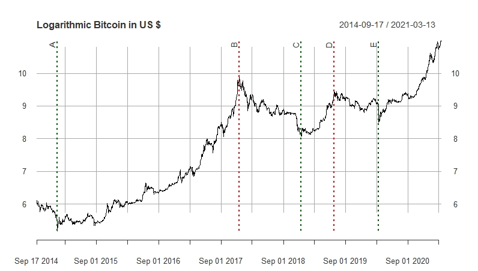

## 2. Theory {#theory}

The following section is intended to provide the theoretical foundations necessary for our work. It is divided into a part that provides an overview of artificial neural networks. Followed by section [2.4](#bitcoin) which shows the background and the ecosystem of Bitcoin. This knowledge should be kept in mind, which should help in understanding the price formation of Bitcoin.

### 2.1. Neural network {#neural_network}

In the context of this work, artificial neural networks are used to answer supervised learning questions that focus on the classification of data. This means that a neural network finds a correlation between the data and their labels and optimizes its parameters to minimize the error for the next try. This process is called supervised training and is performed with a test data sample. An application example of classification is that a neural network is used for face recognition after it has learned the classification of different faces in the process of supervised training. Predictive analysis works similarly to the classification of labeled data. It estimates future values based on past events and can be trained with historical data. On the other hand, unsupervised learning (clustering) is applied to detect patterns from unlabeled data. Based on these patterns, for example, anomalies can be detected that are relevant in the fight against fraud (fraud detection). Unsupervised learning is not discussed further in this paper. Section [2.1.1](#perceptron) will demonstrate the functioning of a neural network using a simple perceptron.

#### 2.1.1. Perceptron {#perceptron}
&nbsp;

The construction of an artificial neural network is demonstrated using a perceptron. It is a simple algorithm for supervised learning of binary classification problems. This algorithm classifies patterns by performing a linear separation. Although this discovery was anticipated with great expectations in 1958, it became increasingly apparent that these binary classifiers are only applicable to linearly separable data inputs. This was only later addressed by the discovery of multiple layer perceptrons (MLP) [@perceptron_paper]. Basically, a perceptron is a single-layer neural network and consists of the following five components and can also be observed in figure \ref{fig:perceptron_schema}.

1.  Inputs

2.  Weights

3.  Bias

4.  Weighted sum

5.  Activation function

Inputs are the information that is fed into the model. In the case of econometric time series, it is mostly the current and historical log returns (lags). These are multiplied by the weights and added together with the bias term to form the weighted sum. This weighted sum is finally passed on to the non-linear activation function, which determines the output of the perceptron.

\newpage

```{r perceptron_schema, fig.align='center', out.width='70%', fig.cap='Schematic diagram of a perceptron. The input data is combined with the weights and added up to a weighted sum. After adding an error term (bias), the activation function is applied to the total sum to produce the output.', echo=FALSE}
knitr::include_graphics("images/Perceptron.jpg")
```

The perceptron can also be represented as a function, which can be seen in equation \ref{eq:perceptron}. Analogous to the representation above, the inputs $x_{i}$ are multiplied by the weights $w_{i}$ in a linear combination. Then an error term is added so that the whole can be packed into the non-linear activation function $g(S)$ . $\hat{y}$ is the binary output of this perceptron. With the aid of an activation function, binary output is obtained. The Heaviside step function shown in figure \ref{fig:perceptron_schema} is usually only used in single layer perceptrons, which recognize linear separable patterns. For the multi-layer neural networks presented later, step functions are not an option, because in the course of the backpropagation algorithm the gradient descent has to be minimized. This requires derivatives of the activation function, which in the case of this Heaviside step function equals 0. Because the foundation for the optimization process is missing, functions like the sigmoid function or the hyperbolic tangent function are used [@nn_learning_theoretical_foundations]. More about this topic is discussed in section [2.1.2](#backprogation_algorithm).

```{=tex}
\begin{align} \label{eq:perceptron}
\hat{y}=g(w_{0}+\sum_{i=1}^{n}x_{i}w_{i})
\end{align}
```
As just mentioned, the aim is to feed the perceptron with the training set and change the weights $w_{i}$ with each cycle so that the prediction becomes more accurate. The output value is compared to the desired value. Finally, the sign of the difference $y-\hat{y}$ determines whether the inputs of that iteration are added to or subtracted from the weights. Ideally, the weights will gradually converge and provide us with a usable model [@nn_learning_theoretical_foundations].

\newpage

#### 2.1.2. Backpropagation Algorithm {#backprogation_algorithm}
&nbsp;

Finding the optimal weights of the neural network is achieved by finding the minimum of an error function. One of the most common methods for this is the backpropagation algorithm. This algorithm searches for the minimum of the error function by making use of a method called gradient descent. The gradient method is used in numerics to solve general optimization problems. In doing so, we progress (using the example of a minimization problem) from a starting point along a descent direction until no further numerical improvement is achieved. Since this method requires the computation of the gradient of the error function after each step, continuity and differentiability of this function must necessarily be given. The step function mentioned above in section [2.1.1](#perceptron) is therefore out of the question. However, non-linear functions such as the logistic and the hyperbolic tangent functions fulfill these conditions [@backpropagation].


Both activation functions are visible in figure \ref{fig:sigmoid}. While the target range of the 'ordinary' sigmoid function (equation \ref{eq:sigmoid_logistic}) is between 0 and 1, the $\hat{y}$ of the hyperbolic tangent function (equation \ref{eq:sigmoid_tanh}) ranges between -1 and 1. $v_{i}$ equals the weighted sum including bias term.

```{=tex}
\begin{eqnarray}
\hat{y}(v_{i})=(1+e^{-v_{i}})^{-1} \label{eq:sigmoid_logistic} \\
\hat{y}(v_{i})=\tanh(v_{i}) \label{eq:sigmoid_tanh}
\end{eqnarray}
```


```{r sigmoid, fig.align='center', echo=FALSE, fig.cap="Two common non-linear sigmoid activation functions: In black, the logistic function, which returns values between 0 and 1. In red the hyperbolic tangent function, which returns values between -1 and 1."}
# Define x
v <- seq(-5, 5, 0.02)

# Calculate target variables for both functions
l <- (1 + exp(-v))^(-1)
t <- tanh(v)

# Plotting sigmoid functions
plot(x = v, y = l, type = "l", main = "Activation functions", xlim = c(-5,5), ylim = c(-1, 1), ylab = "y")
lines(x = v, y = t, col = 2)
legend("bottomright", legend = c("Logistic", "Tanh"), col = c(1,2), pch = "-", cex = 1)
```

In the course of the error analysis, the output of the neural network and the result from the activation function in the output layer is compared with the desired value. The most commonly used error function E is the Mean Squared Error (MSE), which is seen in equation \ref{eq:mse}. $y_{i}$ represents the actual value for the data point $i$, while $\hat{y}_{i}$ is the predicted value for data point $i$. The average of this error function is the average MSE, which is determined for a corresponding model. The learning problem is to adjust the weights $w_{i}$ within the training sample so that $MSE(w)$ is minimized [@efficient_backprop].

```{=tex}
\begin{align} \label{eq:mse}
  E &=MSE(w) \\
  &=\frac{1}{n}\sum_{i = 1}^{n}(y_{i}-\hat{y}_{i})^2 \nonumber \\
  &=\frac{1}{n}\sum_{i = 1}^{n}(y_{i}-g(w_{0}+x_{i}w_{i}))^2 \nonumber 
\end{align}
```
As mentioned, this is searched for by the gradient descent method. The gradient of a function is a vector whose entries are the first partial derivatives of the function. The first entry is the partial derivative after the first variable, the second entry is the partial derivative after the second variable and so on. Each entry indicates the slope of the function in the direction of the variable to which it was derived. In this work, the notation $\nabla{E}$ is used when talking about the gradient for the error function $E$, which is displayed in equation \ref{eq:gradient_descent} [@backpropagation].

```{=tex}
\begin{align} \label{eq:gradient_descent}
\nabla{E}=(\frac{\partial E}{\partial w_{1}},
\frac{\partial E}{\partial w_{2}},
\dots,
\frac{\partial E}{\partial w_{i}})
\end{align}
```
The weights get adjusted according to the following algorithm \ref{eq:weight_adj} where $\Delta{w_{i}}$ is the change of the weight $w_{i}$ and $\gamma$ represents a freely definable parameter. In literature, this parameter is often called a learning constant [@backpropagation_proofs]. The negative value is used because the gradient naturally points in the direction with the largest increase of the error function. To minimize the MSE, the elements in the gradient $\nabla{E}$ must be multiplied by -1.

```{=tex}
\begin{align} \label{eq:weight_adj}
\Delta{w_{i}}=-\gamma\frac{\partial E}{\partial w_{i}}, \\
\text{for } i=1,2,\dots,n \nonumber
\end{align}
```

\newpage

#### 2.1.3. Multilayer Perceptron {#MLP}
&nbsp;

Multilayer perceptrons (MLP) are widely used feedforward neural network models and make usage of the backpropagation algorithm. They are an evolution of the original perceptron proposed by Rosenblatt in 1958 [@perceptron_paper]. The distinction is that they have at least one hidden layer between input and output layer, which means that an MLP has more neurons whose weights must be optimized. Consequently, this requires more computing power, but more complex classification problems can be handled [@mlp_architecture]. figure \ref{fig:mlp_schema} shows the structure of an MLP with $n$ hidden layers. Compared to the perceptron, it can be seen that this neural network consists of an input layer, one or more hidden layers, and an output layer. In each layer, there is a different number of neurons, which are also called nodes. These properties (number of layers and nodes) can be summarized with the term 'network architecture' and will be dealt with in this thesis.

```{r mlp_schema, fig.align='center', out.width='60%', fig.cap='Schematic diagram of a multilayer perceptron. On the left, you see the input layer, on the right the output layer. All layers in between are described as hidden layers. If there is more than one hidden layer, it is referred to as a deep learning neural network.', echo=FALSE}
knitr::include_graphics("images/MLP.jpeg")

# https://assets.website-files.com/5ac6b7f2924c652fd013a891/5edab65ea64212da0ad611b7_5d52f096076d2b058e88cf0c_Artificial-neural-network-architecture-ANN-i-h-1-h-2-h-n-o.jpeg
```

Every neural network has an input layer, which consists of one or more nodes. This number is determined by the training data and tells us how many features should be delivered to the neural network. In the case of Bitcoin prices, we could use today's price and the prices from the last 10 days (lags 1-10), so the input layer would consist of 11 nodes. Some configurations also require a bias term to adjust the output along with the weighted sum, which is also added to the input layer. In contrast to the scheme of the MLP, this setup can be seen in figure \ref{fig:perceptron_schema} where the bias term is defined as 'constant'. Similarly, to the input layer, each neural network has exactly one output layer. This can consist of one or more nodes. In this thesis, MLP is used as a regressor and therefore only one neuron is needed in this layer.

In between are the hidden layers, whose number and size can be configured as desired. The challenge is to find an optimal and efficient configuration without causing overfitting of the training data. The number of hidden layers depends primarily on the application area of the neural network. For example, working with image recognition would require more layers since the image file is broken down into individual pixels. Subsequently, the layers are used to optimize from rough outlines to the smallest detail. In our research, we came across several methods or 'rules of thumb' to optimize the model. A frequently suggested method is explained by Andrej Karpathy (director of the AI department of Tesla, Inc.). His GitHub entry recommends the approach of starting with a model that is too large and causes overfitting. Subsequently, the model is reduced by focusing on increasing training loss and improving validation loss [@recipe_training].

\newpage

#### 2.1.4. Challenges {#challenges}
&nbsp;

In this section, we address the two fundamental challenges when dealing with neural networks.

##### 2.1.4.1. Overfitting {#overfitting}
&nbsp;

We have encountered several challenges that can occur when using neural networks. One of these possible problems is called overfitting. The goal of a neural network is to build a statistical model of the training set that is capable of generating the data. In overfitting on the other hand, the exact conditions of the training data including noise are reproduced. The focus is no longer on the underlying function. Last but not least, an unnecessarily large number of parameters or epochs can be 'consumed' for this, which makes the whole process relatively inefficient [@RNN]. 

##### 2.1.4.2. Vanishing Gradient Problem {#vanishing_gradient}
&nbsp;

Another characteristic that requires our attention is the vanishing gradient problem. As explained in section [2.1.2.](#backpropagation_algorithm), the weights of the neural network are adjusted using the gradient of the loss function. Thereby, the problem can occur that the gradient almost vanishes. The error function's gradients become so small that the backpropagation algorithm takes smaller steps towards the loss function's minima and eventually stops learning. For example, if the derivative of an activation function such as the logistic sigmoid function approaches zero for extremely large or small values for $x$. To avoid these extreme values for $x$, the inputs are scaled and normalized in this paper. This ensures that the definition range is within the range where the gradient is still large enough for the backpropagation algorithm.  

\newpage

### 2.2. Explainable Artificial Intelligence {#xai}

Depending on the model architecture, a neural network can be a very complex construct. A number of weights and biases linked to the neurons lead to an output of the network through training. Understanding how exactly the alterations of the weights and biases lead to this output is a rather complex task. Due to this difficulty in interpretation, neural networks are often referred to as black boxes [@blackbox].

Although the networks may lead to desired results, it can be important to build an understanding of these models. Suppose we are developing a classification method in supervised learning for a particular problem. A classical approach such as linear regression is easy to understand and we can convince people with little knowledge of mathematics of the usefulness of this method. Considering that a good and simple explanation may depend on investment, would an investor fund something that is not understood and difficult to get a grasp of? Neural networks with their non-linearity and the large number of parameters does not make it easy for the user to convince an investor of the benefits of a neural network.

#### 2.2.1. Classic Approach {#classic}
&nbsp;

As mentioned earlier, it is almost impossible to explain the networks based on the weights and biases. The following methods try to find effects on the features. One tries to find out which influence a certain feature has on the prediction of the network. There are classical approaches for explaining neural networks in the applications such as image recognition or text mining.

A widely used approach is the Shapley value which has its origin in game theory. With this method, one tries to find out how big the influence of a feature is. So how much a feature contributes to the prediction. The problem with this method is that it mixes the data at different points in time. In this paper, we study the prediction of financial time series, i.e. autocorrelated data. Thus, this approach is not suitable for our application to interpret the importance of individual features (lagged log returns) [@slide_xai].

An approach like ALE (Accumulated Local Effects) examines how the network reacts to change [@slide_xai]. The features (lags) are plotted in order against ALE in a graph. The problem with this method is that the plotted features do not contain the dimension of time. It could be that two very high values are very close to each other in the plot, but in reality, they occurred years after each other.

Another approach is the LIME (Local Interpretable Model-agnostic Explanations). This method examines the change of the forecast when changing the input data. A permuted data set is generated from the given data (for example, adding standardized noise). Using this artificially altered data set, an interpretable model (regression) is created to analyze the change in features [@xai_blackbox]. Changing the data affects the time dependence of the data. Thus, this method is also unusable for our application.

\newpage

#### 2.2.2. Explainability for Financial Time Series {#xai_finance}
&nbsp;

For the interpretation of financial time series, we would like to keep the dependency structure. The changes in trend or variability should be maintained. The sequence should not be shuffled. When mixing up the order, a value from far back could suddenly play a bigger role for the model than a current one. Intuitively, this would not add any value to financial time series.

For our application, the lagged log returns of Bitcoin prices, are the features to be studied (in this paper we are focusing on Bitcoin, here we are already using it as a means of explaining neural networks. A detailed description of BTC follows in sections [2.4](#bitcoin) and [3.1](#data_exploration)). We want to explore how the features affect the output of the neural network. A network is trained with delayed values as the input layer to match the output as closely as possible to the original values (the non-delayed ones). This concept strongly resembles a linear regression. $Y$ is what we want to achieve or what has occurred in reality. The following equation establishes a relationship of the lagged data with the regression coefficients.

```{=tex}
\begin{align} \label{eq:lm1}
  Y_{i}=\beta_{0}+\beta_{1}*x_{i}^{(1)}+\beta_{2}*x_{i}^{(2)} + ... + \epsilon_{i}, \epsilon_{i} \sim \mathcal{N}(0, \sigma^{2})
\end{align}  
```

In our concrete example, the equation would look like this.

```{=tex}
\begin{align} \label{eq:lm2}
 \text{Data}^{(lag=0)}_{t}=\text{Intercept}+\beta_{1}*\text{Data}^{(lag=1)}_{t}+\beta_{2}*\text{Data}^{(lag=2)}_{t} + ... + \epsilon_{i}
\end{align}  
```

Now, what could the fitted regression coefficients tell us about the respective lagged values. For that, we can look at the autocorrelation function of the Bitcoin log returns in figure \ref{fig:xai_acf}. Lags at 6 (red) and 10 (orange) have a positive impact on the original data structure. In the context of the time series, this means that there is a strong 6- or 10-day dependency. 

&nbsp;

```{r xai_acf, fig.align='center', echo=FALSE, fig.cap="Autocorrelation function of BTC/USD. In red and orange you can see significant positive ACF's at lags 6 and 10. These signal some importance for model considerations. Between 6 and 10, the ACF's are negative and thus would have a negative effect on a model. For further considerations, all lags from 6 to 10 are included.", out.width='75%', fig.width = 8, fig.height = 5}
# Load Data
load("data/log_ret_27_03_21.rda")
load("data/BTC_USD_27_03_21.rda")
load("data/xai_data.rda")
load("data/xai_lm.rda")

btc <- BTC_USD_27_03_21$`BTC-USD.Adjusted`
logret <- log_ret_27_03_21

par(mfrow=c(1,1))
chart.ACF.phil.special(logret, ymax=0.06, maxlag = 20, main="BTC log return dependency structure")
```

\newpage

Looking at the regression coefficients in table \ref{tab:lm_tab}, we can discover the relationship between the ACF's and the coefficients of the regression. Again, lags 6 and 10 make the largest positive contribution to the fit of the model. Lags 7, 8, 9 make a negative contribution, as can also be seen in the ACFs.  Sign and value are in line with the ACF's.

```{r lm_tab, echo=FALSE}
library(kableExtra)
name <- c("Intercept", "Lag 1", "Lag 2", "Lag 3", "Lag 4", "Lag 5",
          "Lag 6", "Lag 7", "Lag 8", "Lag 9", "Lag 10")  
z <- as.numeric(round(xai_lm$coefficients,4))
df <- as.data.frame(rbind(name,z))
colnames(df) <- NULL
rownames(df) <- NULL
kbl(df, caption="Coefficients 6 (red) and 10 (orange) have the greatest positive impact on the model. In between, the coefficients are negative.", booktabs = T, linesep = "") %>%
  kable_styling(latex_options = c("hold_position")) %>%
  column_spec(1:6, color="#000000") %>%
  column_spec(7, color="#f6004a") %>%
  column_spec(8, color="#004c6d") %>%
  column_spec(9, color="#0075b6") %>%
  column_spec(10, color="#665191") %>%
  column_spec(11, color="#ff7c43")
```

Now we would like to create such an analogy with neural networks. In the case of linear regression, the coefficients, or the weights of the lagged data are the solutions of the partial derivatives of the optimization function. One obtains a coefficient for each lag, thus the respective weight, is time independent. We would now like to extend this concept. We want to keep the structure of the time series, the time dependence.

We can now calculate the partial derivatives of the output of a neural network with the respective input data of time $t$ for each time $t$. We obtain the coefficients or weights $\Delta_{jt}$.

```{=tex}
\begin{align} \label{eq:xai_partial}
\Delta_{jt} = \frac{\partial \text{Output}_{t}}{\partial \text{Data}^{(lag=j)}_{t}}
\end{align}  
```

Basically, we have a similar concept as above with the regression. Only here the coefficients are the partial derivatives that establish the relationship between input and output at each point in time. Whereas in regression you would only have 1 coefficient to estimate per input neuron $\beta_{i}$, here you have one coefficient $\Delta_{it}$ for each input neuron at each time point $t$.

```{=tex}
\begin{align} \label{eq:xai_fit}
\text{Output}_{t} = \text{Intercept} + \Delta_{1t}*\text{Data}^{(lag=1)}_{t} + \Delta_{2t}*\text{Data}^{(lag=2)}_{t} + ... + \Delta_{qt}*\text{Data}^{(lag=q)}_{t}
\end{align}  
```

In simpler terms, we train a neural network with input data of length up to lag $q$. Now we change a data point at time $t$, we add a disturbance term by $\delta$. So, we change the value of an explanatory variable, one of our features. Suppose our input data at time $t$ looks like this.

$$X_{t} = x_{1t}+x_{2t}+...+x_{qt}$$
For the feature at lag 1, we now want to calculate the partial derivative. We create a new data set $Y$ and change the data point at lag 1.

$$Y_{t} = x_{1t}+(\delta*x_{1t})+x_{2t}+...+x_{qt}$$
With the trained network we now generate two predictions for time $t$. Once with the original data $NN(X)$ and once with the data with the slightly altered value $NN(Y)$. Now we can calculate the discrete approximated partial derivative.

$$\Delta_{1t} = \frac{\text{NN}(X_{t}) - \text{NN}(Y_{t})}{\delta*x_{1t}}$$

The output of the neural network changes by the value $\Delta_{1t}$ if the input is changed by 1. This procedure can now be performed for each feature at each time point. This gives us the derivatives for each feature and time point, which makes an explanation of neural networks more feasible. We call these newly generated data sets linear parameter data (LPD) [@slide_xai].

\newpage

In figure \ref{fig:xai_plot1}, you can see the $\Delta_{it}$, that is, the partial derivatives from equation \ref{eq:xai_fit} up to $q=10$, and you can see the intercept. For the comparison to the linear regression and the autocorrelation, only the lags 6 to 10 are explicitly highlighted. A detailed identification of all LPD's can be seen in figure \ref{fig:xai_plot2}.

It is noticeable that the structure of LPD's strongly resembles the logarithmic returns of BTC. The heteroskedasticity of the log returns, i.e. the volatility clusters are also evident in the LPD's. If the BTC is in a turbulent phase, then the partial derivatives also fluctuate. 

&nbsp;

```{r xai_plot1, fig.align='center', echo=FALSE, fig.cap="Upper panel: LPD's of BTC's log returns. Only lags between 6 and 10 are highlighted in color. Lag 6 (red) and 10 (orange) have the largest positive impact. 7, 8 and 9 have a negative impact. Lower panel: Logarithmic returns of BTC. Phases with high volatility are visible in both panels, as the input data (log returns) affect the LPD's.", out.width='100%', fig.width = 11, fig.height = 8.5}
par(mfrow=c(2,1))
colorino <- c("#000000", "#000000", "#000000", "#000000", "#000000", "#000000", "#f6004a", "#004c6d", "#0075b6", "#665191", "#ff7c43")
plot(xai_data, main="LPD ~ Bitcoin", col=colorino)
for (i in c(7,8,9,10,11))
  mtext(colnames(xai_data)[i], col=colorino[i], line=-i*0.8)
plot(logret, main="Log Return ~ Bitcoin")
```

In the autocorrelations (figure \ref{fig:xai_acf}) and in the regression coefficients (table \ref{tab:lm_tab}), lags 6 and 10 have a significant positive effect, while lags 7, 8, and 9 have a negative effect. This is also the case for the LPD's. Lag 6 (red) and lag 10 (orange) have a positive sign and have the largest positive effects on an eventual model in terms of absolute value. Lags 7, 8 and 9 (dark blue, light blue and purple) have the largest negative effects here, as well as in the autocorrelations and regression coefficients.

\newpage

To provide a more accurate and better comparison between regression and XAI, table \ref{tab:lpd_tab} compares the regression coefficients with the mean values of the LPDs. Although the values are not equal, the signs are the same. With this knowledge, we can say that both procedures are similar. Through this similarity, a connection can be made. As already explained in section [2.2.1](#classic), a linear regression is easier to explain and therefore more likely to be used. With this transfer between these two procedures, a bridge can be built.

```{r lpd_tab, echo=FALSE}
library(kableExtra)
name <- c("Lag 6", "Lag 7", "Lag 8", "Lag 9", "Lag 10")
lr <- round(as.numeric(coef(xai_lm)[c(7,8,9,10,11)]), 5)
lpd <- round(as.numeric(apply(na.omit(xai_data), 2, mean)[c(7,8,9,10,11)]), 5)

df <- as.data.frame(rbind(name, lr, lpd))
colnames(df) <- NULL
rownames(df) <- c(" ","LR", "LPD")
kbl(df, caption="Comparison between linear regression (LR) and linear parameter data (LPD) coefficients. Again, lags 6 and 10 have the largest positive effect in the respective model. Also 7, 8 and 9 all have a negative sign.", booktabs = T, linesep = "") %>%
  kable_styling(latex_options = c("hold_position")) %>%
  column_spec(1, color="#000000") %>%
  column_spec(2, color="#f6004a") %>%
  column_spec(3, color="#004c6d") %>%
  column_spec(4, color="#0075b6") %>%
  column_spec(5, color="#665191") %>%
  column_spec(6, color="#ff7c43")
```

&nbsp;

Together with the findings from the visualization in figure \ref{fig:xai_acf} and the autocorrelations in figure \ref{fig:xai_plot1}, a connection can be established. Strong autocorrelations, i.e. large dependencies on a given delay, can be recognized in the partial derivatives. With the help of the LPD's and the autocorrelations, the behavior of neuronal networks could be explained with the handling of time series. The delayed input of a neural network seems to have probably a connection with the ACF's.

Thus, we can say that at best, with this method of calculating the partial derivatives for each feature at each time t, we may have found an explanation for the black box of neural networks. With this method we cannot explain how the network led to exactly this prediction using the backpropagation algorithm with the many weights and error terms, but the basic structure, i.e. information which is in the data (for example the autocorrelation), can be found. The ACF is a basic method to find structures in time series and here, with the LPD's you can fall back on exactly this ACF. Despite the complexity of the networks, this special procedure for the XAI leads to the basic ACF's, thus improving the explainability.

Another finding is the correlated behavior of the partial derivatives and the original time series. Volatile log return of the BTC leads to unstable derivatives. In other words, during a turbulent phase in the market, the neural networks are unstable, leading to unstable solutions. This particular behavior can potentially be used for possible trading decisions, which will be explored in section [3.3](#trading-strat)
.

\newpage

### 2.3. Model Comparison {#model_comparison}

This thesis sets the goal to compare the different neural network architectures presented in order to find the best model. To quantify the quality of the prediction as well as the trading performance, we make use of the following measures.

#### 2.3.1. Sharpe Ratio {#sharpe_ratio}
&nbsp;

The first measure refers to the performance of the trading strategy based on the sign of the prediction $t+1$ and is called Sharpe ratio. Sharpe ratio is a very powerful and widely used ratio to measure performance and it describes return per risk.

```{=tex}
\begin{align} \label{eq:Sharpe}
  \text{Sharpe Ratio} = \frac{R_{p}-R_{f}}{\sigma}
\end{align}
```

$R_{p}$ represents the return of the portfolio, while $R_{f}$ equals the risk free rate. $\sigma$ is the standard deviation of the portfolios excess return (risk). For the comparison of different series, the Sharpe Ratio needs to be annualized with $\sqrt{365}$ as the crypto market is open 24/7.

#### 2.3.2. Mean Squared Error (MSE) {#MSE}
&nbsp;

The second performance measurement method is also widely used and called mean squared error. Its calculation is very simple, for every timestep the estimated value is subtracted from the real empirical value, squared and then summarized and divided by the absolute number of observations as seen in equation \ref{eq:MSE}.

```{=tex}
\begin{align} \label{eq:MSE}
  \text{MSE} &= \frac{1}{N}\sum_{i = 1}^{N}(\text{realvalue}_{i}-\text{prediction}_{i})^2 \\
  &= \frac{1}{N}\sum_{i = 1}^{N}(y_{i}-\hat{y}_{i})^2
\end{align}  
```

The application of MSE is widely used in statistical modeling and supervised learning. However, it should be noted that the metric is very sensitive to outliers. In the presence of outliers, a robust variant should be considered as an alternative. 

\newpage

### 2.4. Bitcoin {#bitcoin}

In this section, Bitcoin as a cryptocurreny is introduced by analyzing and commenting historical events. Further the technology in and around cryptocurrencies in section [2.4.2](#bitcoin_tec) is briefly explained. This section serves to get an overview of the technology and background of Bitcoin. A more detailed description is beyond the scope of this thesis and will therefore be refrained from. We work with the short form 'BTC', which is the abbreviation for the currency. 

#### 2.4.1. Historical Analysis {#historical_analysis}
&nbsp;

The story of Bitcoin began with a paper published in the name of an alleged person called Satoshi Nakamoto [@bitcoin]. The publisher of the document cannot be assigned to a real person, therefore the technology inventor remains mysteriously unknown until today. In 2009, the first Bitcoin transaction was executed. Over the years, several other cryptocurrencies have emerged as a result of the open source-based code. Until 2013, cryptocurrencies operated under the radar of most regulatory institutions. The character traits, including total anonymity, led Bitcoin to become a common alternative to cash in criminal transactions. Silk Road was one of the most famous dark web trading platforms, where the trade of illegal narcotics and fake ID cards flourished. Due to this, Bitcoin was portrayed in a rather bad light by the media and newspapers. The crowning moment was when the drug enforcement agency shut down Silk Road and confiscated 26,000 Bitcoins. Nevertheless, in 2014, more companies, such as Zynga, The D Las Vegas Casinos, Golden Gate Hotel & Casino, TigerDirect, Overstock.com, Newegg, Dell Technologies, and even Microsoft Corporation [@A_History_of_Bitcoin], began to accept Bitcoin as a payment method. In the same year, the first derivative with Bitcoin as an underlying was approved by the U.S. Commodity Futures Trading Commission. In 2015, an estimated 160,000 merchants used Bitcoin to trade. Since then, cryptocurrencies have become increasingly popular among businesses and individuals, which has also been reflected in the exchange market.

Therefore, we examine the price of BTC/USD and the logarithmic price in figures \ref{fig:price_btc} and \ref{fig:logprice_btc}. The latter plot helps to compare the relative price changes as the price level changed dramatically over the years. These historical prices originate from the price-tracking website CoinMarketCap and show data originating from 2014. 

In 2010, the events just described caused the price to increase a hundredfold from 0.0008 USD to 0.08 USD [@Bitcoin_history]. The first bubble phenomenon was observed after that. In 2011, the price moved from USD 1 to USD 32 within three months, after which it settled back at USD 2. The following year, the price climbed to 13 USD and reached a never-before-seen level of 220 USD, only to plunge to 70 USD within two weeks in April 2013. By the end of the year, a rally brought BTC to a price of USD 1156. Negative media reports triggered mixed moods. The trial of Silk Road founder Ross Ulbricht was one of the more notable events that unsettled the market. This time point is marked with the letter \textbf{A}. From this point in time, things began to change. More volume was flushed in the market and the price of BTC began to ascend. The price soared to 20,000 on 17th September 2017, which can be seen in letter \textbf{B}. After this tremendous bull run, BTC lost value for more than a year until mid-December 2018 (letter \textbf{C}). The trend reverted and found its peak after 6 months in June 2019 (letter \textbf{D}). After this on 3 March 2020, BTC lost nearly half of its value in 4 days, which can be seen in letter \textbf{E}. This is likely due to irrational behavior during the outbreak of the Covid-19 pandemic. Subsequently, the price recovered rapidly. Institutional investors and prominent companies such as Tesla Inc. announced their purchase, which in combination with the halving effect in May 2020 led to this effect. At the time of writing this thesis, the registered BTC all-time high is USD 64,805. In summary, the BTC market is strongly driven by emotional trends and is very volatile. The time series is analyzed in more detail in section [3.1](#data_exploration).

\newpage

```{r price_btc, out.width='70%', fig.cap='Price development of BTC in USD from fall 2014 to spring 2021. Events worth mentioning are marked with letters A to E and described in the text above.', echo=FALSE, fig.keep='last', fig.width = 8, fig.height = 5}
# 
load("data/BTC_USD_27_03_21.rda") 

BTC_USD <- BTC_USD_27_03_21

cl_btc <- Cl(BTC_USD)
cl_btc_log <- log(cl_btc)


first <- min(cl_btc["2019-06-26::2020-09-01"]) # maximales / minamales value zwischen datum 

# events generieren für values
events <- xts(LETTERS[1:5], as.Date(c("2015-01-14","2017-12-16","2018-12-15","2019-06-26","2020-03-12")))

#plots
plot.xts(Cl(BTC_USD), col = "black", main="Bitcoin in US $",lwd = 0.8)
addEventLines(events,srt=90,pos=2,lty=3,col = c("darkgreen","red","darkgreen","red","darkgreen"),lwd=2,)
```

&nbsp;

&nbsp;

```{r logprice_btc, out.width='70%', fig.cap='Logarithmic transformation of the price development of the upper chart. In this representation, the relative price changes are better visible. Thus, the events marked with the letters can be better compared with each other. In contrast to the upper chart, here you can see not only the extreme price spikes, but also the rather small price movements.', echo=FALSE, fig.keep='last', fig.width = 8, fig.height = 5}
# knitr::include_graphics("images/btc_usd.jpeg")
plot.xts(cl_btc_log,col = "black", main="Logarithmic Bitcoin in US $",lwd = 0.8)
addEventLines(events,srt=90,pos=2,lty=3,col = c("darkgreen","red","darkgreen","red","darkgreen"),lwd=2,)

```

\newpage

#### 2.4.2. Cryptocurrencies and Bitcoin Technology  {#bitcoin_tec} 
&nbsp;

This section focuses on the technical aspects of the cryptocurrency Bitcoin. It describes the role that blockchain technology plays in cryptocurrencies and how this manifests itself in the case of Bitcoin. One may look at a cryptocurrency similarly to a normal currency because you can buy and sell things and get bitcoin in exchange. But cryptocurrencies fundamentally differ from conservative currencies in almost all ways. The cryptocurrencies (not just bitcoin) are based on the blockchain technology introduced in Nakamoto's paper [@bitcoin]. The system is decentralized, where no institution or government regulates the market in terms of the blockchain itself. The transactions are signed by the participants via  cryptographic hash functions, which generate a private and public key. This means that every signature can only be accessed by the owner of the private key i.e. it can not be copied. Once a transaction is signed, it is broadcast into the network to all participants, so that everyone sees a transaction has been made.  Around 2400 transactions are packed in a block (the block size is limited by memory) which are broadcast to all participants of the system. Every block consists the transaction information, previous hash, the special number and their resulting hash as visualized in figure \ref{fig:blockchain}.
Miners are now trying to approve the block by generating a hash with a certain pattern with the hash function f(previous hash, data of the block, special number), the so-called proof of work. The first miner who finds the special number according to the hash with a certain pattern, gets an amount of Bitcoin in reward.
The block with its new hash and the special number is now added to the chain and is broadcast to the network. If someone manipulates transactions in a block and finds the special number to the hash, he could potentially get away with it but not for long because for the next block he must also be the first to find the right hash and so on. In figure \ref{fig:blockchain}, the red block is a false one that gets attached and later declined because the other branch is longer. Only the longest chain can be trusted, and because there are so many miners one must have more than 50 % off the calculating power to get the best chance to find the right hash. Therefore, it is almost impossible to manipulate the chain. The cryptocurrency itself is now entirely defined by a chain of approved blocks by all participants.

Another interesting fact about Bitcoin is that the total number of coins is determined by the rewards of the miners. The first block (genesis block) had a reward of 50 Bitcoins, every 210'000 blocks this reward gets halved. Since a new block is added every 10 minutes (this is the average time to solve a hash) the halving of the block rewards occurs approximately every 4 years. Under these conditions, one expects a block reward of zero in 2140 with a maximum number of Bitcoins of 21 million [@blockrewards].

In recent days, cryptocurrency has come under a lot of criticism. The immense computing expenditure has a very high power consumption which leads crypto mining companies to build huge farms with massive cooling aggregates. According to the article in Forbes magazine [@energy_consumption] the Bitcoin mining process uses 0.51 percent (127TWh) of global energy consumption. The University of Cambridge created an index where the live energy consumption can be observed [@energy_index]. Right now China [@energy_map] contributes 70 % to the hash rate whereas the remaining 30 percent is distributed over the rest of the world.

```{r blockchain, out.width='80%', fig.cap='Schematic diagram of a blockchain. In black are the previous blocks. This is followed by a fork in red and green. The red block is wrong and is not accepted, because the green path is longer and only this one is trusted.', echo=FALSE}

```

\newpage

#### 2.4.3. Valuation and Digital Gold {#bitcoin_valuation} 
&nbsp;

As mentioned in the previous section, the maximum possible amount of 21 million equals a fixed supply of the cryptocurrency Bitcoin. This leads to the question of whether this influences the fair market value of bitcoins. A. Meynkhard is researching this area and has concluded that it relies on the following three factors [@bitcoin_halving]:

- Fixed maximum supply
- Mining process
- Reward halving

First, it is emphasized that in a decentralized monetary system, the newly issued amount is defined by the cryptographic algorithm. In contrast, this amount is determined by the national banks in the case of conventional currencies. New Bitcoins enter circulation when a miner sells their received reward to fund operating costs or new equipment. Unlike a central bank, which typically aims for an annual inflation target of 2%, the number of newly issued coins decreases after each halving. Meynkhard describes that this decrease in newly issued Bitcoins, assuming constant demand, causes the market value to increase in the long term. Although in contrast to stock markets, there is only a fraction of historical data available, this halving phenomenon could certainly be observed. The halving in 2016 is made responsible for the price increase from USD 500 to USD 20'000 by December 2017. The latest halving in May 2020 appears to be responsible for the subsequent bull market, which let the price drive from USD 9000 to a new all-time high greater than USD 60'000. The energy-intensive mining of Bitcoin is essential for the blockchain and thus the currency to function. Additionally, the code determines that the maximum supply is limited. This analogy to gold mining is why the broad media often refer to it as digital gold [@digital_gold].
