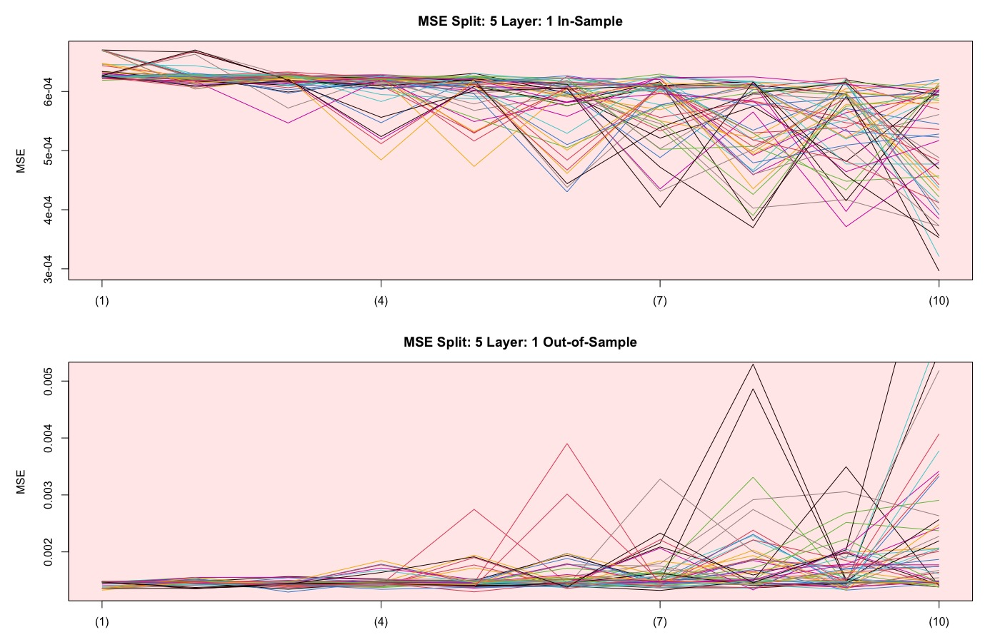
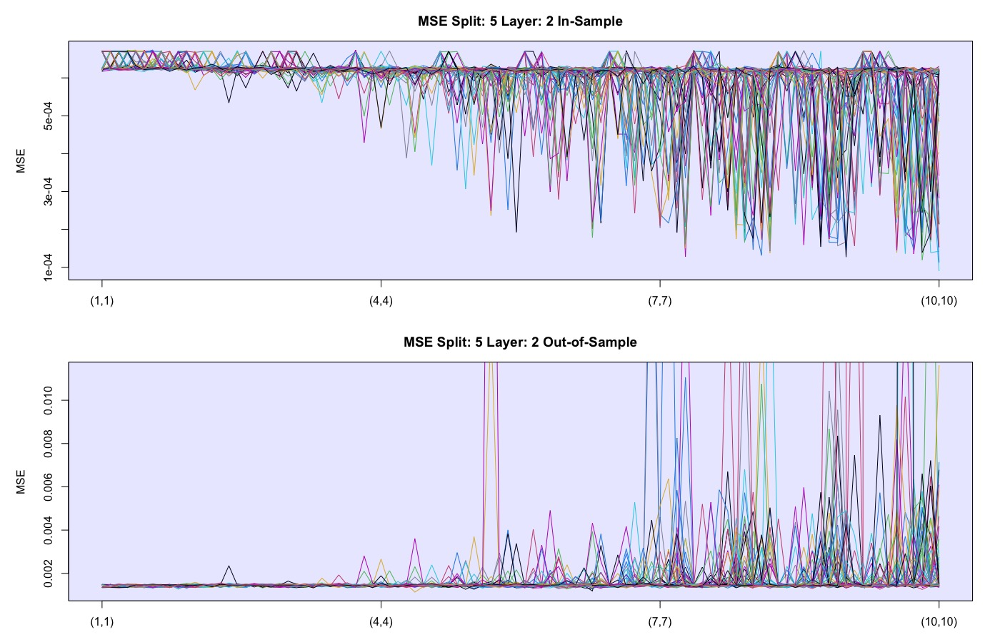
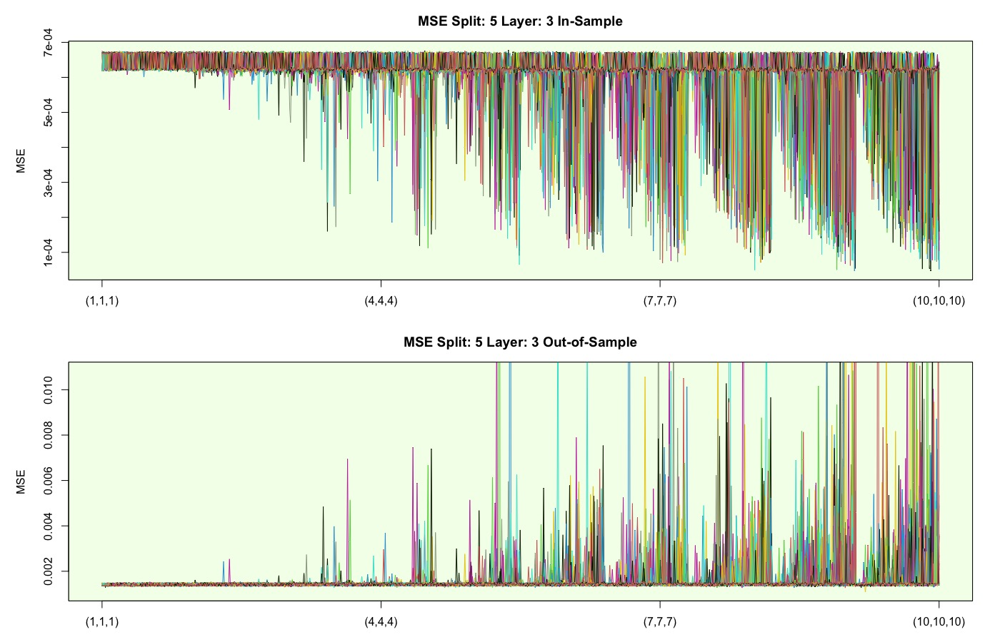
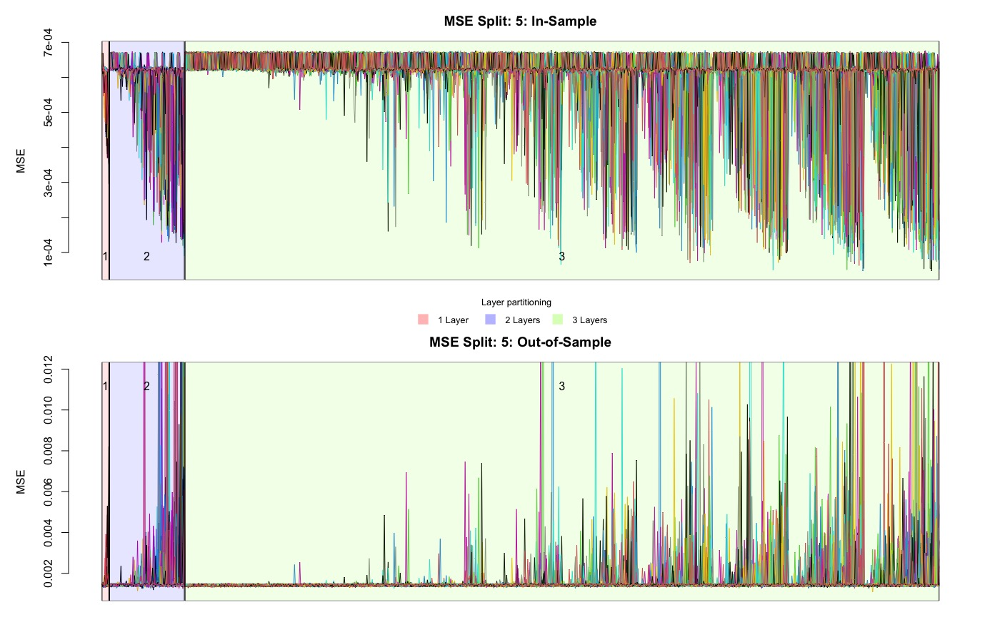
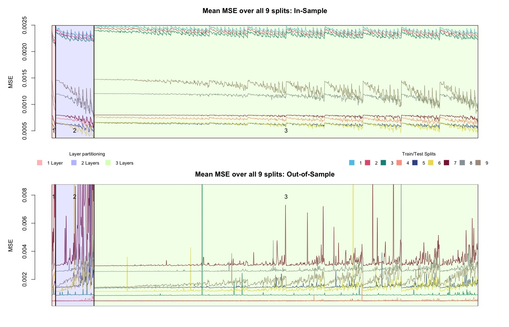
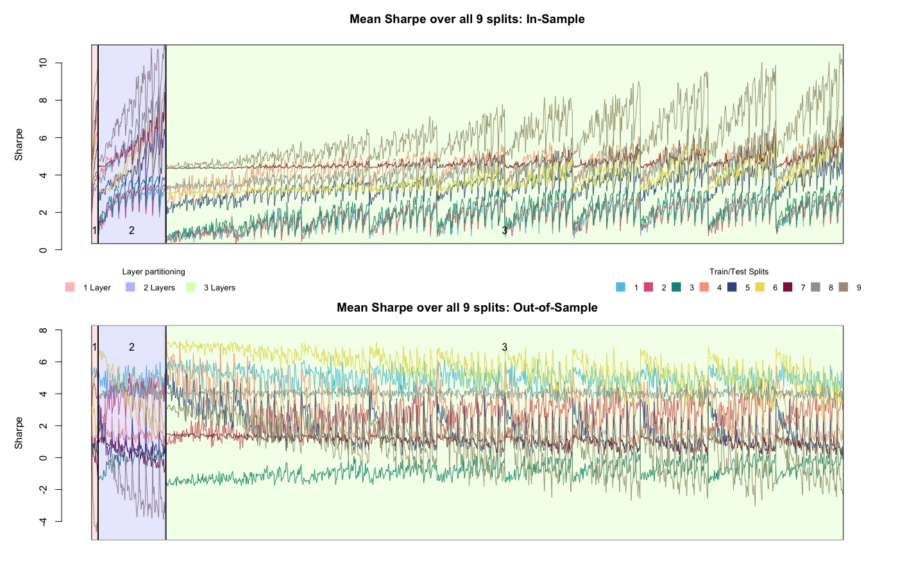

## 3. Methodology

The focus of this thesis can be divided into two areas. First, the aim is to find an optimal neural network including a network architecture. This should perform well in the application area, in which the future log return of the Bitcoin is predicted on the basis of historical log returns. In a second step, we will focus on defining a trading strategy based on our findings. All considerations and findings will be presented in a quantitative way and compared with each other. Figure \ref{fig:flowchart_overview} helps to get an overview of the individual steps followed in this chapter.  

```{r flowchart_overview, fig.align='center', out.width='65%', fig.cap='This flowchart illustrates an overview of the individual intermediate steps that are covered in the Methodology chapter. ', echo=FALSE}
knitr::include_graphics("images/flowchart_overview.png")
```

\newpage

### 3.1. Data exploration {#data_exploration}

The data in this paper is accessed  via yahoofinance provided by coinmarket https://coinmarketcap.com/. We use the daily "closing price" of bitcoin in US Dollars with the ticker BTC-USD.
Cryptoassets are tradeble 24 hours a day  365 days a year. There is no real "closing price" for the bitcoin, hence the "closing-Price" is just the last price of the day evaluated at the last timestamp with timeformat UTC.


In chapter [2.3.](#bitcoin) the bitcoin price and the logarithmic price is visualized.
For processing and analyzing the data in order to fullfill the weak stationarity assumptions we transform the data into logreturns according to equation \ref{eq:logreturn}.
```{=tex}
\begin{align} \label{eq:logreturn}
\mathrm{LogReturn} = \mathrm{log}(x_{t})-\mathrm{log}(x_{t-1})
\end{align}
```


```{r log_ret, echo=FALSE, message=FALSE, fig.cap="logreturns BTC",out.width="80%"}
load("data/log_ret_27_03_21.rda");log_ret=    log_ret_27_03_21   # loading logreturns
df_sub <- data.frame(date = ymd(time(log_ret)), value = as.numeric(log_ret))
plot(df_sub,
     type="l",
     frame.plot = FALSE,
     xaxt="n",
     xlab="",
     ylab="Log Return", ylim=c(-0.45, 0.2))
axis.Date(1, at=seq(min(df_sub$date), max(df_sub$date), by="months"), format="%m-%y")
```

In plot \ref{fig:log_ret} various large outliers are visible, especially one outlier towards the end catches the eye. The series seems to be very noisy, nevertheless volatility clusters are observable. By computing the ACF of the series in figure \ref{fig:acf_log_ret}, we can describe the dependency in these clusters. According to the ACF the lags 6 and 10 are significant on a 5% level. 


```{r acf_log_ret, echo=FALSE, message=FALSE, fig.cap="logreturns BTC"}
# acf(log_ret,main="autocorrelation Logreturns")
chart.ACF(log_ret,main="autocorrelation Logreturns", maxlag = 20)
```

Curios from which distribution the logreturns might originate, we are fitting a Normaldistribution and a Students-t distribution to the data in Figure \ref{fig:histogramm_logreturns}.

Interestingly the mean is shifted slightly (0.002) to the positive side.By inspecting the tails, one can observe that the negativ tail is not fitted as good as the positive part by the t distribution. The two Normaldistributions either over- or underestimate the values in the tails, therefore we conclude that the proposed t-distribution fits the data better but also not perfect.

Pointing at the extreme outlier discussed earlier, visible in Figure \ref{fig:log_ret} towards the end, the density plot makes clear how unimaginable small the probability of this extreme observation is. 


```{r histogramm_logreturns, out.width='80%', fig.cap='Distribution of Logreturns', echo=FALSE,fig.align="center"}
knitr::include_graphics("images/histogram_logret_3.jpeg")
```


\newpage

### 3.2. Network architecture

As mentioned in chapter [2.1.3.](#MLP), choosing an appropriate network architecture for bitcoin price prediction is a crucial step in order to achieve useful forecasts while avoiding overfitting. Due to the complexity as well as the non-linearity of neural networks, the interpretation cannot be performed intuitively. For this reason, an approach is pursued in which neural networks with different numbers of layers and neurons are compared with each other by using the MSE loss. This allows us to compare accuracy and possibly see a connection with network architecture.

To find the optimal network architecture, we test a maximum of 3 layers with a maximum of 10 neurons each. We limited ourselves with this number, because on the one hand in the extent of this bachelor thesis the time lacks, and on the other hand we think that with time series, too complex models on no added value and rather to overfitting lead. The simplest network has one layer with one neuron (1), while the most complex has 3 layers with 10 neurons each (10,10,10). The total number of different combinations can be expressed as follows:

```{=tex}
\begin{align} \label{eq:comb}
\text{comb}=\sum_{i=1}^{L}N^{i}
\end{align}
```
with:

$L=\text{maximum Layer} \in \mathbb{N}^{*}$

$N=\text{maximum Neuron}\in \mathbb{N}^{*}$

$\text{comb} =\text{Number of all combinations}$

Thus, with our initial setup, we obtain a maximum neuron-layer combination of 1110. To respond to the challenges mentioned in section [2.1.6.](#challenges), not only a single network per neuron-layer combination is trained, but a whole batch of 50 networks. So you end up with a total of 55500 trained networks. For each individual network, the in-sample and out-of-sample MSE as well as the Sharpe ratio are determined. We use these values to find an optimal network architecture based on the statistical error as well as on the trading performance (daily trading).

This now leads us to our next consideration. For which period and for which in-sample and out-of-sample split should the architecture be defined.

\newpage

#### 3.2.1. Defining train and test samples
&nbsp;

We are looking for an optimal network, the optimal network should also provide reasonable and reliable predictions for different periods. So, for further analysis, we are going to use a subset of the introduced closing prices of bitcoin.
Starting from the first of January 2020 to the 27th of March in 2021, we only consider 15 months for our data.

The reason for doing so is, we don’t believe that the historical data longer than a year is consisting of any information about the price tomorrow. By optimizing our models we found that more data would bring no additional performance, therefore the selected subset should be sufficient.
As proposed in [@nn_trading] we choose a test train split from 6 months in-sample and 1 month out-of-sample. This split is applied to the whole subset in form of a rolling window. By stepping forward with this 6/1 split by steplength of one month we end up with 9 data splits in total. In figure \ref{fig:test_train} this procedure is visualized, for every new timestep a new month is considered for the out of sample and the first month of the in sample falls out of the frame.

```{r test_train, out.width='80%', fig.cap='Distribution of Logreturns', echo=FALSE}
knitr::include_graphics("images/test_train_split_pp.jpeg.jpg")
```

In the course of the time series in figure \ref{fig:test_train}, one can see different periods. Strongly volatile as well as rather calm phases occur. With the rolling window, we can train and test the networks based on different phases. Thus, we can also evaluate the performance of the networks based on different phases and not only on a predefined single test and train split.

The complexity of the search for the optimal network architecture increases significantly here. With the conditions defined for us, we train and test a total number of 499500 networks to define the optimal network.

\newpage

#### 3.2.2.  Evaluating network architecture
&nbsp;

Here we would like to focus on some findings that we discovered during the processing of the trained networks. To illustrate the results, an extract is discussed here, namely only the 5th train/test split.

The plot in figure \ref{fig:mse_plot1} compares different neural networks with one layer. Networks with a maximum of ten neurons are compared. These different configurations can be seen on the x-axis. The first data point corresponds to a simple network with one neuron at only one layer. The y-axis shows the MSE values obtained with the respective trained model. As already explained, we use 50 different optimizations of each configuration to get a better idea of a potentially systematic relationship with the MSE. In the plot, each of the configurations is drawn using a different color.

```{r mse_plot1, out.width='100%', fig.cap='Fifth train/test split, 1 layer with 10 different networks.', echo=FALSE,fig.align="center"}

```

What is already noticeable here is that with increasing complexity, i.e. with the increasing number of neurons, the in-sample MSE decreases. So it gets better. At the same time, you can see how the out-of-sample MSE increases with increasing complexity, which means that it tends to get worse.

\newpage

If you add another layer to the network architecture, the number of different networks with the same number of layers also increases. In the following figure \ref{fig:mse_plot2}, the simplest network is a (1,1) network. So 2 layers with one neuron each. The most complex is a network with a (10,10) architecture.

As noted earlier in figure \ref{fig:mse_plot1}, the values for the MSE also fluctuate more and more with increasing complexity. Small in-sample MSE for more complex networks lead to rather high out-of-sample MSE. This leads us to the previously mentioned challenges in section [2.1.6.1.](#overfitting), and that is that too many estimated parameters can lead to overfitting of the network.

```{r mse_plot2, out.width='100%', fig.cap='Fifth train/test split, 2 layers with 100 different networks.', echo=FALSE,fig.align="center"}

```

Looking at the out-of-sample MSE's in the graph below in figure \ref{fig:mse_plot2}, you can see lines that are outside the blue rectangle. These values are extreme outliers that indicate the randomness of neural networks. This again confirms that choosing an optimal network over several equal networks (50 in our case) makes more sense than making the choice depend on only one randomly trained network. Depending on which solution the training algorithm finds, the results can be very different. The y-axis was scaled for better comparability of in-sample and out-of-sample, but one loses the overview of how much the outliers differ from the rest.

\newpage

Lastly, we look at the results of the different network architectures with a third layer. In figure \ref{fig:mse_plot3}, we can see very well the inverse correlation between the in-sample and out-of-sample MSE. Again, the in-sample MSE gets better with increasing complexity while the out-of-sample MSE gets worse. There is also a certain recurring pattern that is striking. After a certain complexity, the in-sample MSE decreases steadily and then increases abruptly. The opposite pattern can also be observed out-of-sample. These patterns emerge during transitions from more complex to more simple architectures. For example, the transition from a model with (8,10,10), with a total of 28 neurons, to a model with (9,1,1) with only 11 neurons.

It is interesting that at the beginning, with the rather simple model architectures, the MSE of all realizations is very constant and only varies very slightly.

```{r mse_plot3, out.width='100%', fig.cap='Fifth train/test split, 3 layers with 1000 different networks.', echo=FALSE,fig.align="center"}

```
\newpage

- ERKLÄREN, DASS ES UNMÖGLICH IST FÜR 9 VERSCHIEDENE SPLITS EIN EINE REIN VISUELLE ANALYSE DURCHZUFÜHREN

```{r mse_plot5, out.width='100%', fig.cap='Fifth train/test split, all layers with 1110 different networks.', echo=FALSE,fig.align="center"}

```

\newpage

- MITTELWERTE ÜBER SÄMTLICHE DER 9 SPLITS BERECHNEN UM DEI BESTIMMUNG DES OPTIMALEN NETZTES ZU VEREINFACHEN
BESPIEL: Man hat 9 Splits à je 1110 Neuronen-Layer-Kombinationen. Für jede NL-Architektur wurden 50 neuronale Netzwerke trainiert. Somit kommt man auf 55500 Netze pro Splits. Also für alleine diese Versuchreihe wurden 499500 Netzwerke trainiert. Nun möchte man diejenige NL-Architektur finden, welche im Verlauf der Zeit (Verlauf der 9 Splits) am besten geblieben/am wenigsten an Performanz verloren hat/am besten geworden ist finden. Man hat herausgefunden, dass Netzte sehr zufällig sind. Somit werden die Mittelwerte über die 50 Netzte pro Layer, pro Split gebildet. Man erhält für jede NL-Kombination 9 verschiedene Mittelwerte der MSEs. Die Suche nach einer optimalen Netzwerk-Architektur ist so um einiges einfacher. (siehe \ref{fig:mse_mean})

```{r mse_mean, out.width='100%', fig.cap='MSE mean over all 9 splits.', echo=FALSE,fig.align="center"}

```
\newpage
- Eventuell noch Sharpe hinzunehmen, wäre noch interessant (work in Progress)? oder evtl doch erst später im Trading?

```{r sharpe_mean, out.width='100%', fig.cap='Sharpe mean over all 9 splits.', echo=FALSE,fig.align="center"}

```

\newpage

### 3.3. Benchmark

To compare the models we choose two simple benchmarks the well known buy and hold and an Ar(1) process as you can see in Figure xy and Figure xxy.

### 3.4. Trading strategiesg

-   Define trading strategies

- Sign-trading (daily)
- Vola-gewichtet trading 

-   Define realistic fee structure for trading (Coinbase Pro, Binance, Kraken etc.)

#### 3.5.1. Other cryptocurrency

- Test our best model with another time series

### 3.6. Explainability

- Performing the predictions with the two (?) best models

-   Include variations to find possible starting points for explainability (number of nodes, layers)

### 3.7. (Relationship between accuracy and market phase)

-   Test
