---
output:
  html_document:
    df_print: paged
geometry: margin = 1in
---

## 3. Methodology

The focus of this thesis can be divided into three areas. First, the aim is to find an optimal neural network including a network architecture. This should perform well in the application area, in which the future log return of the Bitcoin is predicted on the basis of historical log returns. In a second step, it will be evaluated whether added value can be found with the help of XAI. Finally, we will focus on defining a trading strategy based on our findings. All considerations and findings will be presented in a quantitative way and compared with each other. Figure \ref{fig:flowchart_overview} helps to get an overview of the individual steps followed in this section.

&nbsp;

```{r flowchart_overview, fig.align='center', out.width='65%', fig.cap='This flowchart illustrates an overview of the individual intermediate steps that are covered in the methodology section. After the data is explored, the details for the network archtecture are examined and compared quantitatively. Finally, aspects of Explainable Artificial Intelligence and traditional time series analysis are applied for the implementation of the trading strategy.', echo=FALSE}
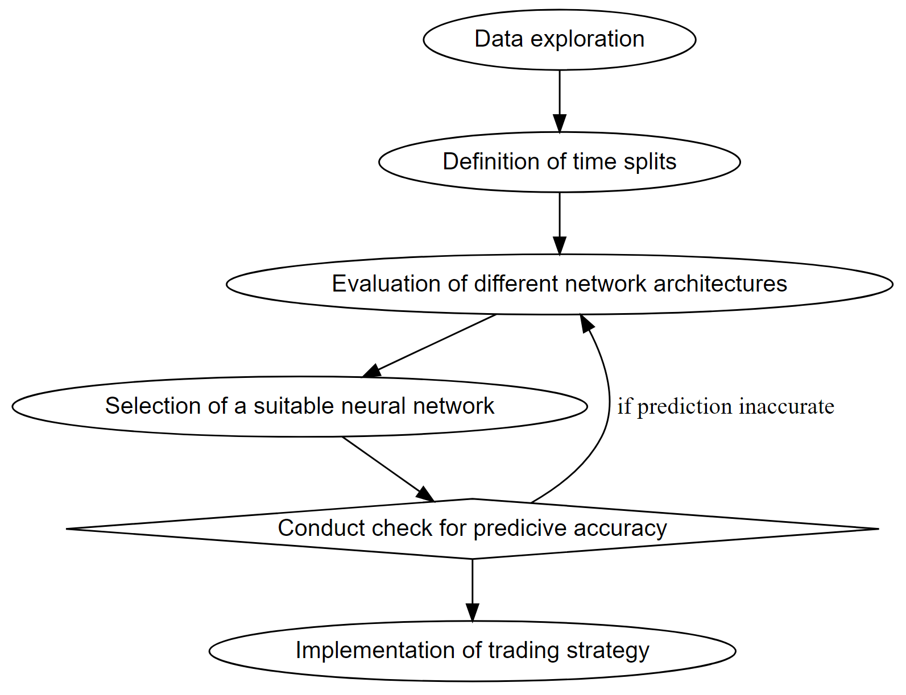
```

\newpage

### 3.1. Data Exploration {#data_exploration}

The data in this paper is accessed through the API of Yahoo Finance and is originally provided by the price-tracking website CoinMarketCap. We use the daily closing price of Bitcoin in USD with the ticker BTC-USD. As cryptocurrencies are traded 24/7, the closing price refers to the last price of the day evaluated at the last timestamp according to the Coordinated Universal Time (UTC).

In section [2.4](#bitcoin), the Bitcoin price and the logarithmic price are visualized.
For processing and analyzing the data in order to fulfill the weak stationarity assumptions, we transform the data into log returns according to equation \ref{eq:logreturn}.

```{=tex}
\begin{align} \label{eq:logreturn}
\mathrm{LogReturn_{t}} = \mathrm{log}(x_{t})-\mathrm{log}(x_{t-1})
\end{align}
```

```{r log_ret, echo=FALSE, message=FALSE, fig.cap="Logarithmic returns of BTC/USD. Start of the time series is autumn 2014 and goes here until spring 2021. One can recognize the typical patterns of log returns, namely the vola clusters. This means phases in which the returns fluctuate strongly.", out.width='85%', fig.width = 10, fig.height = 5}
# load("data/log_ret_27_03_21.rda");log_ret=    log_ret_27_03_21   # loading logreturns
# df_sub <- data.frame(date = ymd(time(log_ret)), value = as.numeric(log_ret))
# plot(df_sub,
#      type="l",
#      frame.plot = FALSE,
#      xaxt="n",
#      xlab="",
#      ylab="log return", ylim=c(-0.45, 0.2))
# axis.Date(1, at=seq(min(df_sub$date), max(df_sub$date), by="months"), format="%m-%y")
load("data/log_ret_27_03_21.rda")
log_ret <- log_ret_27_03_21
plot(log_ret, ylab="Log Return", main="Logarithmic Return BTC/USD")
```

Figure \ref{fig:log_ret} displays the historical log returns. In addition to the volatility clusters typical for financial time series, large outliers are visible. The negative outlier at the beginning of 2020 is particularly noticeable. By computing the autocorrelation (ACF) of the series in figure \ref{fig:acf_log_ret}, we can describe the dependency in these clusters. According to the ACF, the lags 6 and 10 are significant on a 5% level.

We are curious about how the log returns are distributed. Therefore, we fit a normal distribution and a Student-t distribution to the histogram of the log returns, which can be seen in figure \ref{fig:histogramm_logreturns}. Interestingly the mean is shifted slightly (0.002) to the positive side. By inspecting the tails, one can observe that the negative tail is not fitted as well as the positive part by the t distribution. The two normal distributions either over- or underestimate the values in the tails, therefore we conclude that the proposed t-distribution fits the data better but also not perfect. Concerning the extreme outlier discussed earlier, visible in figure \ref{fig:log_ret} towards the end, the density plot makes clear how unimaginably small the probability of this extreme observation is. Although the histogram might be useful for value-at-risk considerations, for trading purposes its use is mitigated due to its complete loss of the dependency structure by plotting the returns in a density distribution.

\newpage

```{r acf_log_ret, echo=FALSE, message=FALSE, fig.cap="Autocorrelation function of BTC log returns during the entire time period from fall 2014 to spring 2021. Lag 6 and 10 are significant (values exceed the blue dotted line) and thus have an impact on possible models.", out.width='80%', fig.width = 8, fig.height = 4.4}
chart.ACF.phil(log_ret, main="Autocorrelation of log returns", maxlag = 20, ymax = 0.07)
```

&nbsp;

&nbsp;

```{r histogramm_logreturns, out.width='80%', fig.cap='Histogram of BTC log return. Possible distribution of the data. None of the possible distributions would fit the data as well as possible. The blue t-Student distribution would fit the data better in the tails, while the yellow normal distribution would disperse a little better around the expected value.', echo=FALSE,fig.align="center", fig.width = 8, fig.height = 4.4}
# 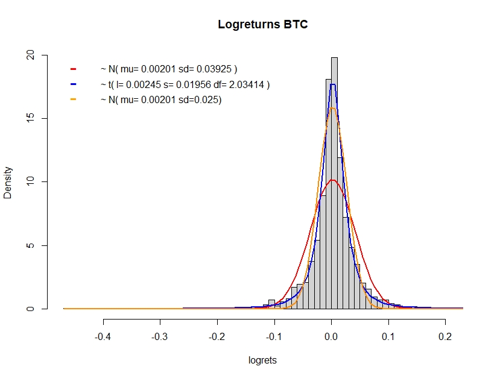

load("data/log_ret_27_03_21.rda")  # loading logreturns closing! data xts
logret=log_ret_27_03_21 

my_data=as.numeric(logret[,1])   # as vector 
fit <- fitdistr(my_data, densfun="normal")  
fit2<- fitdistr(my_data, "t", start = list(m=mean(my_data),s=sd(my_data), df=1), lower=c(-1, 0.001,1)) #algo braucht startwerte
dt_ls <- function(x,mu,sigma,df){1/sigma * dt((x - mu)/sigma, df)}   # converting scale and location in only df

# plotting the data
hist(my_data, pch=20, breaks=70, prob=TRUE, main="Logreturns BTC",xlab="logrets")
curve(dnorm(x, fit$estimate[1], fit$estimate[2]), col="red", lwd=1.5, add=T)
curve(dt_ls(x,fit2$estimate[1], fit2$estimate[2],fit2$estimate[3]), col="blue", lwd=1.5, add=T)
curve(dnorm(x, fit$estimate[1], 0.025), col="orange", lwd=1.5, add=T)
legend("topleft", inset=.02, legend=c(TeX(sprintf("$N(\\mu = 0.00201$,$ \\sigma = 0.03925)$")), TeX(sprintf("$t(l = 0.00245$,$ s = 2.0341$,$ df = 2.0341)$")), TeX(sprintf("$N(\\mu = 0.00201$,$ \\sigma = 0.025)$"))),
       col=c("red", "blue", "orange"), lty = c(1,1,1), cex=1, horiz=F, bty = "n")
```


\newpage

### 3.2. Network Architecture {#networkarchitecture}

As mentioned in section [2.1.3](#MLP), choosing an appropriate network architecture for Bitcoin price prediction is a crucial step in order to achieve useful forecasts while avoiding overfitting. Due to the complexity as well as the non-linearity of neural networks, the interpretation cannot be performed intuitively. For this reason, an approach is pursued in which neural networks with different numbers of layers and neurons are compared with each other by using the MSE loss and Sharpe ratio. This allows us to compare accuracy, respectively trading performance and possibly see a connection with network architecture.

To find the optimal network architecture, we test a maximum of 3 layers with a maximum of 10 neurons each. More complex models are not included in this thesis, as this would exceed the time frame. Furthermore, the application of complex network architectures for financial time series can be expected to lead to overfitting and thus to no real added value. The simplest network has one layer with one neuron (1), while the most complex has 3 layers with 10 neurons each (10,10,10). The total number of different combinations can be expressed as follows:

```{=tex}
\begin{align} \label{eq:comb}
\text{Comb}=\sum_{i=1}^{L}N^{i}
\end{align}
```
with:

$L=\text{maximum Layer} \in \mathbb{N}^{*}$

$N=\text{maximum Neuron}\in \mathbb{N}^{*}$

$\text{Comb} =\text{Number of all combinations}$

Thus, with our initial setup, we obtain a maximum neuron-layer combination of 1'110. To respond to the challenges mentioned in section [2.1.4](#challenges), not only a single network per neuron-layer combination is trained, but a whole batch of 50 networks. So, we end up with a total of 55,500 trained networks. For each network, the in-sample and out-of-sample MSE as well as the Sharpe ratios are determined. We use these values to find an optimal network architecture based on the statistical error as well as on the trading performance (daily signum trading).

To ensure that the neural network with the chosen network architecture does not produce trustworthy predictions only for a specific time period, the in-sample and out-of-sample splits are examined for different time periods.

\newpage

#### 3.2.1. Defining Train and Test Samples {#test_train}
&nbsp;

We are looking for an optimal network, the optimal network should also provide reasonable and reliable predictions for different periods. For further analysis, we use a subset of the introduced closing prices of Bitcoin. Starting from the first of January 2020 to the 27th of March in 2021, we only consider 15 months for our data.


We do not believe that data older than one year provides useful information for predicting the following day. The reason is that the market environmnet is constantly changing and institutional investors are not yet in agreement about Bitcoin as an asset class. By optimizing our models we found that more data would offer no additional performance, therefore the selected subset should be sufficient. Regarding consistency, the terms train and test set are used in the same sense as in-sample and out-of-sample. As proposed in [@nn_trading] we choose a test train split from 6 months in-sample and 1 month out-of-sample. This split is applied to the whole subset in form of a rolling window. By stepping forward with this 6/1 split by step length of one month we end up with 9 data splits in total. In figure \ref{fig:test_train} this procedure is visualized, for every new timestep, a new month is considered for the out-of-sample and the first month of the in-sample falls out of the frame. 


```{r test_train, out.width='85%', fig.cap='Nine different in- and out-of-sample splits. The 6-month training phase (in-sample) is indicated in blue and the 1-month test phase (out-of-sample) in green. The splits capture different phases of the time series. Both very turbulent phases (split 1) and rather calm phases (split 5) can be recorded.', echo=FALSE, fig.width = 10, fig.height = 6}
# 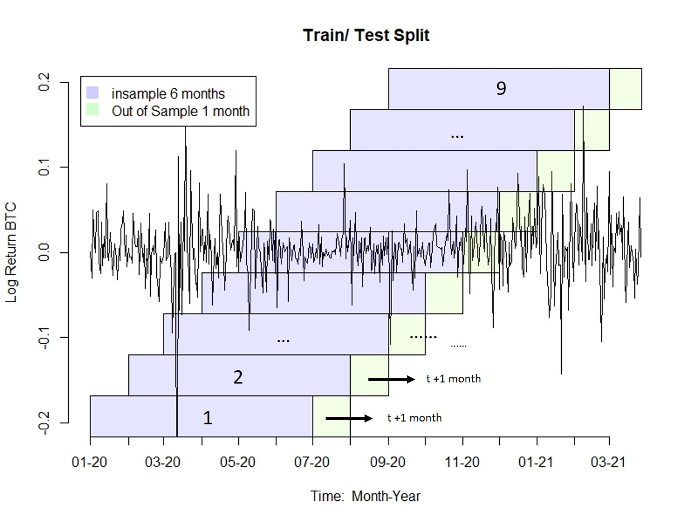
load("data/dates_mat.rda")

subseti <- logret["2020-01-01::2021-03-27"]

# r graph gallery
# Create a df
df_sub <- data.frame(date = ymd(time(subseti)), value = as.numeric(subseti))

plot(df_sub,
     type="l",
     lwd=1.5,
     frame.plot = FALSE,
     xaxt="n",
     xlab="Time:  Month-Year",
     ylab="Log Return BTC",
     ylim=c(-0.2, 0.2),
     main= "Train/ Test Split")
axis.Date(1, at=seq(min(df_sub$date), max(df_sub$date), by="months"), format="%m-%y")


# Transform timestamp to numeric for the plot
ybot <- par('usr')[3]
ytop <- par('usr')[4]

ydist <- abs(ybot - ytop)
ypartial <- ydist/9

for (i in 1:9) {
  rect_borders <- as.numeric(ymd(dates_mat[i,]))
  
  rect(xleft = rect_borders[1],
       xright = rect_borders[2]+1,
       ybottom = par('usr')[3]+(ypartial*(i-1)),
       ytop = par('usr')[3]+(ypartial*i),
       col="#0000FF1A")
  rect(xleft = rect_borders[3],
       xright = rect_borders[4]+1,
       ybottom = par('usr')[3]+(ypartial*(i-1)),
       ytop = par('usr')[3]+(ypartial*i),
       col="#80FF001A")
}

text1 <- as.numeric(ymd(dates_mat[1,]))
posx <- (text1[4] + text1[1])/2
posy <- par('usr')[3] + ypartial/2
text(x=posx, y=posy, labels="1", cex = 1.1)
text(x=text1[4]+55, y=posy, labels="t+1 month", cex = 0.8)
arrows(x0=text1[3]+15, y0=posy, x1=text1[3]+50, y1=posy, length = 0.12, angle = 20)

text1 <- as.numeric(ymd(dates_mat[2,]))
posx <- (text1[4] + text1[1])/2
posy <- par('usr')[3] + ypartial/2 + ypartial
text(x=posx, y=posy, labels="2", cex = 1.1)
text(x=text1[4]+55, y=posy, labels="t+1 month", cex = 0.8)
arrows(x0=text1[3]+15, y0=posy, x1=text1[3]+50, y1=posy, length = 0.12, angle = 20)

text1 <- as.numeric(ymd(dates_mat[3,]))
posx <- (text1[4] + text1[1])/2
posy <- par('usr')[3] + ypartial/2 + ypartial*2
text(x=posx, y=posy, labels="...", cex = 1.1)

text1 <- as.numeric(ymd(dates_mat[8,]))
posx <- (text1[4] + text1[1])/2
posy <- par('usr')[3] + ypartial/2 + ypartial*7
text(x=posx, y=posy, labels="...", cex = 1.1)

text1 <- as.numeric(ymd(dates_mat[9,]))
posx <- (text1[4] + text1[1])/2
posy <- par('usr')[3] + ypartial/2 + ypartial*8
text(x=posx, y=posy, labels="9", cex = 1.1)


legend("topleft", inset=.02, legend=c("In-sample 6 months","Out-of-sample 1 month"),
       col =c("#CCCCFF", "#CCFFCC"),  pch=c(15,15),cex=1,2, horiz=F,pt.cex=2,
       bty = "n")
```

In the time series in figure \ref{fig:test_train}, one can see different periods. Strongly volatile as well as rather calm phases occur. With the rolling window, we can train and test the networks based on different phases. Thus, we can also evaluate the performance of the networks based on different phases and not only on a predefined single test and train split.

The complexity of the search for the optimal network architecture increases significantly here. With the conditions defined for us, we train and test a total number of 499,500 networks to define the optimal network.

\newpage

#### 3.2.2. Defining Input-Layer {#input-layer}
&nbsp;

To train the feedforward neural networks, we need to specify the input layer in addition to the network architecture. For this, we take the autocorrelation function of the time period specified earlier.

In contrast to the ACFs of the entire data set shown in figure \ref{fig:acf_log_ret} where lags 6 and 10 have a high impact, here in figure \ref{fig:test_train_acf} we see that lags 4 and 10 are significant. If one uses the ACFs as an indicator for the specification of a model, it must be considered that for other time periods also other rules apply. For modeling the entire data set, one could safely specify the input layer up to a lag of 10. Here for our subset, we specify the input layer up to a lag of 7. Lag 7 is just significant and could potentially explain an important dependency in the data. Since Bitcoin can be traded 7 days a week, including weekends, the dependency of 7 lags in the ACFs would also be explained.

```{r test_train_acf, out.width='85%', fig.cap='Autocorrelation function of our chosen time period. One can clearly see an increased influence of lags 4 and 7, not as in the ACFs of the entire data set with significant values at 6 and 10. Only late at lag 18 does the ACF show a significant value again.', echo=FALSE, fig.width = 10, fig.height = 6}

chart.ACF.phil(subseti, maxlag = 20, ymax = 0.12, main="ACF of time period: 2020-01-01/2021-03-27")
```

For the following procedure for finding an optimal network architecture we use an input layer of 7 lags. Since we will also use the same time period later in the trading section [3.3](#trading-strat), we will also specify the input layer with 7 lags for training these networks.

\newpage

#### 3.x.x. Neural Network Training {#train-nn}
&nbsp;

So far, we have specified the time periods as well as the input layer for the neural network. Together with one of the many different neuron layer combinations from section [3.2](#networkarchitecture), we can train networks. The exact procedure will be explained in more detail in this section.

\newpage

#### 3.2.3.  Evaluating Network Architecture {#evaluate_nn}
&nbsp;

Here we would like to focus on some findings that we discovered during the processing of the trained networks. To illustrate the results, an extract is discussed here, namely only the 5th train/test split (in figure \ref{fig:test_train} the middle one).

The plot in figure \ref{fig:mse_plot1} compares one layer networks with different numbers of neurons with each other. Networks with a maximum of ten neurons are compared. These different configurations can be seen on the x-axis. The first data point corresponds to a simple network with one neuron. The y-axis shows the MSE values obtained with the respective trained model. As already explained, we use 50 different optimizations of each configuration to get a better idea of a potentially systematic relationship with the MSE. In the plot, each of the 50 configurations is drawn using a different color.

```{r mse_plot1, out.width='100%', fig.cap='In- and out-of-sample MSE of the 5th split. Only the networks with only one layer are shown here. Simplest network has 1 neuron (leftmost) and the most complex one has 10 neurons (rightmost), so here you have the MSEs of 10 different networks. In-sample the MSEs tend to decrease, while out-of-sample they increase.', echo=FALSE, fig.align="center"}
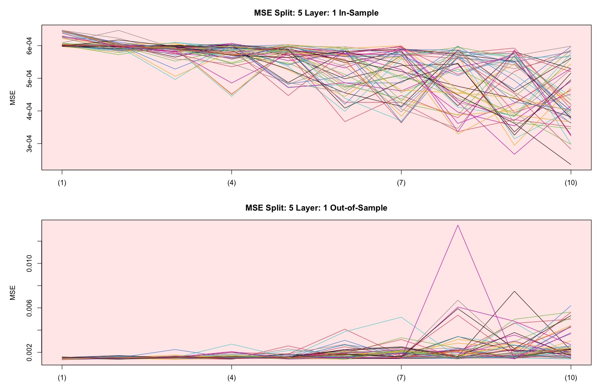
```

What is already noticeable here is that with an increasing complexity, i.e. with increasing number of neurons, the in-sample MSE decreases. The in-sample forecasts are thus becoming more accurate. At the same time, you can see how the out-of-sample MSE increases with increasing complexity, which means that the forecast accuracy tends to get worse.

\newpage

If you add another layer to the network architecture, the number of different networks with the same number of layers also increases. In the following figure \ref{fig:mse_plot2}, the simplest network is a (1,1) network. So 2 layers with one neuron each. The most complex is a network with a (10,10) architecture.

As noted earlier in figure \ref{fig:mse_plot1}, the values for the MSE also fluctuate more and more with increasing complexity. Small in-sample MSE for more complex networks leads to rather high out-of-sample MSE. This leads us to the previously mentioned challenges in section [2.1.4.1](#overfitting), and that is that too many estimated parameters can lead to overfitting of the network.

```{r mse_plot2, out.width='100%', fig.cap='In- and out-of-sample MSE of the 5th split. Shown here are only the networks with two layers. The simplest network has an architecture of 1 neuron per layer (leftmost) and the most complex has 10 neurons per layer (rightmost), so you have the MSEs of 100 different networks. As in the previous graph, in-sample MSEs tend to decrease while out-of-sample MSEs tend to increase.', echo=FALSE,fig.align="center"}
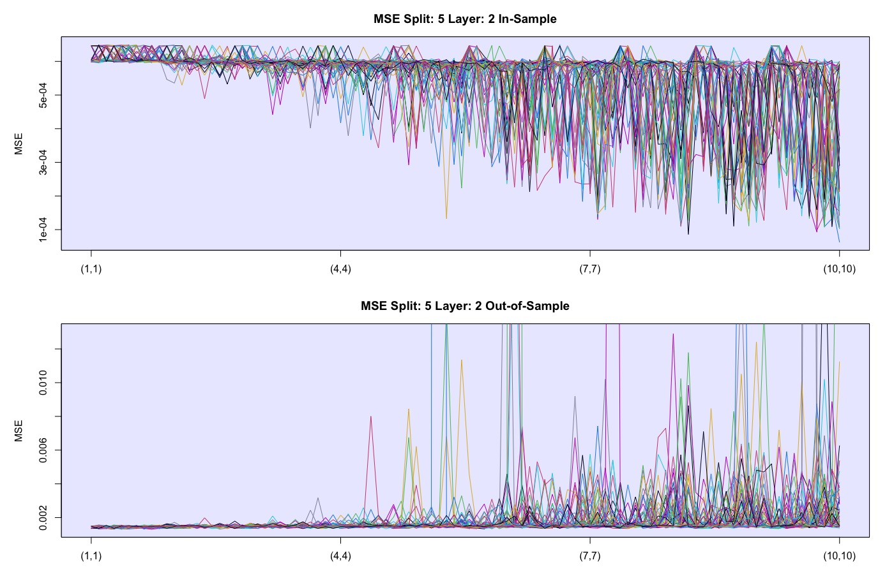
```

Looking at the out-of-sample MSE's in the graph below in figure \ref{fig:mse_plot2}, we can see lines that are outside of the blue rectangle. These values are extreme outliers that indicate the randomness of neural networks. This again confirms that choosing an optimal network over several equal networks (50 in our case) makes more sense than making the choice depend on only one randomly trained network. Depending on which solution the training algorithm finds, the results can be very different. The y-axis was scaled for better comparability of in-sample and out-of-sample, but one loses the overview of how much the outliers differ from the rest.

\newpage

Lastly, we look at the results of the different network architectures with a third layer. In figure \ref{fig:mse_plot3}, we can see very well the inverse correlation between the in-sample and out-of-sample MSE. Again, the in-sample MSE gets better with increasing complexity while the out-of-sample MSE gets worse. There is also a certain recurring pattern that is striking. After a certain complexity, the in-sample MSE decreases steadily and then increases abruptly. The opposite pattern can also be observed out-of-sample. These patterns emerge during transitions from more complex to more simple architectures. For example, the transition from a model with (8,10,10), with a total of 28 neurons, to a model with (9,1,1) with only 11 neurons.

It is interesting that at the beginning, with the rather simple model architectures, the MSE of all realizations is very constant and only varies very slightly.

```{r mse_plot3, out.width='100%', fig.cap='In- and out-of-sample MSE of the 5th split. Shown here are only the networks with 3 layers. Simplest network has an architecture of 1 neuron per layer (leftmost) and the most complex has 10 neurons per layer (rightmost), so here you have the MSEs of 1000 different networks. Same pattern as for 1 layer and 2 layers. In-sample the MSE decreases, out-of-sample it increases.', echo=FALSE,fig.align="center"}
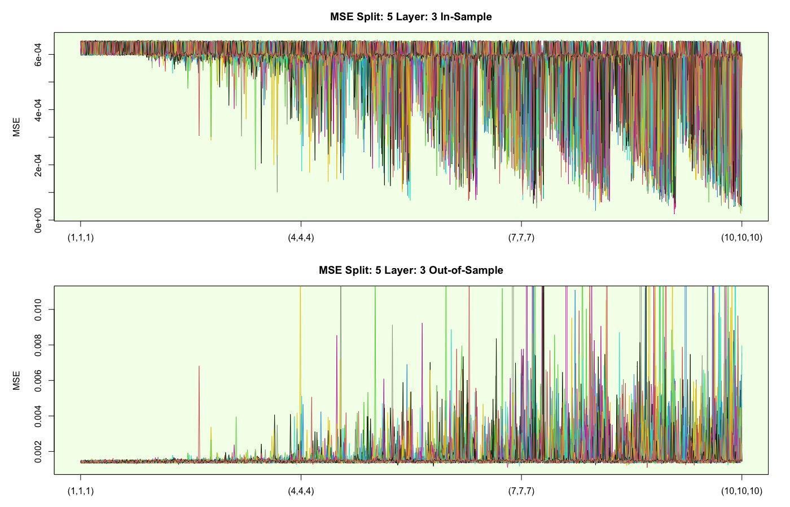
```
\newpage

Figure \ref{fig:mse_plot5} shows the MSE of the models with 1-3 layers, i.e. the last three plots side by side. As mentioned, it can be seen here that the in-sample MSE scatter more towards the bottom as the complexity of the architecture increases. This does not have a positive effect on the out-of-sample, since in the same area the MSE deteriorates massively (note the different scaling of the y-axes). As a result, we have no real added value from more complex models. Also, to be noted is that the in-sample MSE does not get worse than a certain threshold at the upper boundary. This asymmetric scattering around this value is likely due to the numerical characteristics of the optimization algorithm.  

At this point, it should be emphasized that only the analyses from time split 5 are visualized in this section. Our primary goal is to compare the performances of different network architectures using MSE to find the optimal network that works every time split. However, finding an optimal architecture using such visual analysis of the MSE seems nearly impossible. Nevertheless, the main finding of this section is that the MSE deteriorates massively with more complex models and thus a simpler one should be considered. Equally remarkable is the fact that the same model architectures produce such different results. Whilst many models range in a more or less solid midfield, traits of overfitting can be recognized. These are reflected by the spikes in the out-of-sample MSE.

```{r mse_plot5, out.width='100%', fig.cap='In- and out-of-sample MSE of the 5th split. The 3 previous graphs are summarized here. One has here an overview of all 3 layers and thus of all 1110 neuron-layer combinations. The more complex a network, the smaller the in-sample MSE becomes, but the larger the out-of-sample MSE becomes.', echo=FALSE,fig.align="center"}
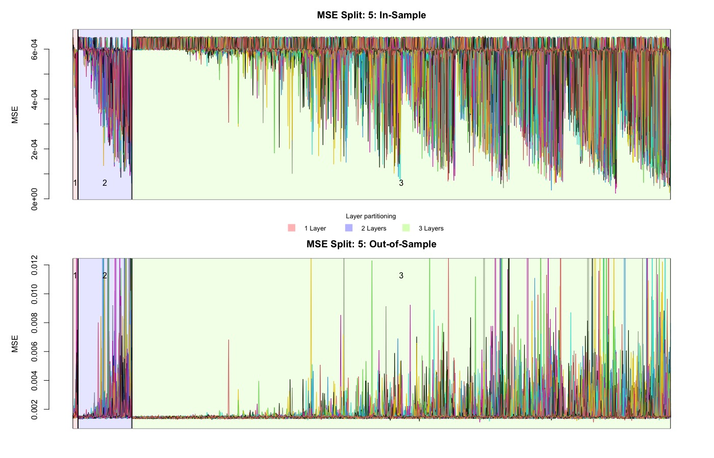
```

What has not yet been studied is the dependence of the neural network's behavior on the different window splits we defined in figure \ref{fig:test_train}. Considering that the same network architectures provide MSE's of different quality (including huge outliers), the results for each configuration are summarized using a robust method. We make use of the median of the MSE's of all 50 equal networks across all time splits in order to evaluate the accuracy of the corresponding model. We consider this a better method than the arithmetic mean as figure \ref{fig:mse_plot5} shows large outliers. Thus, it can be better investigated whether the corresponding network architecture provides sound results apart from this one outlier. 

\newpage

The medians of the MSE's of all 50 equal networks across all time splits are plotted in figure \ref{fig:mse_median}. We restrict ourselves to neural networks with 1-2 layers (recognizable in the red (1) and blue (2) rectangles), since it can be assumed that too complex models are not suitable for the target. The lines represent the medians of the MSE of all 50 optimized neural networks at a given network architecture (x-axis). The nine different colors specify the specific time split in which the neural networks have been trained and tested. We anticipate that this comparison will facilitate finding a network architecture that performs across all time splits. 

```{r mse_median, out.width='100%', fig.cap='MSE median across all 9 splits. For each network architecture, 50 neural networks were trained (55`500 models per time split). The nine colors illustrate how these models behave in the different time splits. Time periods with a strong trend (for example, the dark red line, split 7) lead to the same structure as already noted in the previous graphs. The more complex a network, the smaller the in-sample MSE becomes, but the larger it becomes out-of-sample.', echo=FALSE,fig.align="center"}
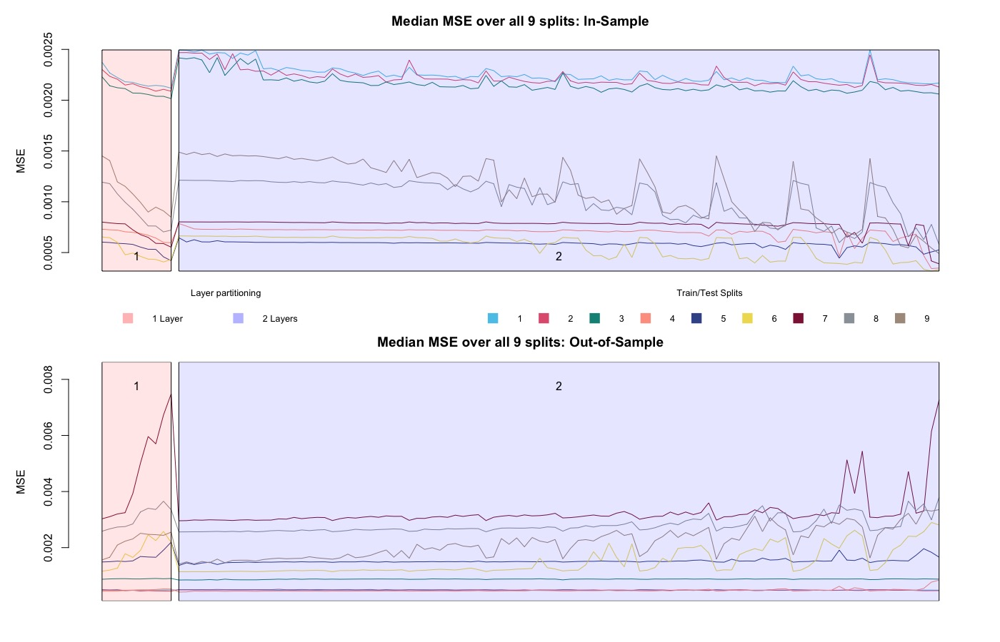
```

First, there is evidence of overfitting in the medians as well. In particular, splits 1-6 shows a somewhat expected picture: the in-sample error becomes smaller with more complex architecture, while the opposite can be seen in the out-of-sample. However, the periodically appearing spikes visible in the time splits 8 and 9 of the in-sample plot seem unnatural. The plausible difference between this and the other splits is the underlying data. Therefore, we take a look at what the initial prices of Bitcoin are doing in this period. The plots with the time splits of the logarithmic prices can be found in the appendix starting with figure \ref{fig:price1}. As a rule of thumb, the neural network behaves better when the train and test pairs behave similarly. In the plots of splits 8 and 9, it is clearly visible that in each case the in-sample shows a bullish behavior. This trend is not continued in the out-of-sample part, which probably leads to biased predictions due to amplified dependence structures.

\newpage

Our goal in the second part of this thesis is to work out a trading strategy with a suitable neural network. Therefore, as the last comparison, we visualize in figure \ref{fig:sharpe_median} how well the different network architectures behave in sign trading. This is simple trading which depends on the sign of the prediction $\hat{y}_{t+1}$ i.e. next expected log return. If a positive prediction is forecast, the trader is in a long position, otherwise in a short position. As with the previous plot, the Sharpe ratios of each neural network realization perform differently despite having the same network architecture. Therefore, we again decided to plot the median of all Sharpe ratios with the same network architecture. The nine different colors indicate the time interval during which the neural networks were trained and tested.

```{r sharpe_median, out.width='100%', fig.cap='Sharpe median across all 9 splits. Sharpe ratios increase in-sample (upper plot) with increasing complexity. Out-of-sample Sharpe ratios tend to decrease with increasing complexity. However, the effect is rather small here.', echo=FALSE,fig.align="center"}
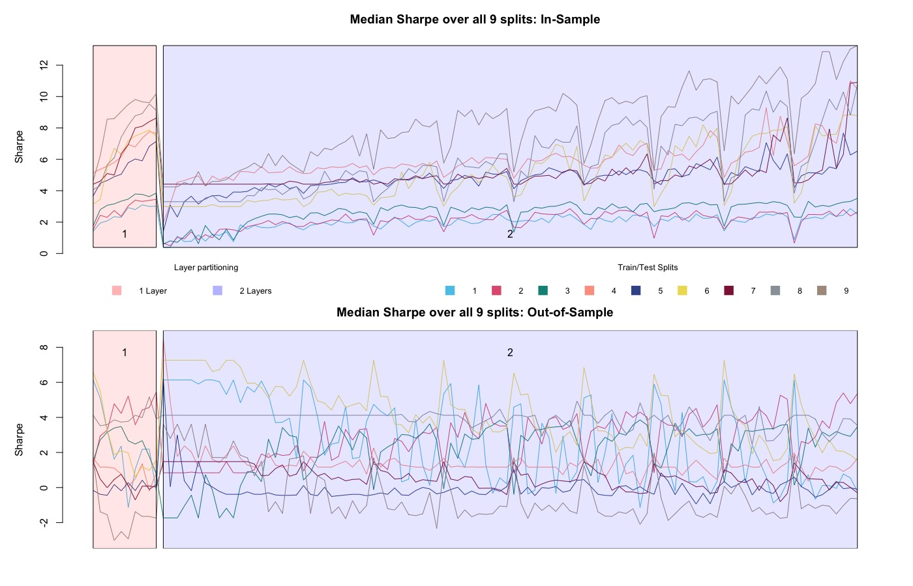
```

When looking at the Sharpe ratios, an inverse relationship between the in-sample and out-of-sample can be seen. The in-sample Sharpe ratio improves in most time splits with increasing complexity. In the out-of-sample, however, the medians decrease. It can also be seen that some of the Sharpe ratios show periodic spikes again. Apart from these aspects, no clear patterns or correlations could be identified. To put these numbers into perspective, a one-time investment in the S&P 500 ten years ago would have resulted in a Sharpe ratio of 0.83 [@S&P500_sharpe].

\newpage

#### 3.2.4. Model Selection {#mod-select}
&nbsp;

With the above procedure, we have been able to identify the characteristics of neural networks. In time series applications, complex networks lead to overfitting. We could detect an inverse relationship between in- and out-of-sample MSE. We trained many networks, yet no distinct optimal neuron-layer combination can be identified. Determining the architecture based on the minimum MSE would not yield good results. There would be too great a risk that the chosen architecture would be too complex and lead to overfitting. Additionally, the chosen architecture should lead to trustworthy predictions over different time periods (in our example over the 9 splits).

For the rest of the procedure, we decide to use a neural network architecture of (7,7). According to the 2-layer structure visualized in figure \ref{fig:mse_plot2}, the architecture we chose looks very balanced. In-sample, the MSE is rather in a more optimal range (smaller MSE) and out-of-sample, any overfitting is rather minimal compared to even more complex networks. In the attachment in figure \ref{fig:meanmean2}, you can see the average MSE across all 9 splits. The neuron layer architecture of (7,7) is exactly in the range where the in-sample MSE decreases and out-of-sample increases. The selected network lies exactly between the volatile networks, thus this architecture does not seem to be as prone to overfitting as the one next to it. The (7,7) network is not too complex, tends to have a good in-sample MSE and the out-of-sample MSE does not tend to overfit as much.

#### 3.2.5. Benchmark {#benchmark}
&nbsp;

The trained networks and applied methods are compared with each other using a benchmark. For this purpose, we use the buy-and-hold, which is a long-term passive investment strategy. Investing with this strategy often leads to better returns in the long run than active trading [@bnh]. This strategy is hard to beat, especially when the market is trending upwards. In such a trend, an active strategy would hardly recommend anything other than buy-and-hold.

We, therefore, compare our developed active strategies with the cumulative log returns. Our benchmark includes all green out-of-sample returns from figure \ref{fig:test_train} cumulated.

\newpage

### 3.3. Trading Strategy {#trading-strat}

This section describes the trading strategy in more detail. In basic terms, the findings of the previous sections are extended with considerations from explainable artificial intelligence (XAI) as well as from more traditional tools used in time series analysis. The following flowchart in figure \ref{fig:flowchart_trading} shows a broad overview of how the different factors are combined to generate the final trading signal.

&nbsp;

```{r flowchart_trading, fig.align='center', out.width='100%', fig.cap='This flowchart illustrates an overview of the trading strategy applied in this section. From left to right: Trading signals are created from forecasts, XAI and GARCH and combined at the end.', echo=FALSE}
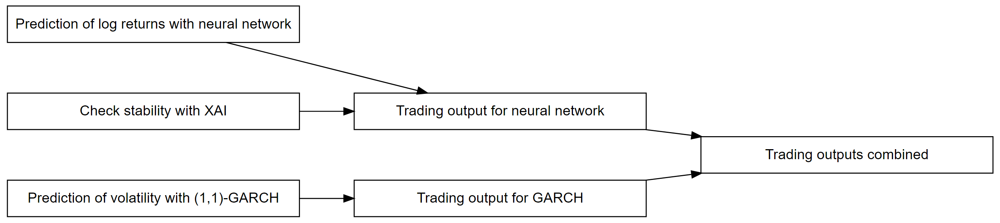
```

&nbsp;

The main component is the prediction of the neural network. This reflects the expected log return of the next day and is thus an important indicator of whether the money should remain invested or not. However, the output of these neural networks are to be treated with caution, as we have seen in the section [3.2.3](#evaluate_nn). Therefore, we rely on XAI to detect instability and incorporate this information into the final trading signal. Furthermore, volatility persistence is observed in financial time series, i.e. large changes can be expected after large changes. Leverage effects are also probable, which means that the tendency to achieve a negative return is higher when volatility is large. A GARCH model is used to model these phenomena, whose volatility predictions provide important information for the final trading signal.

While these methods sound promising, it should not be forgotten that a buy-and-hold strategy (given nerves of steel) also led to remarkable performances in the past that even outperformed traditional asset classes. The price development is described in sections [2.4.1](#historical_analysis) and [2.4.3](#bitcoin_valuation). That is why buy-and-hold is frequently used as a comparison. 

Before we trade the returns, we first need to define the environment and make some assumptions. Normally, trading costs are crucial in high-frequency trading. Since the fee structure for cryptocurrencies is more attractive than for stocks, transaction costs are waived for the sake of simplicity.  Further, we assume the possibility of entering short positions for BTC. These assumptions allow us to either stay in the market (signal = 1), to exit the market (signal = 0) or to sell tomorrow's return (signal = -1). In the latter two positions, negative returns can be avoided, or we can even profit from the downward movement. By exiting the market with signal 0, there are several opportunities to invest the money elsewhere or just stay out of the market and therefore eliminate market exposure. 

\newpage

#### 3.3.1. Trading with Neural Networks and LPD
&nbsp;

The following consecutive sections 3.3.2. and 3.3.3. go together. We describe, how in this thesis the neural network and LPD( theory explained in section [2.2.2](#xai_finance)) is used to create  trading signals. 


#### 3.3.2. Neural Network
&nbsp;

In [3.2.](#networkarchitecture) we use an average of only 50 realizations of feedforward nets to reduce computation time. However, it is proposed by the Central Limit Theorem [@central_limit_theorem] to use an approximate   $\text{number of iterations } N_{total} \ge 100$ for an accurate mean value. 

For a better understanding, we will take a closer look at an example of the effects of averaging all predictions.

Assume we calculate an amount of $N_{total}$=100 nets in total and try to predict just 1 day and use the sign of the forecast as a trading signal. If 49 nets predict a positive forecast and 51 a negative, we end up with a negative trading signal, which is actually decided by just one net. This means that the resulting trading signale occurs randomly. A positive trading signal that results from 60 positive predictions and 40 negative ones may be more accurate.

Therefore, the following a function is introduced that takes this aspect of majority voting into account.

&nbsp;

Let $\hat{\underline{p}}$ be the predicted values {$\hat{p}_{1}...\hat{p}_{N_{total}}$} of the neural networks in a certain time $t$.
With function $f$ \ref{eq:net_decision1} in every $t$ a trading signal is derived by majority decision. How clearly the decision of the forecasts must be, is decided by parameter $\kappa$.
For further evaluation of neural networks $\kappa$ can be used as an optimizing factor.

&nbsp;
 
```{=tex}
\begin{equation}\label{eq:net_decision1}
 f(\hat{\underline{p}}) =
\begin{cases} 
  0      & \quad \text{if } \frac{1}{N_{total}}  \sum_{i=1}^{N_{total}}sign(\hat{p}_{i}) < \kappa \\
  sign(\sum_{i=1}^{N_{total}}sign(\hat{p}_{i}))    & \quad \text{else}
  

   \end{cases}
\end{equation}
```

&nbsp;
  
$N_{total}$ = Total number of neural networks

$\kappa$ = Ratio of majority decision 

$\hat{p}_{k}$ = Predicted value from neural network

&nbsp;

One can observe in $f$ how the uncertain decisions result in a 0 signal. You could also use position sizing and adjust the signal depending on the size of $\kappa$. But we have omitted this aspect, because otherwise there are too many parameters in the model.

\newpage

#### 3.3.3. LPD Signal {#lpd-signal}
&nbsp;

To explain the following as understandable as possible, we recall chapter [2.2.2](#xai_finance) where the discrete derivatives of each input layer $lag_{j}$ were calculated with respect to the forecast at each time step. This procedure is now applied to the in-sample as well as the out-of-sample area. From the in-sample, the standard deviation and the mean are calculated for each $lag_{j}$. These are now used for the out-of-sample area. An example with out-of-sample 2021.01.01 - 2021.02.08 clarifies these procedure:
Figure \ref{fig:lpd_explain} represents the 7 lags, when looking at lag 4, the top line shows the previously calculated mean value from the in-sample (black) and the in-sample standard deviation upwards and downwards (dashed red). For the visualization the lines are drawn only for one lag.
Let's take a look at the time step 2021.01.25, where you can see that the pink line exceeds the standard deviation.  Now we count in this time step how many other lags also overshoot their standard deviation.
This is shown in formula \ref{eq:net_decision2}, we see immediately that on 2021.01.25, 4 lags have exceeded their standard deviation by the mean value.
In the example we state that if 4 or more lags exceed the upper limit the final signal is 0 and if between 2 and 4 lags exceed the standard deviation, we assign the signal 0.5. For our example date 2021.01.25 the signal would be 0.
Correctly concluded, we get a trading signal for each date.

```{r lpd_explain, fig.align='center', out.width='60%', fig.cap="LPD Plot for illustration: Visualization of the above signal generation procedure. For the top LPD time series, the mean value and the upper and lower decision bands are plotted.", echo=FALSE, fig.width = 8, fig.height = 5, fig.keep='last'}
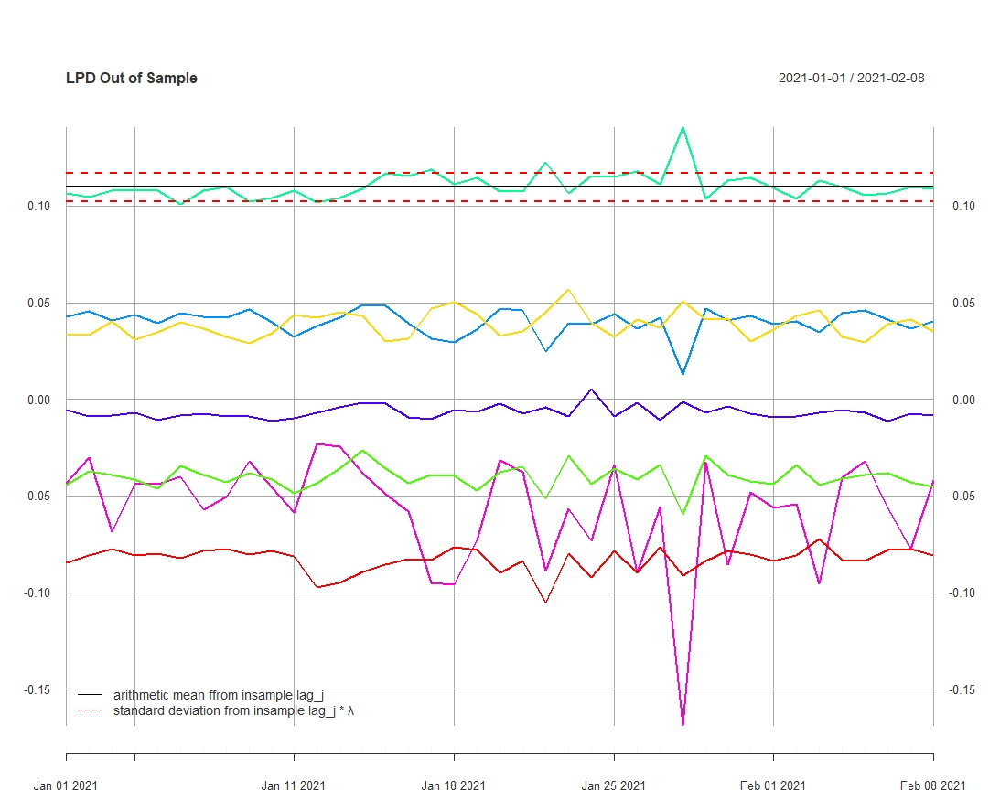
load("data/xai/7_7_withsignal_xai_in/OLPD_mat_out_plot.rda")
load("data/xai/7_7_withsignal_xai_in/meanCI.rda")
plot.xts(OLPD_mat_out["::2021-02-08."],
         col=c("#003f5c", "#665191", "#d45087", "#f6004a", "#ff1208", "#ffa600", "#ff7c43"),
         main="LPD Out-of-Sample")
lines(meanCI$meanline,lwd=2,col="black",lty=2)
lines(meanCI$meanup,lwd=2,col="red",lty=3)
lines(meanCI$meandown,lwd=2,col="red",lty=3)
addLegend("bottomleft",
          legend.names=c(TeX(sprintf("Mean value from $lag_{j}$")), TeX(sprintf("Standard deviation from $lag_{j}*\\lambda$"))),
          col=c("black","red"),
          lty=c(2,3),
          lwd=c(2,2),
          ncol=1,
          bg="white")
```

```{r lpd_explain_sum, fig.align='center', out.width='60%', fig.cap="LPD Sum Plot for illustration: Sum of the LPDs in black. Red is the upper decision limit and the green is the lower one. Values below the green line lead to a signal = 1. Values above the red line lead to a signal = 0. Values between the red and the green line lead to a signal = 0.5.", echo=FALSE, fig.width = 8, fig.height = 5, fig.keep='last'}
# 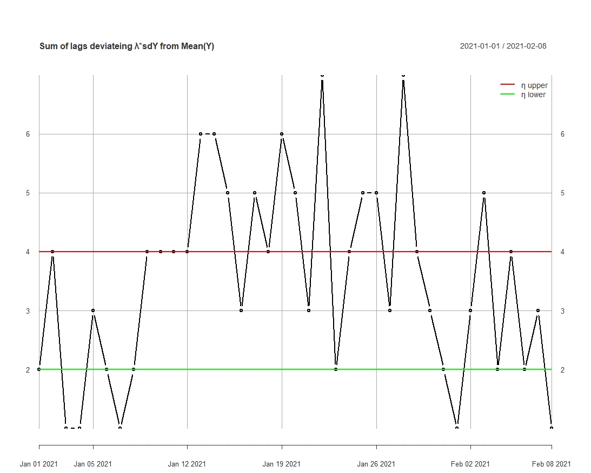
load("data/xai/7_7_withsignal_xai_in/sum_explana_out_plot.rda")
load("data/xai/7_7_withsignal_xai_in/sumCI.rda")
plot(sum_explana["::2021-02-08"],type=c("b"),
     main=TeX(sprintf("Sum of lags deviating $\\lambda$ *sdY from $\\bar{Y}$")))
lines(sumCI$lineup,lwd=2,col="red",lty=1)
lines(sumCI$linedown,lwd=2,col="green",lty=1)
name=c("η upper","η lower")
addLegend("topright",
          legend.names=c(TeX(sprintf("$\\eta_{upper}$")), TeX(sprintf("$\\eta_{lower}$"))),
          col=c("red","green"),
          lty=c(1,1),
          lwd=c(2,2),
          ncol=1,
          bg="white")
```

\newpage

To use this behavior for optimizing our model, a more formal general approach is required. The standard deviation is therefore scaled with parameter $\lambda$ and with formula \ref{eq:count} in every $lag_{j}$ it is decided whether the predicted LPD $\Delta_{j,t}$ exceeds $\mu_{j} \pm \lambda \sigma_{j}$.  

With function $g$ \ref{eq:count} we count the lags which exceed their bands, the output of $g$ is between 0 and $lag_{n}$. In  $\text{signal}$ \ref{eq:net_decision2}, $g$ is further applied to generate a signal. With $\eta_{lower}$ (green) and $\eta_{upper}$ (red) it is decided which final output for the timestep $t$ should be assigned. In section [3.1.](#data_exploration) last section, we observed, that larger negative returns are more likely than positive, therefore the proposed signal is 0. For values between $\eta_{lower}$ and $\eta_{upper}$ we propose a signal 0.5. Function \ref{eq:net_decision2} $\text{signal}$  is now applied to every timestep $t$, therefore the final LPD signal is computed.

&nbsp;


```{=tex}
\begin{align} \label{eq:Ybar}
\mu_{j}=\frac{1}{n_{in}} \sum_{t=1}^{n_{in}}\Delta_{j,t}
\end{align}
```


```{=tex}
\begin{align} \label{eq:sdY}
\sigma_{j}=\sqrt{  \frac{1}{n_{in}}  \sum_{t=1}^{n_{in}}(\mu_{j}-\hat{\Delta}_{j,t})^{2} }
\end{align}
```


```{=tex}
\begin{align} \label{eq:count}
g(\hat{\Delta}_{t})=\sum_{j=1}^{lag_{n}}\Big((\hat{\Delta}_{j}>\mu_{j} - \lambda \sigma_{j} )\vee( \hat{\Delta}_{j}<\mu_{j} + \lambda \sigma_{j})\Big)
\end{align}
```

```{=tex}
\begin{equation}\label{eq:net_decision2}
\text{signal}(\hat{\Delta}_{t}) =
\begin{cases} 
  0.5    & \quad \text{if } ,  \eta_{lower} < g(\hat{\Delta}_{t}) \le \eta_{upper}    \\                                              
  0      & \quad \text{if } ,   \eta_{upper} < g(\hat{\Delta}_{t}) \\
  1      & \quad \text{else}
   \end{cases}
\end{equation}
```

&nbsp;

$\Delta_{j,t}$ = matrix of in-sample LPD {$\underline{\Delta}_{1}...\underline{\Delta}_{n_{in}}$} observed for every t in insample

$\hat{\Delta}_{j,t}$ = matrix of out-of-sample LPD {$\underline{\hat{\Delta}}_{1}...\underline{\hat{\Delta}}_{n_{out}}$} predicted for every t in out of sample

$\lambda$ = Scaling parameter for standard deviation

$lag_{n}$ = Maximum number of lags

$\eta_{lower},\eta_{upper}$ = Lower  and upper border for signal decision

$n_{in} ,n_{out}$ = Maximum time insample / out-of-sample

$g$ = Function of lags exceeding band , output $\in$ {$0...lag_{n}$}

$signal$ = Function of trading signal

\newpage

#### 3.3.4. GARCH Volatility Predictions {#garch-signal}
&nbsp;

In a further step, we examine the time series with a traditional GARCH model that allows heteroskedasticity. T. Bollerslev proposes to use this to model time-dependent variance as a function of lagged shocks and lagged conditional variances [@garch]. Based on an ARMA(1,1)-GARCH(1,1), we conduct one-step-ahead predictions using a rolling window of size 365 days and refit the model after 30 days. This results in two different trading strategies of which one is based on the signs of the forecasts and the other on predicted volatility. The predictions of future volatilities are presented in the appendix in figure \ref{fig:vola_forecasts}. 

The first trading strategy is based on one-step-ahead rolling window forecasts (here: log return) resulting from the ARMA(1,1)-GARCH(1,1). When we predict a positive value, the algorithm decides to enter, respectively remain in a long position. When predicting a negative value, we enter a short position to benefit from the anticipated market movement. 

The second strategy is solely based on volatility predictions resulting from a GARCH(1,1) and tries to take an advantage from the asymmetric volatility phenomenon by F. Black. This phenomenon describes a negative correlation between the volatility of the return and the achieved return [@leverage_effect]. Therefore, we define the following trading rule:

```{=tex}
\begin{equation}\label{eq:vola_predict}
\text{Signal}_{GARCH}(\hat{\sigma}_{t}) =
\begin{cases} 
                                              
  0      & \quad \text{if} ,  \hat{\sigma}_{t} \ge \sigma_{historical} \\
  1      & \quad \text{else}

   \end{cases}
\end{equation}
```

$\hat{\sigma}_{t}$ = predicted volatility for every ${t}$

$\sigma_{historical}$ = historical volatility

In other words, the function checks whether the predicted volatility is significantly greater than the 95% confidence interval (based on historical data). If this is the case, the trading signal is set to 0, i.e. the position is sold respectively we stay out of the market. If the expected volatility is within the normal range, we enter respectively remain in a long position. For simplicity, a threshold of 1.64 is used, which corresponds approximately to the upper 95% confidence interval for a standard normal distribution.

\newpage

```{r garch_trading, fig.align='center', out.width='80%', fig.cap='Cumulative daily returns of two different GARCH trading strategies and a simple buy-and-hold strategy. The GARCH Signum strategy is based on the ARMA(1,1)-GARCH(1,1) prediction, while the GARCH Volatility strategy simply checks if the threshold is exceeded. The time periods where we quit the market is clearly visible as horizontal lines.', echo=FALSE, fig.width = 8, fig.height = 5, fig.keep='last'}
# 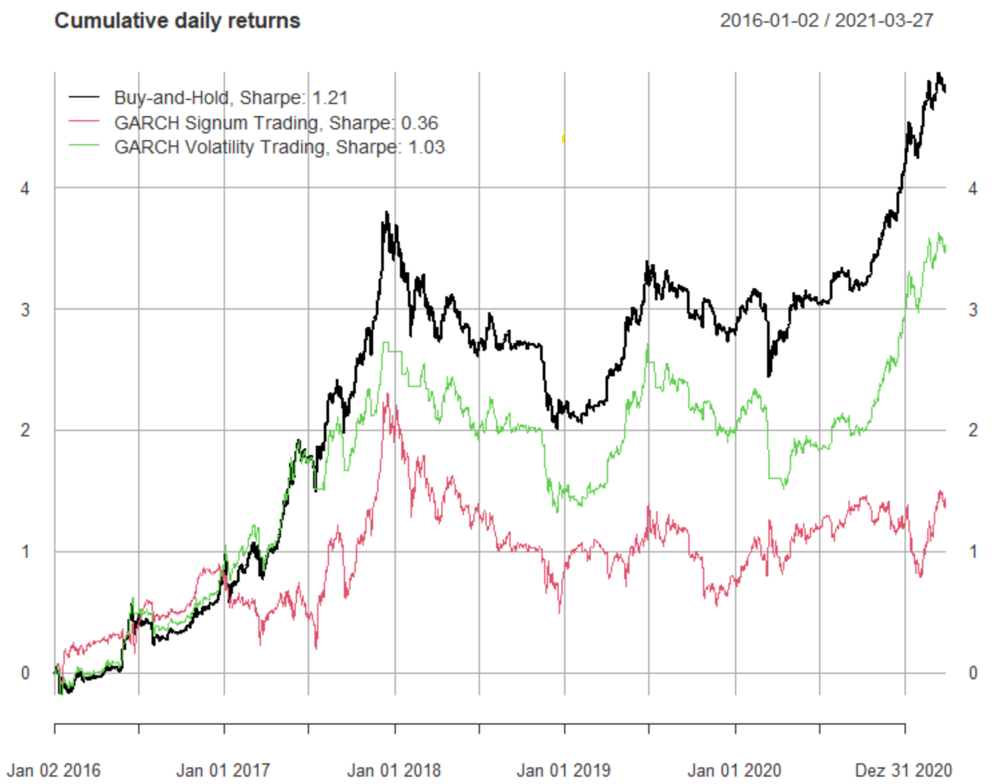

load("data/GARCH_vola_predictions/garch_perf.rda")
load("data/GARCH_vola_predictions/sharpe_perf.rda")
par(mfrow = c(1,1))
plot(cumsum(garch_perf[,1]), main = "Cumulative daily returns", lwd=1.5)
lines(cumsum(garch_perf[,2]), col = 2, lwd=1.5)
lines(cumsum(garch_perf[,3]), col = 3, lwd=1.5)
addLegend(legend.loc = "topleft", legend = c("Buy-and-Hold", "GARCH Signum Trading", "GARCH Volatility Trading"), col = c(1,2,3), lty = 1, lwd=1.5)
```

&nbsp;

Figure \ref{fig:garch_trading} illustrates how the GARCH trading strategies shown as well as a buy-and-hold strategy would have performed in a backtesting. It is easy to see that buy-and-hold outperforms the other two. The GARCH sign strategy misjudges the situation at key points in time and thus hurts the overall performance. Only during the Covid-19 crash in March 2020, the GARCH sign strategy suffered a smaller loss. On the other hand, we missed the following bull run. Also, the horizontal lines in the GARCH volatility strategy are clearly visible at which the predicted volatility is too large and thus the market exits. While some draw-downs are dampened, upside moves are also avoided. 

\newpage

#### 3.3.5. NN and LPD Estimation
&nbsp;

In section [3.2.4](#mod-select) we have decided to fix the architecture 7 layers 7 nets, all
the 9 splits which were introduced in section [3.2.1](#test_train), are now used for trading. The out-of-sample performances of every split are added together and are compared with the benchmark from [3.2.5](#benchmark).

Our findings from the GARCH model were not very promising, nevertheless we combine their signals with the neuralnet output and the signals from LPD.

With the previously established architecture, different values for the parameters: $\lambda$, $\eta_{lower},\eta_{upper}$ and $\kappa$  are used and the performance is compared to each other. In order to find a balance between precision and computation time, we found $N_{total}$= 1000 iterations should be sufficient for the evaluation.

The most promising performance is found with $\lambda = 1$,$\eta_{lower} > \eta_{upper}$ (no 0.5 signals were used) $\eta_{upper}=3$ and $\kappa = 0.2$.
In figure \ref{fig:perf} different combinations are visualized, NN is simply trading the forecast of neuralnet based on their sign. The signals of LPD are all 1 except off all those which are predicted 0. NN+LPD is the performance as described in section [3.3.3](#lpd-signal). The combination NN+LPD+GARCH takes in account the GARCH signals from section [3.3.4](#garch-signal). If LPD or GARCH signal is 0 then the signal is also 0. 

By investigating the plot it seems that some combinations are performing better than the others. The GARCH application appears to worsen the performance. Ligthblue and the Yellow line catches our eye, their perfomance seems to be better than the rest and as we can see, those are combinations of NN+LPD.

&nbsp;

```{r perf, fig.align='center', out.width='80%', fig.cap="Visualization of different signaling combinations. The best performing rule here is buy and hold in green. It is closely followed by the light blue NN+LPD combination with a $\\kappa$ of 0.2. The behavior of the individual rules is often very similar, few different decisions can influence the performance. Especially at the end of July, beginning of August the rules behave differently, but then usually behave very similarly.", echo=FALSE, fig.width = 8, fig.height = 5, fig.keep='last'}

# 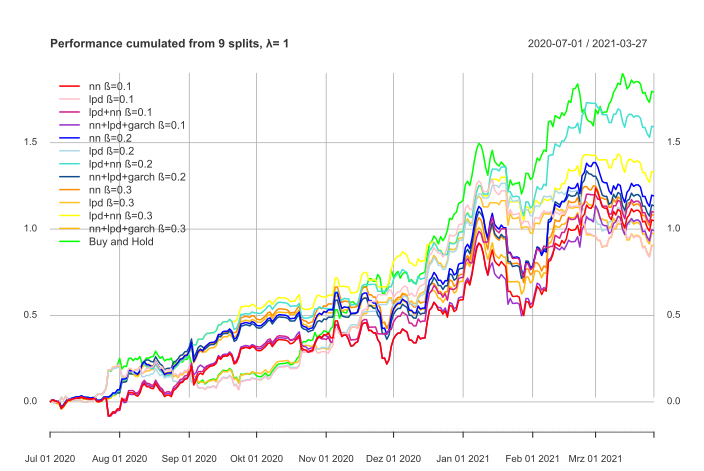

load("data/xai/7_7_withsignal_xai_in/perfall_without_eth.rda")
colors= c("red","pink","violetred","darkorchid","blue","lightblue","turquoise","dodgerblue4","darkorange","goldenrod1","yellow","darkgoldenrod1","green")
plot.xts(compare_perf,
         main=TeX(sprintf("Performance cumulated from 9 Splits, $\\lambda = %d$", 1)),
         col=colors)
addLegend("topleft",
          legend.names=c(TeX(sprintf("NN $\\kappa = %.1f$", 0.1)),
                         TeX(sprintf("LPD $\\kappa = %.1f$", 0.1)),
                         TeX(sprintf("NN+LPD $\\kappa = %.1f$", 0.1)),
                         TeX(sprintf("NN+LPD+GARCH $\\kappa = %.1f$", 0.1)),
                         
                         TeX(sprintf("NN $\\kappa = %.1f$", 0.2)),
                         TeX(sprintf("LPD $\\kappa = %.1f$", 0.2)),
                         TeX(sprintf("NN+LPD $\\kappa = %.1f$", 0.2)),
                         TeX(sprintf("NN+LPD+GARCH $\\kappa = %.1f$", 0.2)),
                         
                         TeX(sprintf("NN $\\kappa = %.1f$", 0.3)),
                         TeX(sprintf("LPD $\\kappa = %.1f$", 0.3)),
                         TeX(sprintf("NN+LPD $\\kappa = %.1f$", 0.3)),
                         TeX(sprintf("NN+LPD+GARCH $\\kappa = %.1f$", 0.3))
                         ,
                         TeX(sprintf("Buy and Hold"))),
          col=colors,
          lty=c(rep(1,13),2),
          lwd=c(rep(2,13),3),
          ncol=1,
          bg="white")
```

\newpage

Regarding the Sharpe in figure \ref{fig:sharpe} our findings from before are confirmed. The NN+LPD with $\kappa = 0.2$ has even a better Sharpe ratio than buy and hold. But another observation is seemingly more interesting, the LPD is alway better than only NN. By investigating the other calculations we have done, we find the same pattern, therefore we conclude that LPD brings us a real benefit.

&nbsp;

```{r sharpe, fig.align='center', out.width='80%', fig.cap="Sharpe ratios of different signaling combinations. Based on the performance measure Sharpe ratios, the LPDs lead to a better performance. According to the Sharpe ratio, the performance of the NN+LPD signaling rule with a $\\kappa$ of 0.2, is better than Buy and Hold.",echo=FALSE, fig.width = 8, fig.height = 5}
# 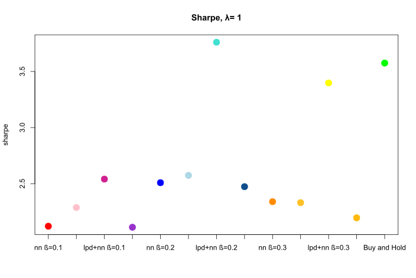

load("data/xai/7_7_withsignal_xai_in/sharpeplot_without_eth.rda")
defaultmar <- par("mar")
par(mar=c(11,4,4,4))
my_bar <- barplot(as.numeric(sharpesave), border=F,
                  names.arg=c(TeX(sprintf("NN $\\kappa = %.1f$", 0.1)),
                              TeX(sprintf("LPD $\\kappa = %.1f$", 0.1)),
                              TeX(sprintf("NN+LPD $\\kappa = %.1f$", 0.1)),
                              TeX(sprintf("NN+LPD+GARCH $\\kappa = %.1f$", 0.1)),
                              
                              TeX(sprintf("NN $\\kappa = %.1f$", 0.2)),
                              TeX(sprintf("LPD $\\kappa = %.1f$", 0.2)),
                              TeX(sprintf("NN+LPD $\\kappa = %.1f$", 0.2)),
                              TeX(sprintf("NN+LPD+GARCH $\\kappa = %.1f$", 0.2)),
                              
                              TeX(sprintf("NN $\\kappa = %.1f$", 0.3)),
                              TeX(sprintf("LPD $\\kappa = %.1f$", 0.3)),
                              TeX(sprintf("NN+LPD $\\kappa = %.1f$", 0.3)),
                              TeX(sprintf("NN+LPD+GARCH $\\kappa = %.1f$", 0.3)),
                              
                              TeX(sprintf("Buy and Hold"))),
                  cex.names=0.8,
                  las=2, 
                  col=colors, 
                  ylim=c(0,4), 
                  main=TeX(sprintf("Sharpe $\\lambda = %d$", 1)),
                  ylab="Sharpe")
grid()
par(mar=defaultmar)
```

\newpage

Figure \ref{fig:batch} gives a insight on how the individual combinations performed in each of the 9 splits. The NN+LPD with $\kappa = 0.2$ is predominantly better in the first three splits, in the middle section its worse and towards the end the Sharpe is again better than buy and hold.
But lets take this plot not to serious because these splits are just one month out-of-sample i.e the Sharpe ratio is sensitive to outliers, this effect is even stronger when there is little data present.

&nbsp;

```{r batch, fig.align='center', out.width='80%', fig.cap="Sharpe ratios from the same different signaling combinations as in the last two graphs, but each for the 9 different time splits. Certain combinations have very similar decisions and thus lead here also to similar trajectories of the Sharpe ratios.",echo=FALSE, fig.width = 8, fig.height = 5}
# knitr::include_graphics("images/xailpd/lambda_1/batch.svg")

load("data/xai/7_7_withsignal_xai_in/sharpmat_perbatch_without_eth.rda")
load("data/xai/7_7_withsignal_xai_in/allsharp_without_eth.rda")


colorsbatch= c("red","pink","violetred","blue","lightblue","turquoise","darkorange","goldenrod1","yellow","green")
main="Sharpe per batch, λ=1"
plot(sharpmat_1[,4],type="l",col="green",xlab="Batch Nr.",ylab= "Sharpe",lwd=2,ylim=c(min(allsharp),max(allsharp)),
     main=TeX(sprintf("Sharpe per batch, $\\lambda = %d$", 1)))
grid()
for (i in 1:8){lines(allsharp[,i],col=colorsbatch[i],type="l",lwd=2)}
```

\newpage

#### 3.3.6. Adding Ether
&nbsp;

In the performance plot \ref{fig:perf}, we have still left out what to do with 0 signals. One opportunity as in [3.3](#trading-strat) shortly mentioned, is to invest the money in another asset. By reason of staying in the same asset class we choose Ether [@ether] to invest in.
The coin Ether from Ethereum is with $61.48B [@ethereum] the second largest cryptocurrency according to marketcapitalisation. 

According to [@correlation_btc] the correlation between the two assets is 0.91. This is not a braking factor to us, because the 0 signal of the LPD is just indicating that something is changing in the data or the neural net is not stable, thus we cant exactly know what the 0 signal means. 

The structure Ether is very similar to Bitcoin [@oeko3project]. The series is imported in the same way as BTC e.g. the log returns are derived.

That said, we use a simple rule to integrate Ether. If the signal of the combination NN+LPD is 0 then we go long on Ether. As soon as the signal from LPD changes back to 1 or -1, Ether is sold and the Bitcoin position is entered again.

&nbsp;

```{r with_eth, fig.align='center', out.width='80%', fig.cap="In addition to LPD+NN combinations with different beta, combinations with ETH are added here. The combination LPD+NN+ETH with a beta of 0.2, clearly performs best here. Overall, even 3 combinations are better than buy and hold.",echo=FALSE, fig.width = 8, fig.height = 5, fig.keep='last'}
# 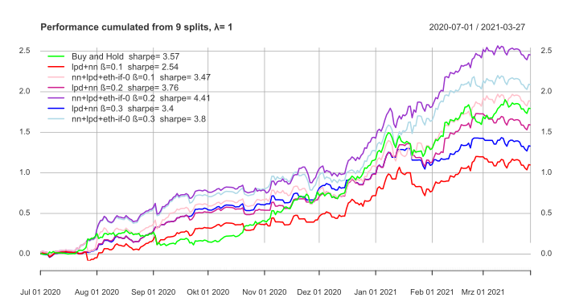
load("data/xai/7_7_withsignal_xai_in/performance_with_eth.rda")
load("data/xai/7_7_withsignal_xai_in/nn_lpd_without_eth.rda")
signal <- data$BTC.USD.Close
signal$BTC.USD.Close <- nn_lpd
colors= c("green","red","pink","violetred","darkorchid","blue","lightblue")
plot(data, col=colors, main=TeX(sprintf("Performance cumulated from 9 splits, $\\lambda = %d$", 1)))
addLegend("topleft", 
          legend.names=c(TeX(sprintf("Buy and Hold, $Sharpe = %.2f$", 3.57)),
                         TeX(sprintf("LPD+NN $\\kappa = %.1f$, $Sharpe = %.2f$", 0.1, 2.54)),
                         TeX(sprintf("LPD+NN+ETH if 0 $\\kappa = %.1f$, $Sharpe = %.2f$", 0.1, 3.47)),
                         TeX(sprintf("LPD+NN $\\kappa = %.1f$, $Sharpe = %.2f$", 0.2, 3.76)),
                         TeX(sprintf("LPD+NN+ETH if 0 $\\kappa = %.1f$, $Sharpe = %.2f$", 0.2, 4.41)),
                         TeX(sprintf("LPD+NN $\\kappa = %.1f$, $Sharpe = %.2f$", 0.3, 3.40)),
                         TeX(sprintf("LPD+NN+ETH if 0 $\\kappa = %.1f$, $Sharpe = %.2f$", 0.3, 3.80))),
                         
          col=colors,
          lty=c(rep(1,13),2),
          lwd=c(rep(2,13),3),
          ncol=1,
          bg="white")
```

&nbsp;

In figure \ref{fig:with_eth} the NN+LPD's from figure \ref{fig:perf} and the adding of Ether is visualized. In the lower part, we can observe the signals which are 0 in the NN+LPD model. These zeroes are now filled up with the log returns from Ether.

The one performance with NN+LPD+ETH with $\kappa = 20 \%$ seems promising. Also for the other two NN+LPD the adding of Ether seems benefital.

\newpage

```{r with_eth_sole, fig.align='center', out.width='80%', fig.cap="Visualization of the best performing signaling and the benchmark buy and hold. One can clearly see that as of August 2020, the purple signaling strongly contrasts with the green benchmark. There are some decisions which lead to a better performance than simple buy and hold.",echo=FALSE, fig.width = 8, fig.height = 5, fig.keep='last'}

load("data/xai/7_7_withsignal_xai_in/performance_with_eth.rda")
load("data/xai/7_7_withsignal_xai_in/nn_lpd_without_eth.rda")
signal <- data$BTC.USD.Close
signal$BTC.USD.Close <- nn_lpd
colors= c("green","darkorchid")
plot(data[,c(1,5)], col=colors, main=TeX(sprintf("Performance cumulated from 9 splits, $\\lambda = %d$", 1)))

addLegend("left",
          legend.names=c(TeX(sprintf("Buy and Hold, $Sharpe = %.2f$", 3.57)),
                         TeX(sprintf("LPD+NN+ETH if 0 $\\kappa = %.1f$, $Sharpe = %.2f$", 0.2, 4.41))),
          col=colors,
          lty=c(rep(1,13),2),
          lwd=c(rep(2,13),3),
          ncol=1,
          bg="white")

events<- xts(LETTERS[1:6], as.Date(c("2020-08-01","2020-09-04","2020-10-18","2021-01-15","2021-02-22","2021-03-12")))
addEventLines(events, srt=0, pos=1, lty=3, col = rep("#004c6d",6),lwd=2, cex=1.2)
# lines(signal, on=NA, lwd=2, col="red", ylim=c(-1.3, 1.3))

```

&nbsp;

For  a closer analysis, lets have a look at the cumulated logreturns of the best performing model vs. buy-and-hold in Figure \ref{fig:with_eth_sole}. The following analysis is related to the violet chart and starts from left to right, beginning with letter **A**. 
Imideatly after the line by letter **A**, there are several decisions which differ from buy-and-hold and force a shift to the series. In letter **B** we observe a similar behavior for a short period of time. The unsatisfying trend change in letter **C** is stopped around the first of November. Thereafter unto the point in letter **D** the decisions of the model behave quite similar the green line. Right after **D** the net handles the negative trend very well and climbs further up. The same accounts for letter E, where the trend once more goes in the opposite direction than the benchmark. Shortly after **F** the model does exactly the same as buy-and-hold.

Lets have a simple theoretical comparison example under the assumptions in [3.3.](#trading-strat) at last.

With summarizing the logreturns from \ref{eq:logreturn} with Formula \ref{eq:logreturns_transforming},  one can calculate the value $S_{tn}$ which we end up with, when an Amount $S_{t0}$ is invested at the beginning.

&nbsp;

```{=tex}
\begin{align} \label{eq:logreturns_transforming}
S_{tn} &=S_{t0}\prod_{k=1}^{t_{n}}e^{LogReturn_{k}} \\
&=S_{t0}e^{ \sum_{k = 1}^{t_{n}} LogReturn_{k} } \nonumber
\end{align}
```

&nbsp;

Lets say, we invest 1000 US-Dollar  at the beginning of the timeperiod in \ref{fig:with_eth_sole}. With buy-and-hold we would end up at 6003.25 US-Dollar by the end of March. However if we invest the 1000 USD in the best performing strategy we will end up with **11'633.70**  USD, that would be as nearly as double the amount of buy-and-hold. Comparing the Sharperatios  **4.41** to 3.57  of the LogReturns, the used strategy does also significantly better. 


