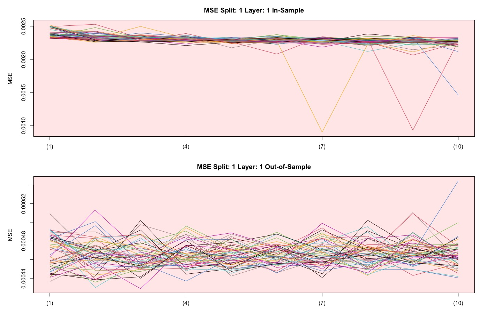
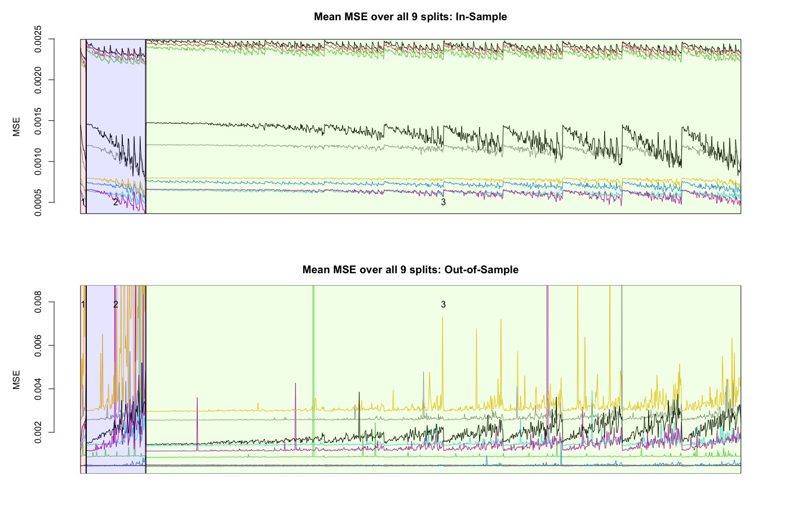
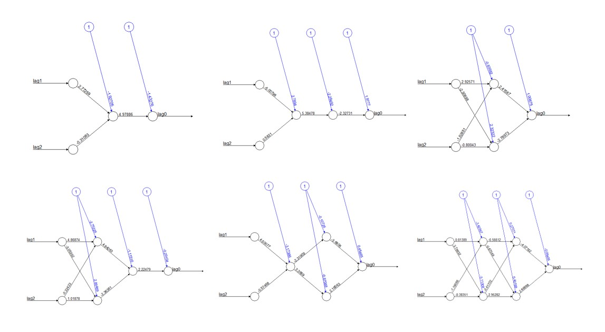

## 3. Methodology

The focus of this thesis can be divided into two areas. First, the aim is to find an optimal neural network including a network architecture. This should perform well in the application area, in which the future log return of the Bitcoin is predicted on the basis of historical log returns. In a second step, we will focus on defining a trading strategy based on our findings. All considerations and findings will be presented in a quantitative way and compared with each other. Figure \ref{fig:flowchart_overview} helps to get an overview of the individual steps followed in this chapter.  

```{r flowchart_overview, fig.align='center', out.width='65%', fig.cap='This flowchart illustrates an overview of the individual intermediate steps that are covered in the Methodology chapter. ', echo=FALSE}
knitr::include_graphics("images/flowchart_overview.png")
```

\newpage

### 3.1. Data exploration {#data_exploration}

The data in this paper is accessed  via yahoofinance provided by coinmarket https://coinmarketcap.com/. We use the daily "closing price" of bitcoin in US Dollars with the ticker BTC-USD.
Cryptoassets are tradeble 24 hours a day  365 days a year. There is no real "closing price" for the bitcoin, hence the "closing-Price" is just the last price of the day evaluated at the last timestamp with timeformat UTC.


In chapter [2.3.](#bitcoin) the bitcoin price and the logarithmic price is visualized.
For processing and analyzing the data in order to fullfill the weak stationarity assumptions we transform the data into logreturns according to equation \ref{eq:logreturn}.
```{=tex}
\begin{align} \label{eq:logreturn}
\mathrm{LogReturn} = \mathrm{log}(x_{t})-\mathrm{log}(x_{t-1})
\end{align}
```


```{r log_ret, echo=FALSE, message=FALSE, fig.cap="logreturns BTC",out.width="80%"}
load("data/log_ret_27_03_21.rda");log_ret=    log_ret_27_03_21   # loading logreturns
df_sub <- data.frame(date = ymd(time(log_ret)), value = as.numeric(log_ret))
plot(df_sub,
     type="l",
     frame.plot = FALSE,
     xaxt="n",
     xlab="",
     ylab="Log Return", ylim=c(-0.45, 0.2))
axis.Date(1, at=seq(min(df_sub$date), max(df_sub$date), by="months"), format="%m-%y")
```

In plot \ref{fig:log_ret} various large outliers are visible, especially one outlier towards the end catches the eye. The series seems to be very noisy, nevertheless volatility clusters are observable. By computing the ACF of the series in figure \ref{fig:acf_log_ret}, we can describe the dependency in these clusters. According to the ACF the lags 6 and 10 are significant on a 5% level. 


```{r acf_log_ret, echo=FALSE, message=FALSE, fig.cap="logreturns BTC"}
# acf(log_ret,main="autocorrelation Logreturns")
chart.ACF(log_ret,main="autocorrelation Logreturns", maxlag = 20)
```

Curios from which distribution the logreturns might originate, we are fitting a Normaldistribution and a Students-t distribution to the data in Figure \ref{fig:histogramm_logreturns}.

Interestingly the mean is shifted slightly (0.002) to the positive side.By inspecting the tails, one can observe that the negativ tail is not fitted as good as the positive part by the t distribution. The two Normaldistributions either over- or underestimate the values in the tails, therefore we conclude that the proposed t-distribution fits the data better but also not perfect.

Pointing at the extreme outlier discussed earlier, visible in Figure \ref{fig:log_ret} towards the end, the density plot makes clear how unimaginable small the probability of this extreme observation is. 


```{r histogramm_logreturns, out.width='80%', fig.cap='Distribution of Logreturns', echo=FALSE,fig.align="center"}
knitr::include_graphics("images/histogram_logret_3.jpeg")
```


\newpage

### 3.2. Network architecture

As mentioned in chapter [2.1.3.](#MLP), choosing an appropriate network architecture for bitcoin price prediction is a crucial step in order to achieve useful forecasts while avoiding overfitting. Due to the complexity as well as the non-linearity of neural networks, the interpretation cannot be performed intuitively. For this reason, an approach is pursued in which neural networks with different numbers of layers and neurons are compared with each other by using the MSE loss. This allows us to compare accuracy and possibly see a connection with network architecture. The first plot in figure \ref{fig:mse_1_layer1} compares different neural networks with one layer. Networks with a maximum of ten neurons are compared. These different configurations can be seen on the x-axis. The y-axis shows the MSE values obtained with the respective optimized model. We use 50 different optimizations of each configuration to get a better idea of a potentially systematic relationship with the MSE. In the plot, each of the configurations is drawn using a different color. 

- NN for bitcoin prediction
- Non-linear task
- How decide the number of layers and nodes
- Keep in mind rule of thumb 
- Test all possible configurations (with realizations = 50) and compare the MSE 

```{r mse_1_layer1, out.width='100%', fig.cap='First Train/Test Split.', echo=FALSE,fig.align="center"}

```

\newpage

- WEITER MIT DER DEFINITION VON TRAIN/TEST SPLITS
- VISUALISIERUNG EINES TRAIN/TEST SPLITS, MIT ANALYSE.
- ERKLÄREN, DASS ES UNMÖGLICH IST FÜR 9 VERSCHIEDENE SPLITS EIN EINE REIN VISUELLE ANALYSE DURCHZUFÜHREN
- MITTELWERTE ÜBER SÄMTLICHE DER 9 SPLITS BERECHNEN UM DEI BESTIMMUNG DES OPTIMALEN NETZTES ZU VEREINFACHEN
BESPIEL: Man hat 9 Splits à je 1110 Neuronen-Layer-Kombinationen. Für jede NL-Architektur wurden 50 neuronale Netzwerke trainiert. Somit kommt man auf 55500 Netze pro Splits. Also für alleine diese Versuchreihe wurden 499500 Netzwerke trainiert. Nun möchte man diejenige NL-Architektur finden, welche im Verlauf der Zeit (Verlauf der 9 Splits) am besten geblieben/am wenigsten an Performanz verloren hat/am besten geworden ist finden. Man hat herausgefunden, dass Netzte sehr zufällig sind. Somit werden die Mittelwerte über die 50 Netzte pro Layer, pro Split gebildet. Man erhält für jede NL-Kombination 9 verschiedene Mittelwerte der MSEs. Die Suche nach einer optimalen Netzwerk-Architektur ist so um einiges einfacher. (siehe \ref{fig:mse_mean})

```{r mse_mean, out.width='100%', fig.cap='MSE mean over all 9 splits.', echo=FALSE,fig.align="center"}

```

- Eventuell noch Sharpe hinzunehmen, wäre noch interessant (work in Progress)? oder evtl doch erst später im Trading?

\newpage

#### 3.2.1. Defining train and test samples

For further analysis, we are going to use a subset of the introduced closing prices of bitcoin.
Starting from the first of January 2020 to the 27th of March in 2021, we only consider 15 months for our data.

The reason for doing so is, we don’t believe that the historical data longer than a year is consisting of any information about the price tomorrow. By optimizing our models we found that more data would bring no additional performance, therefore the selected subset should be sufficient.
As proposed in [@nn_trading] we choose a test train split from 6 months in-sample and 1 month out of sample. This split is applied to the whole subset in form of a rolling window. By stepping forward with this 6/1 split by steplength of one month we end up with 9 data splits in total. In figure \ref{fig:test_train} this procedure is visualized, for every new timestep a new month is considered for the out of sample and the first month of the in sample falls out of the frame.


```{r test_train, out.width='80%', fig.cap='Distribution of Logreturns', echo=FALSE}
knitr::include_graphics("images/test_train_split_pp.jpeg.jpg")
```


-   Describe different phases

-   Explain why we set train and test sample like this

-   Describe stable and volatile phases and why we should keep that in mind for predictions

\newpage
#### 3.2.1.  Evaluating architecture

&nbsp;

In order to find an appropriate model to evaluate our neural net architecture we needed to compare different architectures of the network. Therefore we wrote a function which compares all possible combinations of neurons and layers for a given maximum. 

For an easier understanding here is an example:

We want to know all combinations of nets for a maximum of 2 layers with maximum 2 neurons each. With formula \ref{eq:complexity} we can compute the number of combinations.

In this case it equals 6 nets, which are plotted in figure \ref{fig:examples_for_function}, the input layer is held simply, to two layers for illustration. For each of this 6 models We compute Insample out of sample MSE, their correlation and the In and out of sample performance ( daily trading ) with the Sharpe measure.

Due to the "randomness of the networks  multiple realisations for every single network are computed in order to find a pattern or a systematic deviation.

```{=tex}
\begin{align} \label{eq:complexity}
comb=\sum_{i=1}^{L}N^{i}
\end{align}
```
with:


$L =$ maximum Layer $\in$ Natural numbers without 0 

$N =$ maximum Neurons  $\in$ Natural numbers without 0 

$comb =$ Number of all combinations

```{r examples_for_function, fig.align='center', out.width='70%', fig.cap='Schematic diagram of a perceptron.', echo=FALSE,out.width="100%"}

```


By reason to lack of time in the frame of this bachelorthesis, we only regard maximum 5 layers and maximum 5 realisations which itself generates 3905 models which are each calculated 20 times equaling 78100 differnet nets.

Regarding real life application of the model we evaluate performance over different insample - out of sample 


results:

- no need for more complexity, smaller architecture also does the job

\newpage

### 3.3. Benchmark

To compare the models we choose two simple benchmarks the well known buy and hold and an Ar(1) process as you can see in Figure xy and Figure xxy.

### 3.4. Trading strategiesg

-   Define trading strategies

- Sign-trading (daily)
- Vola-gewichtet trading 

-   Define realistic fee structure for trading (Coinbase Pro, Binance, Kraken etc.)

#### 3.5.1. Other cryptocurrency

- Test our best model with another time series

### 3.6. Explainability

- Performing the predictions with the two (?) best models

-   Include variations to find possible starting points for explainability (number of nodes, layers)

### 3.7. (Relationship between accuracy and market phase)

-   Test
