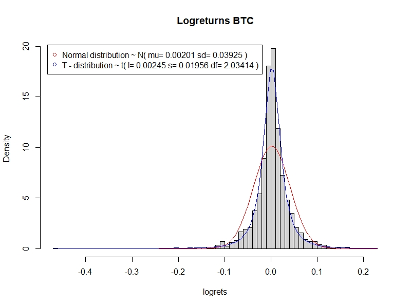

## 3. Methodology

The focus of this thesis can be divided into two areas. First, the aim is to find an optimal neural network including a network architecture. This should perform well in the application area, in which the future log return of the Bitcoin is predicted on the basis of historical log returns. In a second step, we will focus on defining a trading strategy based on our findings. All considerations and findings will be presented in a quantitative way and compared with each other. Figure \ref{fig:flowchart_overview} helps to get an overview of the individual steps followed in this chapter.  

```{r flowchart_overview, fig.align='center', out.width='65%', fig.cap='This flowchart illustrates an overview of the individual intermediate steps that are covered in the Methodology chapter. ', echo=FALSE}
knitr::include_graphics("images/flowchart_overview.png")
```


### 3.1. Data and analysis of Bitcoin 

The data in this paper is accessed  via yahoofinance provided by coinmarket https://coinmarketcap.com/. We use the daily "closing price" of bitcoin in US Dollars with the ticker BTC-USD. Cryptoassets are tradeble 24 hours a day  256 days a year, there is no real "closing price" for the bitcoin, therefore the "closing-Price" is just the last price of the day evaluated at last timestamp with timeformat UTC.


In chapter [2.3.](#bitcoin) the bitcoin price is visualized. For processing and analyzing the data in order to fullfill the weak stationarity assumptions we transform the data into logreturns.

By plotting the frequencies of the logreturns we can observe a t distribution fitting better to the data than a normaldistribution

```{r histogramm_logreturns, out.width='80%', fig.cap='Distribution of Logreturns', echo=FALSE}

```

$$\mathrm{LogReturn} = \mathrm{log}(x_{t})-\mathrm{log}(x_{t-1})$$
```{r, echo=FALSE, message=FALSE}
load("data/log_ret_27_03_21.rda");log_ret=    log_ret_27_03_21   # loading logreturns
ts.plot(log_ret)
```

By computing the autocorrelation oft the log_returns, there is still dependence visible in lag 6 and 10. This indicates dependency in volatility-cluster, to cancel out the effect an ARMA-GARCH model is fitted to the data and the residuals are standardized by the model standard-deviation.


```{r, echo=FALSE, message=FALSE}
acf(log_ret)
```

### 3.2. Comparison of network architecture

As mentioned in chapter [2.1.3.](#MLP), choosing an appropriate network architecture for bitcoin price prediction is a crucial step in order to achieve useful forecasts while avoiding overfitting. Due to the complexity as well as the non-linearity of neural networks, the interpretation cannot be performed intuitively. For this reason, an approach is pursued in which neural networks with different numbers of layers and neurons are compared with each other by using the MSE loss. This allows us to compare accuracy and possibly see a connection with network architecture. The first plot in figure xy compares different neural networks with one layer. Networks with a maximum of six neurons are compared. These different configurations can be seen on the x-axis. The y-axis shows the MSE values obtained with the respective optimized model. We use ten different optimizations of each configuration to get a better idea of a potentially systematic relationship with the MSE. In the plot, each of the configurations is drawn using a different color. 

- NN for bitcoin prediction
- Non-linear task
- How decide the number of layers and nodes
- Keep in mind rule of thumb 
- Test all possible configurations (with realizations = 10) and compare the MSE 


### 3.2. Defining train and test samples

Test train split

By purpose of further analysis were going to use subset of the introduced closing prices of bitcoin.
Starting from the first of   january 2020 to the 27th of march in 2021 we only consider 15 months for our data. The reason for doing that is, we don’t believe that the historical data longer than a year is consisting any information about the price tomorrow. By optimizing our models we found that more data would bring no additional performance, therefore the selected substrata should be sufficient.
As proposed in [@nn_trading] we choose a test train split from 6 months insample and 1 month out of sample. This split is applied to the whole substrata in form of a rolling window by stepping forward 1 month.  


-   Describe different phases

-   Explain why we set train and test sample like this

-   Describe stable and volatile phases and why we should keep that in mind for predictions

#### 3.2.xy. Benchmark

To compare the models we choose two simple benchmarks the well known buy and hold and an Ar(1) process as you can see in Figure xy and Figure xxy.

\newpage
#### 3.3.xy.  Evaluating architecture

&nbsp;

In order to find an appropriate model to evaluate our neural net architecture we needed to compare different architectures of the network. Therefore we wrote a function which compares all possible combinations of neurons and layers for a given maximum. 

For an easier understanding here is an example:

We want to know all combinations of nets for a maximum of 2 layers with maximum 2 neurons each. With formula \ref{eq:complexity} we can compute the number of combinations.

In this case it equals 6 nets, which are plotted in figure \ref{figure:examples_for_function}, the input layer is held simply, to two layers for illustration. For each of this 6 models We compute Insample out of sample MSE, their correlation and the In and out of sample performance ( daily trading ) with the Sharpe measure.

Due to the "randomness of the networks  multiple realisations for every single network are computed in order to find a pattern or a systematic deviation.

```{=tex}
\begin{align} \label{eq:complexity}
comb=\sum_{i=1}^{L}N^{i}
\end{align}
```
with:


$L =$ maximum Layer $\in$ Natural numbers without 0 

$N =$ maximum Neurons  $\in$ Natural numbers without 0 

$comb =$ Number of all combinations

```{r examples_for_function, fig.align='center', out.width='70%', fig.cap='Schematic diagram of a perceptron.', echo=FALSE,out.width="100%"}
knitr::include_graphics("images/examples for function.jpg")
```


By reason to lack of time in the frame of this bachelorthesis, we only regard maximum 5 layers and maximum 5 realisations which itself generates 3905 models which are each calculated 20 times equaling 78100 differnet nets.

Regarding real life application of the model we evaluate performance over different insample - out of sample 


results:

- no need for more complexity, smaller architecture also does the job

### 3.4. Trading strategiesg

-   Define trading strategies

- Sign-trading (daily)
- Vola-gewichtet trading 

-   Define realistic fee structure for trading (Coinbase Pro, Binance, Kraken etc.)

### 3.4.1. Other cryptocurrency

- Test our best model with another time series

### 3.5. Explainability

- Performing the predictions with the two (?) best models

-   Include variations to find possible starting points for explainability (number of nodes, layers)

### 3.6. (Relationship between accuracy and market phase)

-   Test
