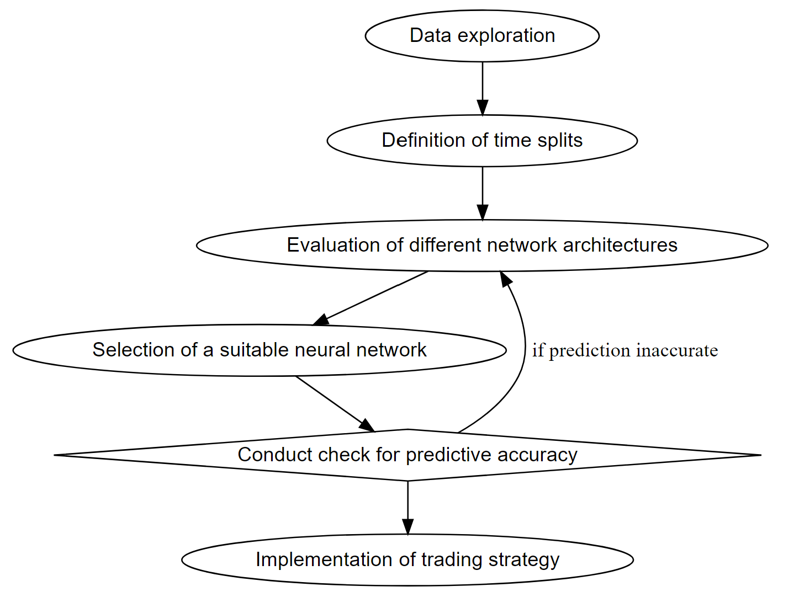
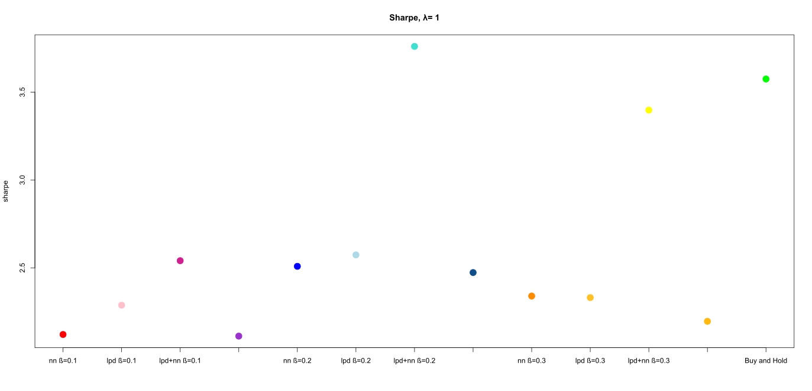
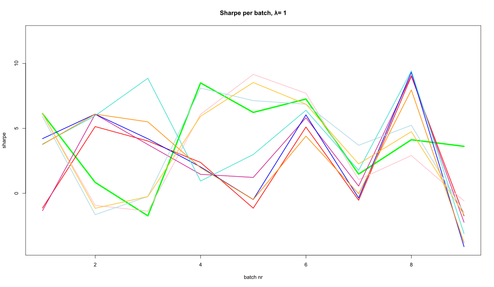

---
output:
  html_document:
    df_print: paged
geometry: margin = 1in
---

## 3. Methodology

The focus of this thesis can be divided into two areas. First, the aim is to find an optimal neural network including a network architecture. This should perform well in the application area, in which the future log return of the bitcoin is predicted on the basis of historical log returns. In a second step, we will focus on defining a trading strategy based on our findings. All considerations and findings will be presented in a quantitative way and compared with each other. Figure \ref{fig:flowchart_overview} helps to get an overview of the individual steps followed in this chapter.  

```{r flowchart_overview, fig.align='center', out.width='65%', fig.cap='This flowchart illustrates an overview of the individual intermediate steps that are covered in the Methodology chapter. ', echo=FALSE}

```

\newpage

### 3.1. Data exploration {#data_exploration}

The data in this paper is accessed  through the API of Yahoo Finance and is originally provided by the price-tracking website CoinMarketCap. We use the daily closing price of bitcoin in USD with the ticker BTC-USD. As cryptocurrencies are traded 24/7, the closing price refers to the last price of the day evaluated at the last time stamp according to the Coordinated Universal Time (UTC).

In chapter [2.3.](#bitcoin), the bitcoin price and the logarithmic price is visualized.
For processing and analyzing the data in order to fulfill the weak stationarity assumptions, we transform the data into log returns according to equation \ref{eq:logreturn}.

```{=tex}
\begin{align} \label{eq:logreturn}
\mathrm{LogReturn_{t}} = \mathrm{log}(x_{t})-\mathrm{log}(x_{t-1})
\end{align}
```

```{r log_ret, echo=FALSE, message=FALSE, fig.cap="BTC log returns",out.width="80%"}
load("data/log_ret_27_03_21.rda");log_ret=    log_ret_27_03_21   # loading logreturns
df_sub <- data.frame(date = ymd(time(log_ret)), value = as.numeric(log_ret))
plot(df_sub,
     type="l",
     frame.plot = FALSE,
     xaxt="n",
     xlab="",
     ylab="log return", ylim=c(-0.45, 0.2))
axis.Date(1, at=seq(min(df_sub$date), max(df_sub$date), by="months"), format="%m-%y")
```

Figure \ref{fig:log_ret} displays the historical log returns. In addition to the volatility clusters typical for financial time series, large outliers are visible. The negative outlier at the beginning of 2020 is particularly noticeable. By computing the autocorrelation (ACF) of the series in figure \ref{fig:acf_log_ret}, we can describe the dependency in these clusters. According to the ACF the lags 6 and 10 are significant on a 5% level. 

```{r acf_log_ret, echo=FALSE, message=FALSE, fig.cap="Autocorrelation of BTC log returns for the entire time window"}
# acf(log_ret,main="autocorrelation Logreturns")
# chart.ACF(log_ret,main="Autocorrelation of log returns", maxlag = 20)
chart.ACF.phil(log_ret,main="Autocorrelation of log returns", maxlag = 20)
```

Curios from which distribution the log returns might originate, we are fitting a normal distribution and a Students-t distribution to the data in figure \ref{fig:histogramm_logreturns}. Interestingly the mean is shifted slightly (0.002) to the positive side. By inspecting the tails, one can observe that the negative tail is not fitted as good as the positive part by the t distribution. The two normal distributions either over- or underestimate the values in the tails, therefore we conclude that the proposed t-distribution fits the data better but also not perfect. Concerning the extreme outlier discussed earlier, visible in figure \ref{fig:log_ret} towards the end, the density plot makes clear how unimaginable small the probability of this extreme observation is. Altough the histogram is might useful for value-at-risk considerations, for trading purposes its use is mitigated due to its complete loss of the dependency structure by plotting the returns in a density-distribution.


```{r histogramm_logreturns, out.width='80%', fig.cap='Distribution of BTC log returns', echo=FALSE,fig.align="center"}
knitr::include_graphics("images/histogram_logret_3.jpeg")

# load("data/log_ret_27_03_21.rda")  # loading logreturns closing! data xts
# logret=log_ret_27_03_21 
# 
# my_data=as.numeric(logret[,1])   # as vector 
# fit <- fitdistr(my_data, densfun="normal")  
# fit2<- fitdistr(my_data, "t", start = list(m=mean(my_data),s=sd(my_data), df=1), lower=c(-1, 0.001,1)) #algo braucht startwerte
# 
# dt_ls <-function(x,mu,sigma,df){1/sigma * dt((x - mu)/sigma, df)}   # converting scale and location in only df
# 
# beschrnorm= paste("Normal distribution ~ N(","mu=",as.character(round(fit$estimate[1],5)),
#                   "sd=",as.character(round(fit$estimate[2],5)),")")
# beschrt= paste("T - distribution ~ t(","l=",as.character(round(fit2$estimate[1],5)),"s=",
#                as.character(round(fit2$estimate[2],5)),"df=",as.character(round(fit2$estimate[3],5)),")")
# 
# # plotting the data
# hist(my_data, pch=20, breaks=70, prob=TRUE, main="Logreturns BTC",xlab="logrets")
# curve(dnorm(x, fit$estimate[1], fit$estimate[2]), col="red", lwd=1.5, add=T)
# curve(dt_ls(x,fit2$estimate[1],fit2$estimate[2],fit2$estimate[3]), col="blue", lwd=1.5, add=T)
# legend("topleft", inset=.02, legend=c(beschrnorm,beschrt),
#        col=c("red", "blue"), pch = c(1,1), cex=1,2, horiz=F)
```


\newpage

### 3.2. Network architecture

As mentioned in chapter [2.1.3.](#MLP), choosing an appropriate network architecture for bitcoin price prediction is a crucial step in order to achieve useful forecasts while avoiding overfitting. Due to the complexity as well as the non-linearity of neural networks, the interpretation cannot be performed intuitively. For this reason, an approach is pursued in which neural networks with different numbers of layers and neurons are compared with each other by using the MSE loss and Sharpe ratio. This allows us to compare accuracy, respectively trading performance and possibly see a connection with network architecture.

To find the optimal network architecture, we test a maximum of 3 layers with a maximum of 10 neurons each. More complex models are not included in this thesis, as this would exceed the time frame. Furthermore, the application of complex network architectures for financial time series can be expected to lead to overfitting and thus to no real added value. The simplest network has one layer with one neuron (1), while the most complex has 3 layers with 10 neurons each (10,10,10). The total number of different combinations can be expressed as follows:

```{=tex}
\begin{align} \label{eq:comb}
\text{Comb}=\sum_{i=1}^{L}N^{i}
\end{align}
```
with:

$L=\text{maximum Layer} \in \mathbb{N}^{*}$

$N=\text{maximum Neuron}\in \mathbb{N}^{*}$

$\text{Comb} =\text{Number of all combinations}$

Thus, with our initial setup, we obtain a maximum neuron-layer combination of 1110. To respond to the challenges mentioned in section [2.1.6.](#challenges), not only a single network per neuron-layer combination is trained, but a whole batch of 50 networks. So we end up with a total of 55'500 trained networks. For each individual network, the in-sample and out-of-sample MSE as well as the Sharpe ratios are determined. We use these values to find an optimal network architecture based on the statistical error as well as on the trading performance (daily trading).

Finally, to ensure that the network architecture does not perform only for the selected time frame, the in-sample and out-of-sample split as well as the time period is discussed. 

\newpage

#### 3.2.1. Defining train and test samples {#test_train}
&nbsp;

We are looking for an optimal network, the optimal network should also provide reasonable and reliable predictions for different periods. For further analysis, we use a subset of the introduced closing prices of the bitcoin. Starting from the first of January 2020 to the 27th of March in 2021, we only consider 15 months for our data.

The reason for doing so is, we do not believe that the historical data longer than a year consists any information about the price tomorrow. By optimizing our models we found that more data would bring no additional performance, therefore the selected subset should be sufficient. Regarding consistency, the terms train and test set are used in the same sense as in-sample and out-of-sample. As proposed in [@nn_trading] we choose a test train split from 6 months in-sample and 1 month out-of-sample. This split is applied to the whole subset in form of a rolling window. By stepping forward with this 6/1 split by steplength of one month we end up with 9 data splits in total. In figure \ref{fig:test_train} this procedure is visualized, for every new timestep a new month is considered for the out of sample and the first month of the in sample, falls out of the frame. 


```{r test_train, out.width='80%', fig.cap='Distribution of BTC log returns', echo=FALSE}
knitr::include_graphics("images/test_train_split_pp.jpeg.jpg")
```

In the time series in figure \ref{fig:test_train}, one can see different periods. Strongly volatile as well as rather calm phases occur. With the rolling window, we can train and test the networks based on different phases. Thus, we can also evaluate the performance of the networks based on different phases and not only on a predefined single test and train split.

The complexity of the search for the optimal network architecture increases significantly here. With the conditions defined for us, we train and test a total number of 499'500 networks to define the optimal network.

\newpage

#### 3.2.2.  Evaluating network architecture {#evaluate_nn}
&nbsp;

Here we would like to focus on some findings that we discovered during the processing of the trained networks. To illustrate the results, an extract is discussed here, namely only the 5th train/test split (in figure \ref{fig:test_train} the middle one).

The plot in figure \ref{fig:mse_plot1} compares one layer networks with different numbers of neurons with each other. Networks with a maximum of ten neurons are compared. These different configurations can be seen on the x-axis. The first data point corresponds to a simple network with one neuron. The y-axis shows the MSE values obtained with the respective trained model. As already explained, we use 50 different optimizations of each configuration to get a better idea of a potentially systematic relationship with the MSE. In the plot, each of the 50 configurations is drawn using a different color.

```{r mse_plot1, out.width='100%', fig.cap='Fifth train/test split, 1 layer with 10 different networks.', echo=FALSE,fig.align="center"}

```

What is already noticeable here is that with increasing complexity, i.e. with increasing number of neurons, the in-sample MSE decreases. The in-sample forecasts are thus becoming more accurate. At the same time, you can see how the out-of-sample MSE increases with increasing complexity, which means that the forecast accuracy tends to get worse.

\newpage

If you add another layer to the network architecture, the number of different networks with the same number of layers also increases. In the following figure \ref{fig:mse_plot2}, the simplest network is a (1,1) network. So 2 layers with one neuron each. The most complex is a network with a (10,10) architecture.

As noted earlier in figure \ref{fig:mse_plot1}, the values for the MSE also fluctuate more and more with increasing complexity. Small in-sample MSE for more complex networks lead to rather high out-of-sample MSE. This leads us to the previously mentioned challenges in section [2.1.6.1.](#overfitting), and that is that too many estimated parameters can lead to overfitting of the network.

```{r mse_plot2, out.width='100%', fig.cap='Fifth train/test split, 2 layers with 100 different networks.', echo=FALSE,fig.align="center"}

```

Looking at the out-of-sample MSE's in the graph below in figure \ref{fig:mse_plot2}, we can see lines that are outside of the blue rectangle. These values are extreme outliers that indicate the randomness of neural networks. This again confirms that choosing an optimal network over several equal networks (50 in our case) makes more sense than making the choice depend on only one randomly trained network. Depending on which solution the training algorithm finds, the results can be very different. The y-axis was scaled for better comparability of in-sample and out-of-sample, but one loses the overview of how much the outliers differ from the rest.

\newpage

Lastly, we look at the results of the different network architectures with a third layer. In figure \ref{fig:mse_plot3}, we can see very well the inverse correlation between the in-sample and out-of-sample MSE. Again, the in-sample MSE gets better with increasing complexity while the out-of-sample MSE gets worse. There is also a certain recurring pattern that is striking. After a certain complexity, the in-sample MSE decreases steadily and then increases abruptly. The opposite pattern can also be observed out-of-sample. These patterns emerge during transitions from more complex to more simple architectures. For example, the transition from a model with (8,10,10), with a total of 28 neurons, to a model with (9,1,1) with only 11 neurons.

It is interesting that at the beginning, with the rather simple model architectures, the MSE of all realizations is very constant and only varies very slightly.

```{r mse_plot3, out.width='100%', fig.cap='Fifth train/test split, 3 layers with 1000 different networks.', echo=FALSE,fig.align="center"}

```
\newpage

Figure \ref{fig:mse_plot5} shows the MSE of the models with 1-3 layers, i.e. the last three plots side by side. As mentioned, it can be seen here that the in-sample MSE scatter towards the bottom respectively decreases with more complex architectures. This does not have a positive effect on the out-of-sample, since in the same area the MSE deteriorates massively (note the different scaling of the y-axes). As a result, we have no real added value from more complex models. Also to be noted is that the in-sample MSE does not get worse than a certain threshold at the upper boundary. This asymmetric scattering around this value is likely due to numerical characteristics of the optimization algorithm.  

At this point it should be emphasized that only the analyses from time split 5 are visualized in this chapter. Our primary goal is to compare the performances of different network architectures using MSE in order to find the optimal network that works in every time split. However, finding an optimal architecture using such visual analysis of the MSE seems nearly impossible. Nevertheless, the main finding of this section is that the MSE deteriorates massively with more complex models and thus a simpler one should be considered. Equally remarkable is the fact that the same model architectures produce such different results. Whilst many models range in a more or less solid midfield, traits of overfitting can be recognized. These are reflected by the spikes in the out-of-sample MSE. 

```{r mse_plot5, out.width='100%', fig.cap='Fifth train/test split, all layers with 1110 different networks.', echo=FALSE,fig.align="center"}

```

What has not yet been studied is the dependence of the neural network's behavior on the different window splits we defined in figure \ref{fig:test_train}. Considering that the same network architectures provide MSE's of different quality (including huge outliers), the results for each configuration are summarized using a robust method. We make use of the median of the MSE's of all 50 equal networks over all time splits in order to evaluate the accuracy of the corresponding model. We consider this a better method than the arithmetic mean as figure \ref{fig:mse_plot5} shows large outliers. Thus, it can be better investigated whether the corresponding network architecture provides sound results apart from this one outlier. 

\newpage

The medians of the MSE's of all 50 equal networks over all time splits are plotted in figure \ref{fig:mse_median}. We restrict ourselves to neural networks with 1-2 layers (recognizable in the red (1) and blue (2) rectangles), since it can be assumed that too complex models are not suitable for the target. The lines represent the medians of the MSE of all 50 optimized neural networks at a given network architecture (x-axis). The nine different colors specify the specific time split in which the neural networks have been trained and tested. We anticipate that this comparison will facilitate finding a network architecture that performs over all time splits. 

```{r mse_median, out.width='100%', fig.cap='MSE median over all 9 splits. For each network architecture, 50 neural networks were trained (55`500 models per time split). The nine colors illustrate how these models behave in the different time splits.', echo=FALSE,fig.align="center"}
knitr::include_graphics("images/batch5/median_mse.jpeg")
```

First, there is evidence of overfitting in the medians as well. In particular, splits 1-6 show a somewhat expected picture: the in-sample error becomes smaller with more complex architecture, while the opposite can be seen in the out-of-sample. However, the periodically appearing spikes visible in the time splits 8 and 9 of the in-sample plot seem unnatural. The plausible difference between this and the other splits is the underlying data. Therefore, we take a look at what the initial prices of bitcoin are doing in this period. The plots with the time splits of the logarithmized prices can be found in the appendix starting with figure \ref{fig:price1}. As a rule of thumb, the neural network behaves better when the train and test pairs behave similarly. In the plots of splits 8 and 9 it is clearly visible that in each case the in-sample shows a bullish behavior. This trend is not continued in the out-of-sample part, which probably leads to biased predictions due to amplified dependence structures.

\newpage

Our goal in the second part of this thesis is to work out a trading strategy with a suitable neural network. Therefore, as a last comparison, we visualize in figure \ref{fig:sharpe_median} how well the different network architectures behave in sign trading. This is a simple trading which depends on the sign of the prediction $\hat{y}_{t+1}$ i.e. next expected log return. If a positive prediction is forecasted, the trader is in a long position, otherwise in a short position. As with the previous plot, the Sharpe ratios of each neural network realization perform differently despite having the same network architecture. Therefore, we again decided to plot the median of all Sharpe ratios with the same network architecture. The nine different colors indicate the time interval during which the neural networks were trained and tested.

```{r sharpe_median, out.width='100%', fig.cap='Sharpe median over all 9 splits.', echo=FALSE,fig.align="center"}

```

When looking at the Sharpe ratios, an inverse relationship between the in-sample and out-of-sample can be seen. The in-sample Sharpe ratio improves in most time splits with increasing complexity. In the out-of-sample, however, the medians decrease. It can also be seen that some of the Sharpe ratios show periodic spikes again. Apart from these aspects, no clear patterns or correlations could be identified. To put these numbers into perspective, an one-time investment in the S&P 500 ten years ago would have resulted in a Sharpe ratio of 0.83 [@S&P500_sharpe].

\newpage

#### 3.2.3. Model selection
&nbsp;

- Vorschlag: zwei Modelle (z.B. c(10,10) und c(7,7) wählen, die irgendwie Sinn machen und dann mit Diebold Mariano Predictive Accuracy vergleichen. Das bessere wird verwendet. 

#### 3.2.3.1 Benchmark {#benchmark}
 
 -buy and hodl kurz erklären im out of sample ( alle grünen beim 9 split)
 
 wiso ist der so stark
 
 schwierig zu schlagen
 
 
&nbsp;

\newpage

### 3.3. Trading strategy

This chapter describes the trading strategy in more detail. In basic terms, the findings of the previous chapters are extended with considerations from explainable artificial intelligence (XAI) as well as from more traditional tools used in time series analysis. The following flowchart in figure \ref{fig:flowchart_trading} shows a broad overview of how the different factors are combined to generate the final trading signal. 

&nbsp;


```{r flowchart_trading, fig.align='center', out.width='100%', fig.cap='This flowchart illustrates an overview of the trading strategy applied in this chapter. ', echo=FALSE}

```

&nbsp;

The main component is the prediction of the neural network. This reflects the expected log return of the next day and is thus an important indicator of whether the money should remain invested or not. However, the output of these neural networks are to be treated with caution, as we have seen in the chapter [3.2.2](#evaluate_nn). Therefore, we rely on XAI to detect instability and incorporate this information into the final trading signal. Furthermore, volatility persistence is observed in financial time series, i.e. large changes can be expected after large changes. Leverage effects are also probable, which means that the tendency to achieve a negative return is higher when volatility is large. A GARCH model is used to model these phenomena, whose volatility predictions provide important information for the final trading signal.

While these methods sound promising, it should not be forgotten that a buy-and-hold strategy (given nerves of steel) also led to remarkable performances in the past that even outperformed traditional asset classes. The price development is described in chapters [2.3.1.](#historical_analysis) and [2.3.3.](#bitcoin_valuation). That is why buy-and-hold is frequently used as a comparison. 

For trading the returns, we must first define the environment and make some assumptions. Tradingcosts are crucial in high frequency trading, nevertheless we assume that transaction costs are non exsistant. Further we assume the possibility of shortselling in BTC. These assumptions allow us to wether stay in the market( signal = 1), to exit the market (signal = 0)  or to sell tomorrows return (signal = -1). If in the two latter  tomorrows return is negative, a gain in performance is realized. By exiting the market with signal 0, there are several opportunities to invest the money elsewhere or just stay out of the market and therefore eliminate market exposure. 

\newpage

#### 3.3.1. Trading with neural networks and LPD 

&nbsp;

In the following we describe how in this case the neural network is used, in order to create a trading signal. Further we use the LPD, explained in chapter [2.4.2.](#xai_finance), based on the computed neural networks to derive an additional  signal for trading.


#### 3.3.2. Neural network

&nbsp;

Due to its randomness in finding the optimum, it is proposed by the Central Limit Theorem [@central_limit_theorem] to use an approximate   $\text{number of iterations } N_{total}$ $\ge$ 100 for an accurate mean value. In order to find a balance between precision and computation time, we found 1000 iterations should be sufficient.

Let $p$ be the predicted value of the neural network in a certain time $_{t}$.
With formula $f(p_{k})$ \ref{eq:net_decision1} in every $_{t}$ a trading signal is derived by majority decision. How clearly the decision of the forecasts must be, is decided by parameter $\beta$.
For further evaluation of neural networks $\beta$ can be used as an optimizing factor.


&nbsp;
&nbsp;
&nbsp;


 
```{=tex}

 
\begin{equation}\label{eq:net_decision1}
 f(p_{k}) =
\begin{cases} 
  0      & \quad \text{if } \frac{1}{N_{total}}  \sum_{k=1}^{N_{total}}signum(p_{k}) < \beta \\
  signum(\sum_{j=1}^{N_{total}}p_{k})    & \quad \text{else}
  

   \end{cases}
\end{equation}


```


&nbsp;
&nbsp;
&nbsp;


  
$N_{total}$ = Total number of neural networks

$\beta$ = Ratio of majority decision 

$p_{k}$ = Predicted value from neural network


\newpage

#### 3.3.3. LPD signal

&nbsp;

In the same manner as before, for every $k$ of the $N_{total}$ network in every time step $t$ the derivative as in chapter [2.4.2.](#xai_finance) is calculated. From the insample lpd the mean $\bar{Y}$ \ref{eq:Ybar} and the standarddeviation $sdY$ \ref{eq:sdY} for every $lag_{j}$ is derived. In the out of sample $\bar{Y}_{j}$ and $sdY_{j}$  are used to generate a signal by the following:


With Formula \ref{eq:count} in every $lag_{j}$ it is decided wether the predicted lpd exceeds $\bar{Y}_{j} \pm   \lambda sdY_{j}$. In Figure \ref{fig:lpd_explain} this procedure is visualized, just for one lag due to a smoother visualisation. 

Function $g(X)$ \ref{eq:count} is further applied in $lpd signal(x_{t})$ to every timestep $_{t}$ in order to generate a signal with \ref{eq:net_decision2} $lpd signal(x_{t})$. The output of $g(X)$ \ref{eq:count} is between 0 and $lag_{j}$.

With $\eta_{lower}$ and $\eta_{upper}$ it is decided which signal output the lpd $_{t}$ will be assigned. We have decided; for values bigger than $\eta_{upper}$ we conclude a big change is likely. In chapter [3.1.](#data_exploration) last section we observed, that larger negative returns are more likely then positive, therefore the proposed signal is 0. For values between $\eta_{lower}$ and $\eta_{upper}$ we propose a signal 0.5. 

&nbsp;


```{=tex}
\begin{align} \label{eq:sdY}
sdY=\sqrt{  \frac{1}{n_{in}}  \sum_{t=1}^{n_{in}}(Y_{t}-\bar{Y})^{2} }
\end{align}
```

```{=tex}
\begin{align} \label{eq:Ybar}
\bar{Y}=\frac{1}{n_{in}} \sum_{t=1}^{n_{in}}Y_{t}
\end{align}
```


```{=tex}
\begin{align} \label{eq:count}
\text{g(X)}=\sum_{j=1}^{lag_{n}}X_{j}\Big((X_{j}>\bar{Y}_{j}+\lambda sdY_{j} )\vee( X_{j}<\bar{Y}_{j}-\lambda sdY_{j})\Big)
\end{align}
```


```{=tex}
\begin{equation}\label{eq:net_decision2}
lpd signal(x_{t}) =
\begin{cases} 
  0.5    & \quad \text{if } ,  \eta_{lower} < g(x) \le \eta_{upper}    \\                                              
  0      & \quad \text{if } ,   \eta_{upper} < g(x) \\
  1      & \quad \text{else}

   \end{cases}
\end{equation}
```
&nbsp;

$Y_{t}$ = insample lpd observed 

$X_{t}$ = outsample lpd predicted

$lag_{j}$ = lags 

$lag_{n}$ = maximum number of lags

$\lambda$ = scaling parameter for standard deviation

$\eta_{lower},\eta_{upper}$ = lower  and upper border for signal decision

$g(X)$ = Function of lags exceeding band $\in$ {0..j}

&nbsp;


```{r lpd_explain, fig.align='center', out.width='100%', fig.cap="LPD Plot for illustration", echo=FALSE,fig.keep="last"}
knitr::include_graphics("images/xailpd/out_decision_small.jpeg")

# load("data/xai/7_7_withsignal_xai_in/OLPD_mat_out_plot.rda")
# load("data/xai/7_7_withsignal_xai_in/OLPD_mat_in_mean.rda")
# load("data/xai/7_7_withsignal_xai_in/OLPD_mat_in_sd.rda")
# devi=2
# 
# plot.xts(OLPD_mat_out["::2021-02-08."],col=rainbow(ncol(OLPD_mat_out)),main="LPD Out of Sample")
# for (i in 1:ncol(OLPD_mat_out))
# 
# meanline=rep(as.numeric(mean_in[4]),nrow(OLPD_mat_out["::2021-02-08"]))
# meanup=rep(as.numeric(mean_in[4]+devi*sd_in[4]),nrow(OLPD_mat_out["::2021-02-08"]))
# meandown=rep(as.numeric(mean_in[4]-devi*sd_in[4]),nrow(OLPD_mat_out["::2021-02-08"]))
# meanline=reclass(meanline,OLPD_mat_out["::2021-02-08"])
# meanup=reclass(meanup,OLPD_mat_out["::2021-02-08"])
# meandown=reclass(meandown,OLPD_mat_out["::2021-02-08"])
# lines(meanline,lwd=2,col="black")
# lines(meanup,lwd=2,col="red",lty=2)
# lines(meandown,lwd=2,col="red",lty=2)
# 
# name=c("arithmetic mean ffrom insample lag_j","standard deviation from insample lag_j * λ")
# addLegend("bottomleft", 
#           legend.names=name,
#           col=c("black","red"),
#           lty=c(1,2),
#           lwd=c(1,1),
#           ncol=1,
#           bg="white")
```

```{r lpd_explain_sum, fig.align='center', out.width='100%', fig.cap="LPD Sum Plot for illustration", echo=FALSE,fig.keep="last"}
knitr::include_graphics("images/xailpd/out_sum_2.jpeg")

# load("data/xai/7_7_withsignal_xai_in/sum_explana_out_plot.rda")
# lineup=rep(4.0,nrow(sum_explana["::2021-02-08"]))
# linedown=rep(2.0,nrow(sum_explana["::2021-02-08"]))
# lineup=reclass(lineup,sum_explana["::2021-02-08"])
# linedown=reclass(linedown,sum_explana["::2021-02-08"])
# sum_with_lines=na.exclude(cbind(as.xts(sum_explana),lineup,linedown))
# 
# plot(sum_explana["::2021-02-08"],type=c("b"),main="Sum of lags deviateing λ*sdY from Mean(Y)")
# 
# lines(lineup,lwd=2,col="red",lty=1)
# lines(linedown,lwd=2,col="green",lty=1)
# 
# name=c("η upper","η lower")
# 
# addLegend("topright", 
#           legend.names=name,
#           col=c("red","green"),
#           lty=c(1,1),
#           lwd=c(2,2),
#           ncol=1,
#           bg="white")
```


\newpage

#### 3.3.4. Volatility predictions with GARCH
&nbsp;

In a further step, we examine the time series with a traditional GARCH model that allows heteroskedasticity. T. Bollerslev proposes to use this to model time-dependent variance as a function of lagged shocks and lagged conditional variances [@garch]. Based on an ARMA(1,1)-GARCH(1,1), we conduct one-step-ahead predictions using a rolling window of size 365 days and refit the model after 30 days. This results in two different trading strategies of which one is based on the signs of the forecasts and the other on predicted volatility. The predictions of future volatilities are presented in the appendix in figure \ref{fig:vola_forecasts}. 

The first trading strategy is based on one-step-ahead rolling window forecasts (here: log return) resulting from the ARMA(1,1)-GARCH(1,1). When we predict a positive value, the algorithm decides to enter, respectively remain in a long position. When predicting a negative value, we enter a short position to benefit from the anticipated market movement. 

The second strategy is solely based on volatility predictions resulting from a GARCH(1,1) and tries to take an advantage from the asymmetric volatility phenomenon by F. Black. This phenomenon describes a negative correlation between the volatility of the return and the achieved return [@leverage_effect]. Therefore, we define the following trading rule:


```{=tex}
\begin{equation}\label{eq:vola_predict}
\text{signal}(\hat{\sigma}_{t}) =
\begin{cases} 
                                              
  0      & \quad \text{if} ,  \hat{\sigma}_{t} \ge \sigma_{historical} \\
  1      & \quad \text{else}

   \end{cases}
\end{equation}
```

$\hat{\sigma}_{t}$ = predicted volatility in every ${t}$

$\sigma_{historical}$ = historical volatility

In other words, the code checks whether the predicted volatility is significantly greater than the 95% confidence interval (based on historical data). If this is the case, the trading signal is set to 0, i.e. the position is sold respectively we stay out of the market. If the expected volatility is within the normal range, we enter respectively remain in a long position. For simplicity, a threshold of 1.64 is used, which corresponds approximately to the upper 95% confidence interval for a standard normal distribution. 

```{r garch_trading, fig.align='center', out.width='90%', fig.cap='Cumulative daily returns of two different GARCH trading strategies and a simple buy-and-hold strategy. The GARCH Signum strategy is based on the ARMA(1,1)-GARCH(1,1) prediction, while the GARCH Volatility strategy simply checks if the threshold is exceeded. The time periods where we quit the market is clearly visible as horizontal lines.', echo=FALSE}

```

Figure \ref{fig:garch_trading} illustrates how the GARCH trading strategies shown as well as a buy-and-hold strategy would have performed in a backtesting. It is easy to see that buy-and-hold outperforms the other two. The GARCH Signum strategy misjudges the situation at key points in time and thus hurts the return and Sharpe Ratio. Only during the Covid-19 crash in March 2020, the GARCH Signum strategy suffered a smaller loss. On the other hand, we missed the following bull run. Also, the horizontal lines in the GARCH Volatility strategy are clearly visible at which the predicted volatility is too large and thus the market exits. While some draw-downs are dampened, upside moves are also avoided. 

\newpage

#### 3.3.5. nn and lpd estimation
&nbsp;

In chapter 3.2.3 we have decided to fix the architecture 7 layers 7 nets, all
the 9 splits which were introduced in chapter [3.2.1.](#test_train), are now used for trading. The out of sample performances of every split are added together and are compared with the benchmark from [bench](#bench_mark).

Our findings from the garch model were not very promising, nevertheless we combine their signals with the neuralnet output and the signals from lpd.

With the previously established architecture, different values for the parameters: $\lambda$, $\eta_{lower},\eta_{upper}$ and $\beta$  are used and the performance is compared to each other.

The most promising performance is found with $\lambda = 1$,$\eta_{lower} > \eta_{upper}$ (no 0.5 signals were used) $\eta_{upper}=3$ and $\beta = 0.2$.
In figure \ref{fig:perf} different combinations are visualized nn is simply trading the forecast of neuralnet based on their sign. The signals of lpd are all 1 except off all those which are predict 0. nn+lpd is the performance as described in 3.3.3. .The combination with garch nn+lpd+garch takes in account the garch signals from 3.3.5. If lpd or garch signal is 0 then the signal is also 0. 

By investigating the plot it seems that some combinations perform better than the others. The garch application appears to worsen the performance. ligthblue and the yellow line catches our eye, their perfomance seems to be better than the rest and as we can see, those are combinations of nn+lpd.


```{r perf, fig.align='center', out.width='100%', fig.cap="Different signal combinations: performance plot",dev = "svg",echo=FALSE}

knitr::include_graphics("images/xailpd/lambda_1/perf.svg")

# load("data/xai/7_7_withsignal_xai_in/perfall_without_eth.rda")
# main="Performance cumulated from 9 splits, λ=1"
# name=c("nn β=0.1","lpd β=0.1","lpd+nn β=0.1","nn+lpd+garch β=0.1","nn β=0.2","lpd β=0.2","lpd+nn β=0.2",
#        "nn+lpd+garch β=0.2","nn β=0.3","lpd β=0.3","lpd+nn β=0.3","nn+lpd+garch β=0.3","Buy and Hold")
# 
# colnames(compare_perf)=name
# colors= c("red","pink","violetred","darkorchid","blue","lightblue","turquoise","dodgerblue4","darkorange","goldenrod1","yellow","darkgoldenrod1","green")
# plot.xts(compare_perf,main=main,col=colors)
# addLegend("topleft",
#           legend.names=name,
#           col=colors,
#           lty=c(rep(1,13),2),
#           lwd=c(rep(2,13),3),
#           ncol=1,
#           bg="white")

```
\newpage

Regarding the sharpe in figure \ref{fig:sharpe} our findings from before are confirmed. the nn+lpd with $\beta = 0.2$ has even  a better sharpe ratio than buy and Hold. But another observations is seemingly more interesting, the lpd is alway better than just nn. By investigating the other calculations we have done, we find the same pattern, therefore we conclude that lpd brings us a real benefit.


```{r sharpe, fig.align='center', out.width='80%', fig.cap="Different signal combinations: Sharpe",dev = "svg",echo=FALSE}


# load("data/xai/7_7_withsignal_xai_in/sharpeplot_without_eth.rda")
# name=c("nn β=0.1","lpd β=0.1","lpd+nn β=0.1","nn+lpd+garch β=0.1","nn β=0.2","lpd β=0.2","lpd+nn β=0.2",
#        "nn+lpd+garch β=0.2","nn β=0.3","lpd β=0.3","lpd+nn β=0.3","nn+lpd+garch β=0.3","Buy and Hold")
# colors= c("red","pink","violetred","darkorchid","blue","lightblue","turquoise","dodgerblue4","darkorange","goldenrod1","yellow","darkgoldenrod1","green")
# plot(sharpesave,main="Sharpe, λ=1",xaxt="n",ylab="sharpe",xlab=""
#      ,col=colors,pch=19,cex=2)
# axis(1, at=1:13, labels=name,)

```

Figure \ref{fig:batch} gives a insight on how the individual combinations performed in each of the 9 splits. the nn+lpd with $\beta = 0.2$ is predominantly better in the first three splits, in the middle section its worse and towards the end the sharpe is again better than Buy and Hold.
But lets take this plot not to serious because these splits are just one month out of sample i.e the sharpe ratio is sensitive to outliers, this effect is even stronger when there is little data present.


```{r batch, fig.align='center', out.width='80%', fig.cap="Different signal combinations: Sharpe per split",dev = "svg",echo=FALSE}


# load("data/xai/7_7_withsignal_xai_in/sharpmat_perbatch_without_eth.rda")
# load("data/xai/7_7_withsignal_xai_in/allsharp_without_eth.rda")
# 
# 
# colorsbatch= c("red","pink","violetred","blue","lightblue","turquoise","darkorange","goldenrod1","yellow","green")
# main="Sharpe per batch, λ=1"
# plot(sharpmat_1[,4],type="l",col="green",xlab="batch nr",ylab= "sharpe",lwd=4,ylim=c(min(allsharp),max(allsharp)),main=main)
# for (i in 1:8){lines(allsharp[,i],col=colorsbatch[i],type="l",lwd=2)}


```

\newpage
#### 3.3.6. Adding Ether

In the performance plot \ref{fig:perf}, we have still left out what to do with the 0 signals.  One opportunity, as in  3.3.3. shortly mentioned, is to invest the money in another asset. By reason of staying in the same asset class we choose ether to invest in. According to [@correlation_btc] the correlation between the two assets is 0.91. This is not a braking factor to us, because the 0 signal of the lpd is just indicating that something is changing in the data or the neural net is not stable thus we cant exactly know what is the 0 signal means. 

Due to the similarity of the data we are not going to further elaborate on ether. The series is imported in the same way as btc e.g. the logreturns are derived.

That said, we use a simple rule to integrate ether in out trading strategy. If the signal of the combination nn+lpd is 0 -> go long on ether, as soon as the signal from lpd changes back to 1 or -1 , ether is sold.


In figure \ref{fig:with_eth} the performance with the added ether is visualized. All 3 nets with the added sharpe were better in terms of absolute performance 

-> the master of descritpion ken please here further elaborate::


```{r with_eth, fig.align='center', out.width='100%', fig.cap="Added Eth signal",dev = "svg",echo=FALSE}
knitr::include_graphics("images/xailpd/lambda_1/lpd_nn_eth_perf.svg")
load("data/xai/7_7_withsignal_xai_in/performance_with_eth.rda")

load("data/xai/7_7_withsignal_xai_in/nn_lpd_without_eth.rda")


signal <- data$BTC.USD.Close
signal$BTC.USD.Close <- nn_lpd


main=paste("Performance cumulated from 9 splits, λ=","1")

colors= c("green","red","pink","violetred","darkorchid","blue","lightblue")

name=c(
  paste("Buy and Hold"," sharpe=3.57"),
  paste("lpd+nn β=0.1"," sharpe=2.54"),
  paste("nn+lpd+eth-if-0 β=0.1"," sharpe=3.47"),
  paste("lpd+nn β=0.2"," sharpe=3.76"),
  paste("nn+lpd+eth-if-0 β=0.2"," sharpe=4.41"),
  paste("lpd+nn β=0.3"," sharpe=3.4"),
  paste("nn+lpd+eth-if-0 β=0.3"," sharpe=3.8")
)

class(data)
plot(data, col=colors, main=main)


addLegend("topleft",
          legend.names=name,
          col=colors,
          lty=c(rep(1,13),2),
          lwd=c(rep(2,13),3),
          ncol=1,
          bg="white")

lines(signal, on=NA, lwd=2, col="red", ylim=c(-1.3, 1.3))

```


