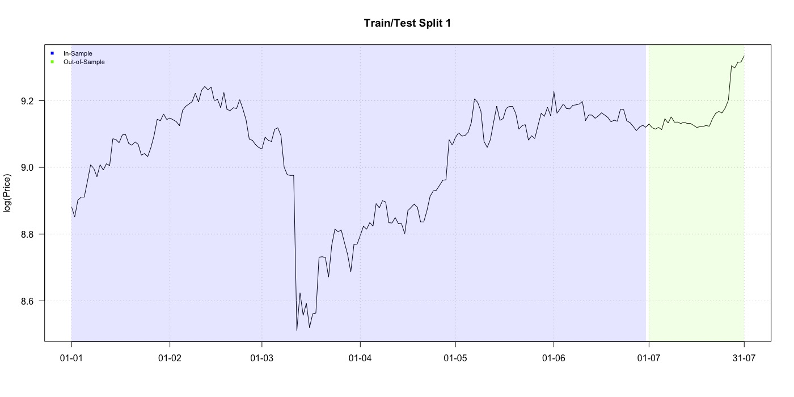
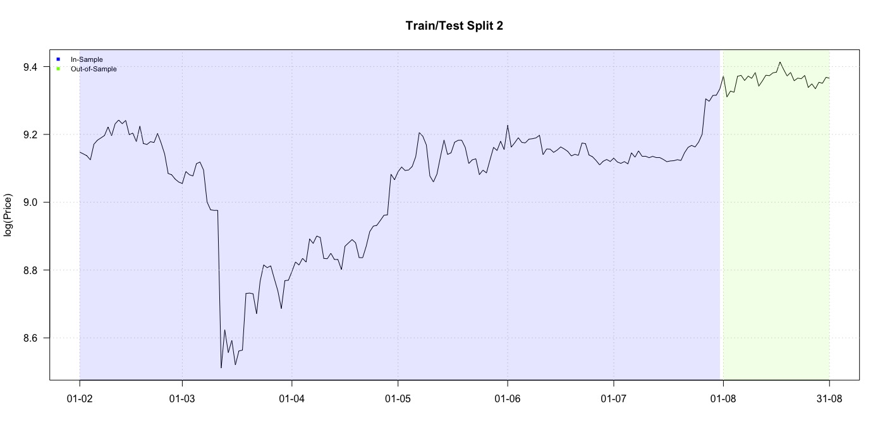
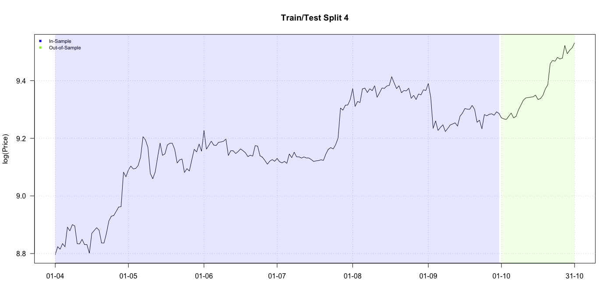
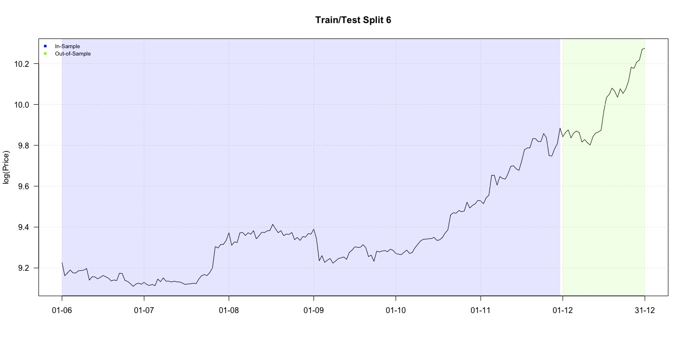
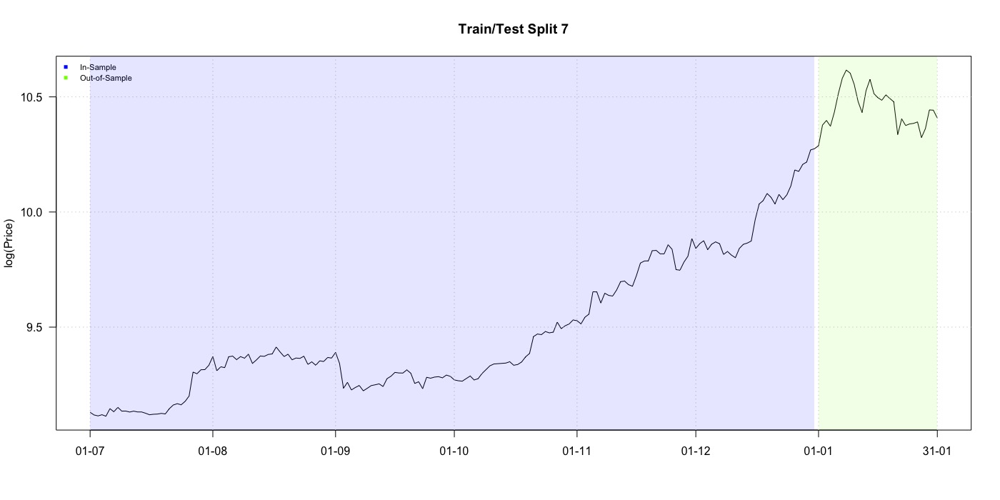
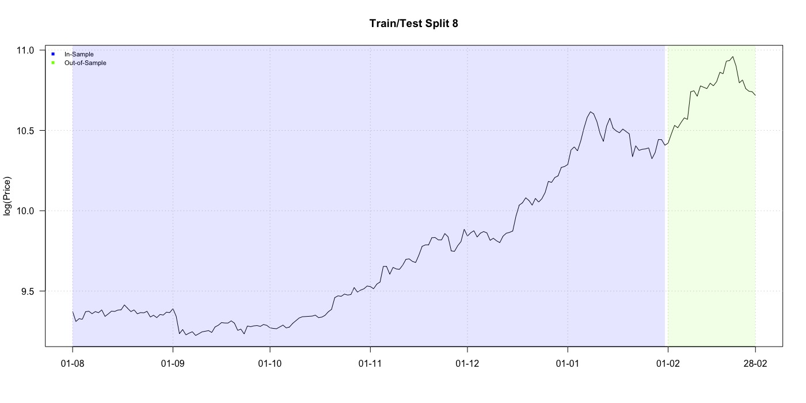
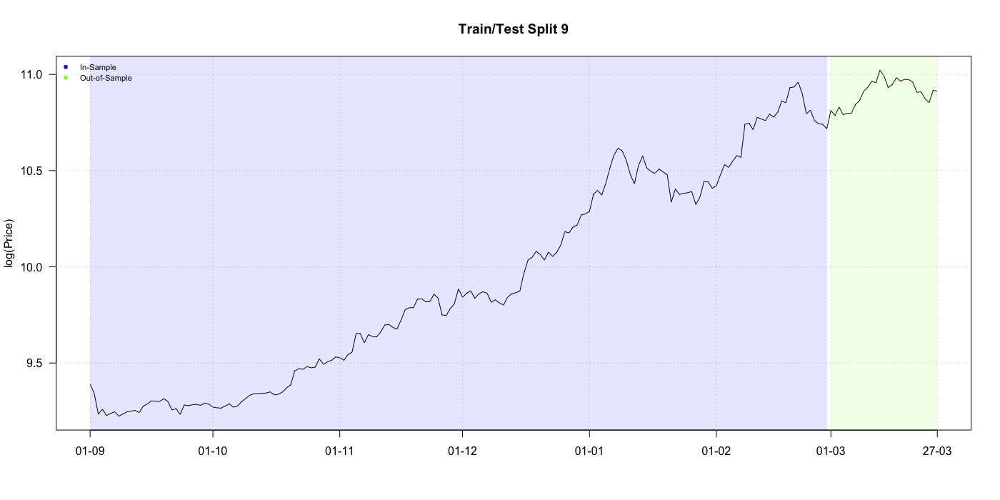

---
output: pdf_document
geometry: margin = 1in
---

## Attachment

This project work is created  with R-4.0.2 , RStudio Version 1.4.904 and RMarkdown in collaborative working via Git / Github

```{r meanmean1, out.width='90%', fig.cap='MSE mean over all 9 splits with all 3 layers.', echo=FALSE,fig.align="center"}
knitr::include_graphics("images/batch5/mean_mean_3layer.jpeg")
```

```{r meanmean2, out.width='90%', fig.cap='MSE mean over all 9 splits with only 2 layers.', echo=FALSE,fig.align="center"}
knitr::include_graphics("images/batch5/mean_mean_2layer.jpeg")
```

```{r logp1, out.width='90%', fig.cap='Split 1.', echo=FALSE,fig.align="center"}

```

```{r logp2, out.width='90%', fig.cap='Split 2.', echo=FALSE,fig.align="center"}

```

```{r logp3, out.width='90%', fig.cap='Split 3.', echo=FALSE,fig.align="center"}
knitr::include_graphics("images/splitplots/log_price_3.jpeg")
```

```{r logp4, out.width='90%', fig.cap='Split 4.', echo=FALSE,fig.align="center"}

```

```{r logp5, out.width='90%', fig.cap='Split 5.', echo=FALSE,fig.align="center"}

```

```{r logp6, out.width='90%', fig.cap='Split 6.', echo=FALSE,fig.align="center"}

```

```{r logp7, out.width='90%', fig.cap='Split 7.', echo=FALSE,fig.align="center"}

```

```{r logp8, out.width='90%', fig.cap='Split 8.', echo=FALSE,fig.align="center"}

```

```{r logp9, out.width='90%', fig.cap='Split 9.', echo=FALSE,fig.align="center"}

```