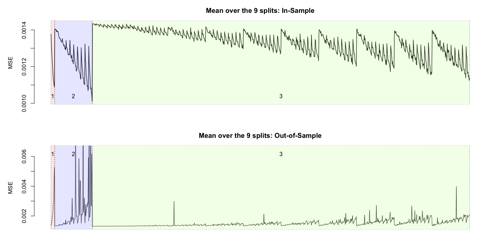
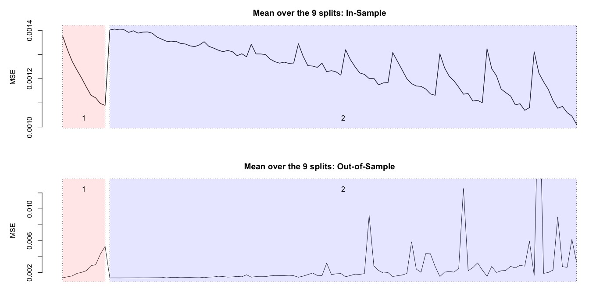
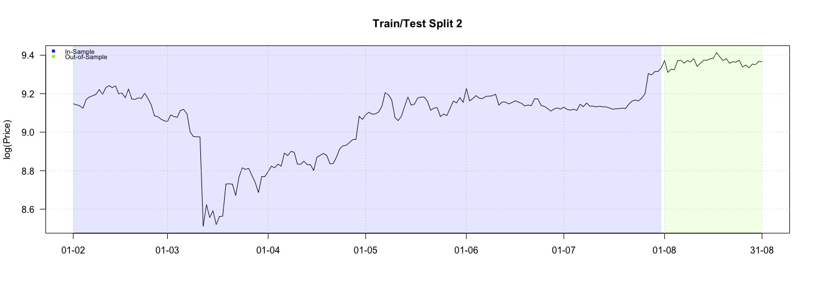
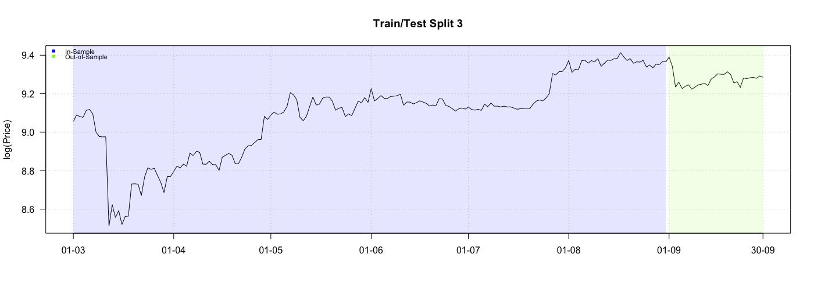
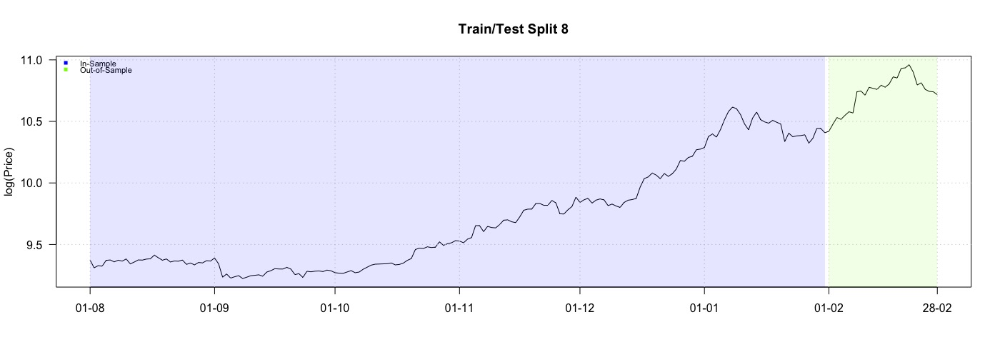
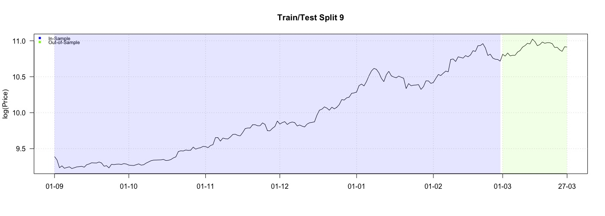
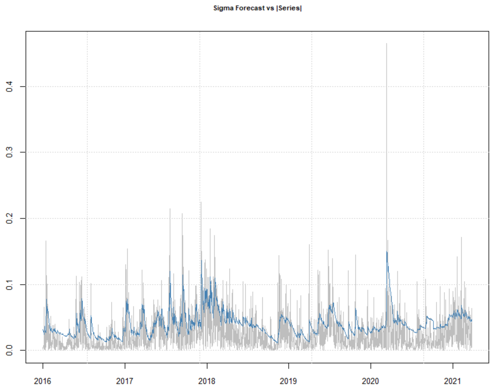

## Attachment {#attachement}

This bachelorthesis is created with R-4.0.2, RStudio Version 1.4.904 and RMarkdown in collaborative working via Git / Github

The full project with all code and data can be found on https://github.com/phibry/BA 

Note that all figures similar to figure \ref{fig:all2_05}: parameter $\beta$ = $\kappa$ from thesis


```{r meanmean1, out.width='90%', fig.cap='MSE mean over all 9 splits with all 3 layers.', echo=FALSE,fig.align="center"}

```

```{r meanmean2, out.width='90%', fig.cap='MSE mean over all 9 splits with only 2 layers.', echo=FALSE,fig.align="center"}

```


```{r price1, out.width='90%', fig.cap='Split 1.', echo=FALSE,fig.align="center"}
knitr::include_graphics("images/splitplots/price1.jpeg")
```

```{r price2, out.width='90%', fig.cap='Split 2.', echo=FALSE,fig.align="center"}

```

```{r price3, out.width='90%', fig.cap='Split 3.', echo=FALSE,fig.align="center"}

```


```{r price4, out.width='90%', fig.cap='Split 4.', echo=FALSE,fig.align="center"}
knitr::include_graphics("images/splitplots/price4.jpeg")
```

```{r price5, out.width='90%', fig.cap='Split 5.', echo=FALSE,fig.align="center"}
knitr::include_graphics("images/splitplots/price5.jpeg")
```

```{r price6, out.width='90%', fig.cap='Split 6.', echo=FALSE,fig.align="center"}
knitr::include_graphics("images/splitplots/price6.jpeg")
```


```{r price7, out.width='90%', fig.cap='Split 7.', echo=FALSE,fig.align="center"}
knitr::include_graphics("images/splitplots/price7.jpeg")
```

```{r price8, out.width='90%', fig.cap='Split 8.', echo=FALSE,fig.align="center"}

```

```{r price9, out.width='90%', fig.cap='Split 9.', echo=FALSE,fig.align="center"}

```

```{r vola_forecasts, out.width='90%', fig.cap='One-step-ahead forecasts of volatility using rolling window of size 365. Refitting model after every months.', echo=FALSE,fig.align="center"}

```


```{r all2_05, out.width='90%', fig.cap='Split 9.', echo=FALSE,fig.align="center"}

```

```{r all2, out.width='90%', fig.cap='Split 9.', echo=FALSE,fig.align="center"}

```

```{r all1_5_05, out.width='90%', fig.cap='Split 9.', echo=FALSE,fig.align="center"}

```

```{r all1_5, out.width='90%', fig.cap='Split 9.', echo=FALSE,fig.align="center"}

```

```{r all1_05, out.width='90%', fig.cap='Split 9.', echo=FALSE,fig.align="center"}

```

```{r xai_plot2, fig.align='center', echo=FALSE, fig.cap="LPD of BTC.", out.width='100%', fig.width = 10, fig.height = 6}
par(mfrow=c(1,1))
colorino <- c("#ff1208", "#003f5c", "#2f4b7c", "#665191", "#a05195", "#d45087", "#f6004a", "#004c6d", "#0075b6", "#665191", "#ff7c43")
plot(xai_data, main="XAI ~ Bitcoin", col=colorino)
for (i in 1:ncol(xai_data))
  mtext(colnames(xai_data)[i], col=colorino[i], line=-i)
```