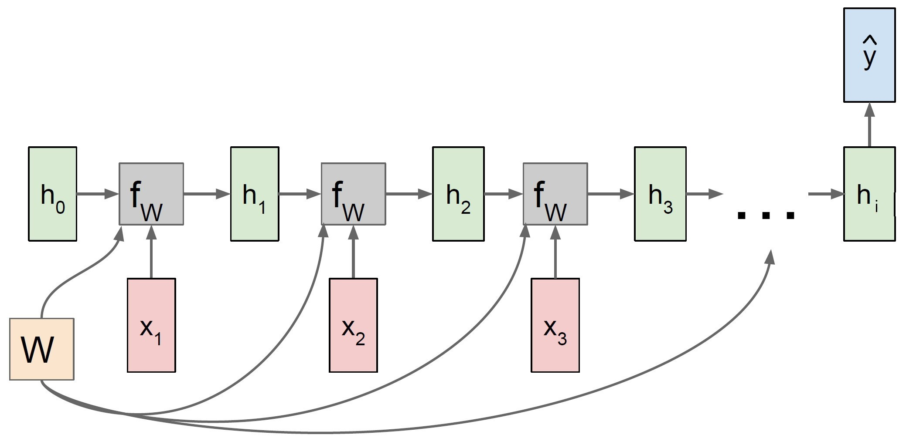

#### 2.1.4. Recurrent neural networks (RNN) {#RNN}
&nbsp;

Recurrent neural networks (RNN) are a further development of conventional neural networks. While MLP use new inputs $x_i$ in each epoch, RNN also use sequential data $h_i$ in addition to $x_i$. This sequential data are called hidden states and result from the previous runs. This has the advantage that historical information stemming from past predictions is included for the prediction for $t+1$. This effect can be intuitively explained by an example in which the flight path of a scheduled flight is predicted using RNN. When predicting the exact location (coordinates) of a plane, it is of great advantage to know the location at $t-1$ and to derive the flight direction from it. With the inclusion of this information, the target area can be narrowed down, which optimally leads to more accurate results. The same principle is used in applications like machine translation and speech recognition, where the result (here possibly letter or word) of the last epoch plays a big role for the next prediction [@RNN].

```{r RNN, fig.align='center', out.width='80%', fig.cap= 'Process sequences of different applicances of RNN.', echo=FALSE}

knitr::include_graphics("images/RNN.jpg")

#[1]F.-F. Li, J. Johnson, and S. Yeung, ‘Lecture 10: Recurrent Neural Networks’, p. 105.

```

Figure \ref{fig:RNN} shows different process sequences of the RNN, which vary depending on the field of application. The red rectangles at the bottom represent the number of inputs. Similarly, the blue rectangles represent the outputs that come out of the RNN. The term 'many' refers to $>1$ and is illustrated with three rectangles in the figure. The green ones represent the hidden states $h_i$ of all time steps and thus can be seen as the memory of the neural network. The green arrows show that the previous hidden state is used as input for the current step. Starting from the left: one-to-many can be used for image captioning (extracting sequence of words from images), many-to-one for sentiment classification from sequence of words, many-to-many for machine translation (sequence of words in one language to sequence of words in another language) and many-to-many for video classification on frame level [@RNN_Stanford]. For the prediction of the BTC/USD exchange rate in this paper, we deal with the process many-to-one. This method combines information from inputs and hidden states into one single prediction value. 

```{r RNN_many_to_one, fig.align='center', out.width='70%', fig.cap= 'Computational graph of a many-to-one RNN.', echo=FALSE}



#[1]F.-F. Li, J. Johnson, and S. Yeung, ‘Lecture 10: Recurrent Neural Networks’, p. 105.

```

```{=tex}
\begin{align} \label{eq:RNN_many_to_one_1}
  h_{i} & = f_{W}(h_{i-1}, x_{i}) \\
  & = \tanh(W_{h}h_{i-1} + W_{x}x_{i} + b) \nonumber 
\end{align}
```

Equation \ref{eq:RNN_many_to_one_1} shows how the hidden states $h_{i}$ are calculated at each time step, $i$ where $f_{W}$ is an activation function (here: hyperbolic tangent function), $h_{i-1}$ is the previous state and $x_i$ is the input vector at time step i. In some cases, a bias term $b$ is added to the parameters. $W_{h}$ represents the weight matrix for $h_{i}$ with dimension (length($h$)$\times$length($h$)). Thus, $W_{x}$ is the weight matrix for $x_{i}$ with dimension (length($h$)$\times$length($x$)).

```{=tex}
\begin{align} \label{eq:RNN_many_to_one_2}
  \hat{y_{i}} = W_{y}h_{i}
\end{align}
```

Looking at equation \ref{eq:RNN_many_to_one_2}, $y_{i}$ equals the output and desired prediction of the RNN. The prediction results from the matrix-vector product of the weight matrix $W_{y}$ with dimension (length($h$)$\times$length($y$)) and the hidden states vector $h$.

#### 2.1.5. Long-short term memory (LSTM) {#LSTM}
&nbsp;


#### 2.2.2. Diebold Mariano {#diebold_mariano}
&nbsp;

The second method used is the Diebold Mariano test, which compares the predictive accuracy between two forecasts. First, the loss differential $d_{i}$ between two forecasts is defined in equation \ref{eq:DM_loss_diff} where a loss function L of one model is subtracted from another model. The proposed loss functions include absolute errors (AE) and squared errors (SE) [@DM_paper]. Given an expected value of $d = 0$, both forecasts are assumed to have the same accuracy. If the expected value differs from zero, the null hypothesis can be rejected. This would mean that the two methods have different levels of accuracy. 

```{=tex}
\begin{align} \label{eq:DM_hypothesis}
  H_{0}: E(d_{i}) = 0 \\
  H_{1}: E(d_{i}) \neq 0 \nonumber
\end{align}
```

with

```{=tex}
\begin{align} \label{eq:DM_loss_diff}
  d_{i} = L(e_{1i}) - L(e_{2i})
\end{align}
```

and

```{=tex}
\begin{align} \label{eq:DM_error}
  e_{ti} = \hat{y_{ti}} - y_{i} \\
  \text{for } t={1,2} \nonumber
\end{align}
```

Under the null hypothesis $H_{0}$, the Diebold Mariano test uses the statistics shown in equation \ref{eq:DM} and is asymptotically N(0,1) distributed. On the other hand, the null hypothesis is rejected if the calculated absolute Diebold Mariano value is outside $-z_{\alpha/2}$ and $z_{\alpha/2}$. Thus, $|DM|>z_{\alpha/2}$ is valid when there is a significant difference between the predictions where $z_{\alpha/2}$ is the positive bound of the z-value to the level $\alpha$.    

```{=tex}
\begin{align} \label{eq:DM}
  DM = \frac{\bar{d}}{\sqrt{\frac{2*\pi*\hat{f_{d}(0)}}{T}}} \rightarrow N(0,1)
\end{align}
```

where $\bar{d}$ is the sample mean of the loss differential and $f_{d}(0)$ is the spectral density of the loss differential at lag k [@DM_lecture].

```{=tex}
\begin{align} \label{eq:DM_definitions}
  \bar{d} = \sum_{i = 1}^{T}d_{i} \\
  f_{d}(0) = \frac{1}{2\pi}(\sum_{k=-\infty}^{\infty} \gamma_{d}(k))
\end{align}
```

In conclusion, the Diebold Mariano test helps us to understand whether the predictions of one model turned out better by chance or due to statistical significance. 
